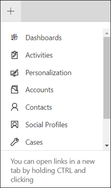
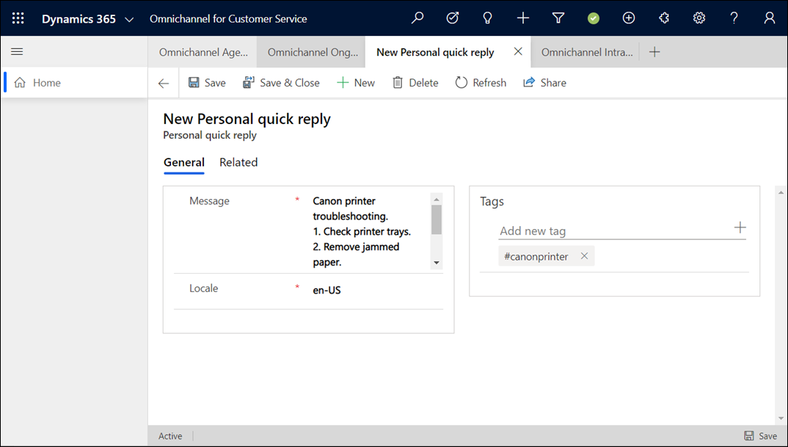
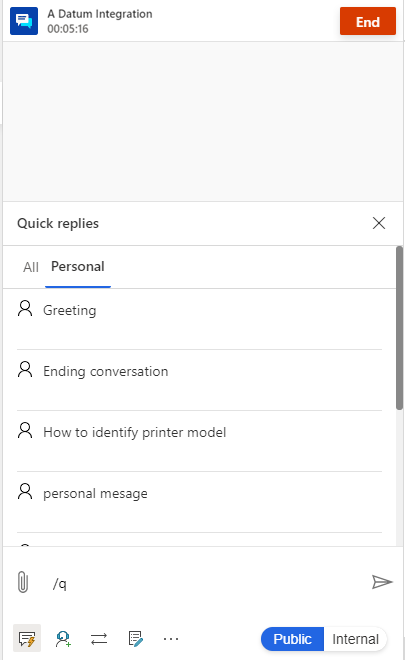

# Preview: Create personal quick replies

[!INCLUDE[cc-use-with-omnichannel](../../../includes/cc-use-with-omnichannel.md)]

[!include[cc-beta-prerelease-disclaimer](../../../includes/cc-beta-prerelease-disclaimer.md)]

## Introduction

The personalization menu that is accessible through the application tab allows you to add personal quick replies, also known as predefined messages. You can create quick replies to cater to the common questions and scenarios that you need to address in your role. You can tag the replies with keywords that help you invoke the quick replies when interacting with customers.

## Create personal quick replies

You can create, edit, and delete the personal quick replies owned by you. The predefined messages that you create are available on the **Personal** tab in the **Quick replies** panel of the conversation window.

1. Sign in to Omnichannel for Customer Service, and on the home page, select the plus (**+**) icon on the application tab.
   > 

2. Select **Personalization**. The **Personalization User settings** page appears.

3. On the **Personal quick replies** tab, select **New Personal quick reply**, and do the following:
    - **Message:** Enter the quick reply text.
    - **Locale:** Select the language in which you want to create the quick reply.

        > [!NOTE]
        > Omnichannel for Customer Service does not localize quick responses. To provide quick responses in multiple languages, create a separate quick response record for each language and select its corresponding locale.
   
   > 
4. In the **Tags** area, enter the keyword you want to associate with the quick reply, and select the plus (**+**) icon. If you want to use the number sign (#), do not use it anywhere else in the keyword except at the beginning.
5. Select **Save**.

## Use personal quick replies

The quick replies created by you are available on the **Personal** tab, and those created by the administrator are available on the **All** tab. Use the personal quick replies when you are in a conversation with a customer by doing the following:

1. Select the quick responses icon at the bottom of your conversation window. The **Quick replies** panel displays the available predefined messages in the **All** and **Personal** tabs.
2. Select the **Personal** tab, and type the number sign (#) in the compose box to list the tags and search through for the personal quick replies available for your use.
3. Use the **more** option to view the complete text in the quick reply.

> 

### See also

[Send predefined messages in chats](oc-conversation-control.md#send-predefined-messages-in-chat)  
[Manage applications](oc-manage-applications.md)  