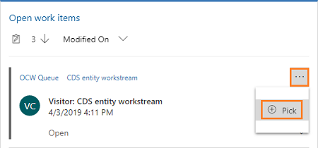
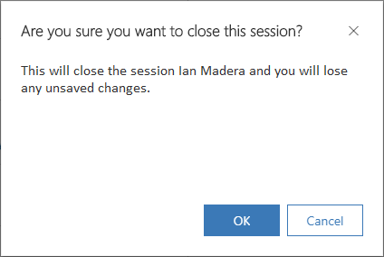

# Manage sessions in Omnichannel for Customer Service

Applies to Dynamics 365 for Customer Engagement apps version 9.1.0

The vertical panel on the left side is the session panel that allows you (the agent) to work on multiple customer sessions simultaneously. As an agent, you can switch between sessions without losing context of the conversation and customer details. The ability to handle multiple sessions simultaneously (while preserving customer context) allows you to resolve issues faster and achieve higher productivity.

> [!div class=mx-imgBorder]
> 

For a SMS or chat channel, when a session is started, the following happens:

- The presence status is updated as per the configuration set by your administrator.
- The Communication panel is displayed so you can interact and exchange messages with the customer.
- The Customer summary page is loaded with the details of customer such as contact or account name, case, conversation summary and so on.
- The KB Search page opens in the app tab panel.

## Start a session

As an agent, you can start the sessions in two ways:

- Manually start a session
- Automatically start a session using the incoming notification
 
When you start a session from a notification request that is a Chat or SMS channel, the presence status is updated as per the configuration set for you by your administrator. In addition, the communication panel is displayed so you can communicate with the customer.

### Manually start a session using the gestures

#### Contact and Case session
Use a combination of keyboard and mouse-click gesture to start a session. You can press **Shift** and select the work item to open a case or contact session. You can also select the **Open** option from the Omnichannel Agent Dashboard to start a case or contact session.

#### Chat and SMS channel

You can start a SMS or Chat session manually from the Omnichannel Agent Dashboard. Select **More options** (**...**) and select **Open** or **Pick** to start the session. The **Open** option is available for **My work items** and **Closed work items** streams. The **Pick** option is available in **Open work items** streams.

  

### Automatically start a session using the incoming notification

When you accept an incoming conversation request by selecting the **Accept** button, a session is started and the customer summary page is loaded in the Unified Interface application area.

 > [!div class=mx-imgBorder]
 > 

 > [!div class=mx-imgBorder]
 > 

## Work on multiple customer sessions

As an agent, when you are working on a case, you get an incoming conversation request, and you accept the request. This starts a new session and the customer summary page is loaded with context of the session. You can open applications such as KB Search, Open records, and any Line-of-Business applications made available in the application tab panel sitemap. You can open these applications using the gestures and the options in the communication panel. To learn more, see [Manually start a session using the gestures](#manually-start-a-session-using-the-gestures) and [View communication panel](oc-conversation-control.md).

When you switch sessions, unsaved changes are not lost and you can continue to work on them.

For example, you are working on a case by entering the title of the case and not yet saved the form. Now, you get a notification about the incoming conversation and you accept the request, which leads to starting of a new session. Again, you can switch back to case session and the data entered is present for you to continue.

## Close a session

You can close any session manually by selecting the **X** button next to the session title. When you hover the cursor on a session, you see the **X** button, and if you select the button, a confirmation dialog is shown to you.

   > [!div class=mx-imgBorder]
   > 

   > [!div class=mx-imgBorder]
   > 

## Mode of the session panel

By default, the session panel is in expanded mode. Use the burger icon to toggle between expand or collapse mode.
At all times, the **Home** session is anchored and you can't close it. The Home session shows the default dashboard set for you by your administrator.

   > [!div class=mx-imgBorder]
   > 

## Title and icon of the session

- **Session Title**

    By default, the title of session is name of the customer, account, or title of the case. For an unauthenticated conversation request, the title will be displayed as visitor with a number. For example, **Visitor 1**.
    
    For an authenticated chat, name of the contact, account or title of the case is displayed.

    > [!div class=mx-imgBorder]
    > 

- **Session icon**

    By default, the first two letters of the session title is displayed as the session icon.

    > [!div class=mx-imgBorder]
    > 

> [!div class="nextstepaction"]
> [Next topic: Manage applications](oc-manage-applications.md)

## See also

- [Understand conversation states](oc-conversation-state.md)
- [View communication panel](oc-conversation-control.md)
- [View agent dashboard and conversations (work items)](oc-agent-dashboard.md)