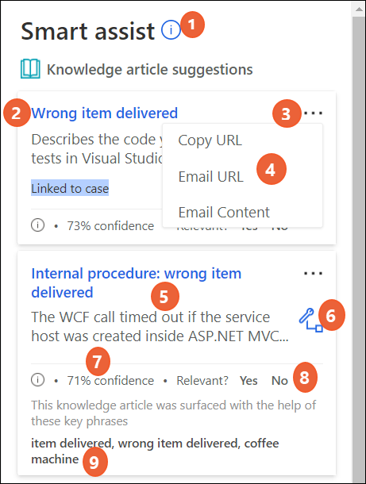

# View smart assist for agents

[!INCLUDE[cc-use-with-omnichannel](../../../includes/cc-use-with-omnichannel.md)]

## Introduction

Smart assist is an intelligent assistant that provides real-time recommendations to you (an agent), helping you to take actions during your interactions with customers. It shows relevant recommendations such as knowledge articles, similar cases, and next-best steps.

If your administrator has enabled the Productivity pane, then the productivity pane appears and on which the smart assist cards appear. By default, the productivity pane is enabled out of the box.

## Preview: AI-based suggestions for knowledge articles and similar cases

Smart assist comes with a set of pre-trained natural language understanding models that help agents find relevant knowledge articles or similar cases quickly, based on the context of ongoing conversation that your agents are handling. Your administrator can enable AI-suggested similar cases and knowledge articles through a single click. These suggestions are displayed in real time based on the conversation context.
> [!div class=mx-imgBorder]
> 

### Understand the knowledge article components in smart assist

When you are interacting with a customer in an ongoing conversation, up to three top knowledge articles that match the conversation context are displayed in the **Smart assist** pane. The suggestions are dynamically refreshed based on the conversation context.

> [!div class=mx-imgBorder]
> 

The following table lists the explanation of the smart assist card for AI-suggested knowledge articles.

| Label | Description |
|--------|-------------|
| 1 | Displays the information about the cards when selected.|
| 2 | Title of the related knowledge article. When selected, opens the knowledge article in an application tab. |
| 3 | Displays the confidence score based on which the knowledge article was selected by the AI model. Usually, the suggested knowledge articles are highly relevant to the context of conversations when the confidence score is above 80%; suggestions with lower confidence score may still be relevant based on the semantic meaning of some key words in the conversation. The minimum confidence score is 65%. |
| 4 | Displays the actions that you can perform.|
| 5 | Displays information on the keywords that were used by the AI model to match the article. |
| 6 | When selected, the link to the knowledge article is pasted in the conversation window that the agent can share with the customer. |
|  |  |

### Understand the similar cases components in smart assist

When you are interacting with a customer in an ongoing conversation, up to three top similar cases that match the conversation context are displayed in the **Smart assist** pane. The suggestions are dynamically refreshed based on the conversation context. 

> [!div class=mx-imgBorder]
> 

The following table lists the explanation of the smart assist card for AI-suggested similar cases.

| Label | Description |
|--------|-------------|
| 1 | Displays the title of the similar case. When selected, opens the customer summary form in an application tab.|
| 2 | The confidence score based on which the similar case was selected by the AI model. Usually, the suggested similar cases are highly relevant to the context of conversations when the confidence score is above 80%; suggestions with lower confidence score may still be relevant based on the semantic meaning of some key words in the conversation. The minimum confidence score is 65%. |
| 3 | Summary of the case resolution that is generated by the AI model. |
| 4 | Status of the similar case. |
| 5 | Displays the actions that can be performed when you select more commands. |
| | |

If no cases match, then the card displays an appropriate message, such as "No suggestions found for similar cases."

## Smart assist suggestions configured using bot user

The smart assist bot interprets the conversation in the communication panel and provides real-time recommendations.

The recommendations appear in the user interface as cards. The most recent card (recommendation) appears at the top on the control. If you feel a recommendation doesn't meet the context of the conversation, you can choose to dismiss the card.

For a macro recommendation card, if the run is successful, a success message is displayed; otherwise, an error message is displayed in the user interface.

When a conversation is escalated from a bot, the agent needs to accept the request and start the conversation with the customer. Now, from this instance, the smart assist bot interprets the conversation in real-time and provides recommendations.

> [!div class=mx-imgBorder]
> 

## See also

[Smart assist for agents (admin)](../../administrator/smart-assist.md)
