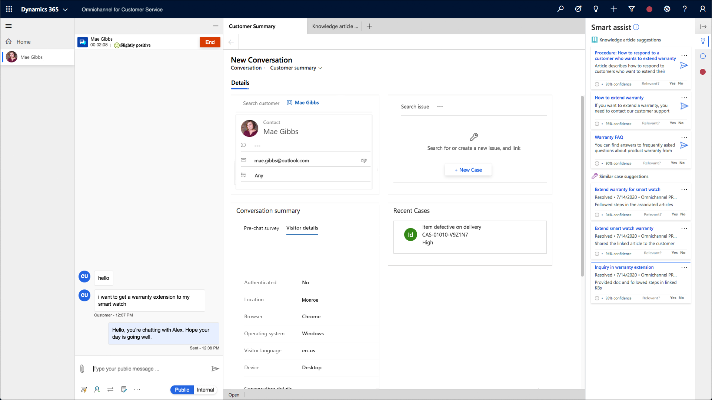

# Preview: View smart assist suggestions for knowledge articles and similar cases using AI

[!include[cc-beta-prerelease-disclaimer](../../../includes/cc-beta-prerelease-disclaimer.md)]

> [!IMPORTANT]
>
> - This feature is a preview, which means that it is made available to you before general availability so you can test and evaluate the preview and provide feedback to Microsoft.
> - This preview may employ reduced or different privacy, security, or compliance commitments than a commercial version. As such, this preview is not meant to be used with any "live" or production Customer Data, Personal Data, or other data that is subject to heightened compliance requirements. Any use of "live" data is at your sole risk and it is your sole responsibility to notify your end users that they should not include sensitive information with their use of the Preview.
> - This preview, and any support Microsoft may elect to provide, is provided "as-is," "with all faults," "as available," and without warranty. This preview is subject to the [Preview Terms](../../../legal/supp-dynamics365-preview.md).

## Introduction

Smart assist is an intelligent assistant that provides real-time recommendations to you, helping you take actions during your interactions with customers.

Smart assist that displays AI-suggestions for similar cases and knowledge articles comes with a set of pre-trained natural language understanding models that help agents find relevant knowledge articles or similar cases quickly, based on the context of ongoing conversations that your agents are handling. Your administrator can enable AI-suggested similar cases and knowledge articles through a single click. These suggestions are displayed in real time based on the conversation context.
> [!div class=mx-imgBorder]
> 

If your administrator has enabled the Productivity pane, then the productivity pane appears and on which the smart assist cards appear. By default, the productivity pane is enabled out of the box.

### Understand the knowledge article components in smart assist

When you are interacting with a customer in an ongoing conversation, up to three top knowledge articles that match the conversation context are displayed in the **Smart assist** pane. The suggestions are dynamically refreshed based on the conversation context.

> [!div class=mx-imgBorder]
> 

The following table lists the explanation of the smart assist card for AI-suggested knowledge articles.

| Label | Description |
|--------|-------------|
| 1 | Displays the information about the cards when selected.|
| 2 | Title of the related knowledge article. When selected, opens the knowledge article in an application tab. |
| 3 | Displays the confidence score based on which the knowledge article was selected by the AI model. Usually, the suggested knowledge articles are highly relevant to the context of conversations when the confidence score is above 80%; suggestions with lower confidence score may still be relevant based on the semantic meaning of some key words in the conversation. The minimum confidence score is 65%. |
| 4 | Displays the actions that you can perform.|
| 5 | Displays information on the keywords that were used by the AI model to match the article. |
| 6 | When selected, the link to the knowledge article is pasted in the conversation window that the agent can share with the customer. |
|  |  |

### Understand the similar cases components in smart assist

When you are interacting with a customer in an ongoing conversation, up to three top similar cases that match the conversation context are displayed in the **Smart assist** pane. The suggestions are dynamically refreshed based on the conversation context.

> [!div class=mx-imgBorder]
> 

The following table lists the explanation of the smart assist card for AI-suggested similar cases.

| Label | Description |
|--------|-------------|
| 1 | Displays the title of the similar case. When selected, opens the customer summary form in an application tab.|
| 2 | The confidence score based on which the similar case was selected by the AI model. Usually, the suggested similar cases are highly relevant to the context of conversations when the confidence score is above 80%; suggestions with lower confidence score may still be relevant based on the semantic meaning of some key words in the conversation. The minimum confidence score is 65%. |
| 3 | Summary of the case resolution that is generated by the AI model. |
| 4 | Status of the similar case. |
| 5 | Displays the actions that can be performed when you select more commands. |
| | |

If no cases match, then the card displays an appropriate message, such as "No suggestions found for similar cases."

### See also

[Enable AI-suggested cases and knowledge articles](../../../customer-service/csw-enable-ai-suggested-cases-knowledge-articles.md)  
[Smart assist suggestions using bot user](oc-smart-assist.md)  
