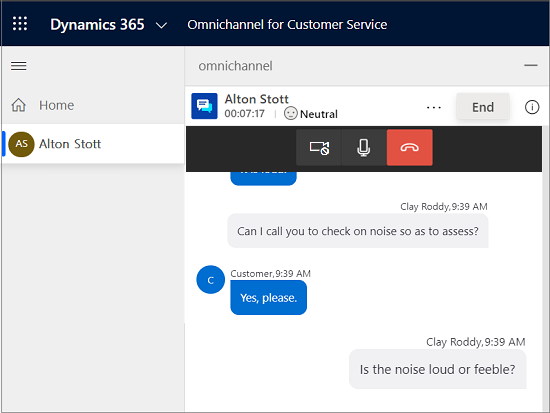
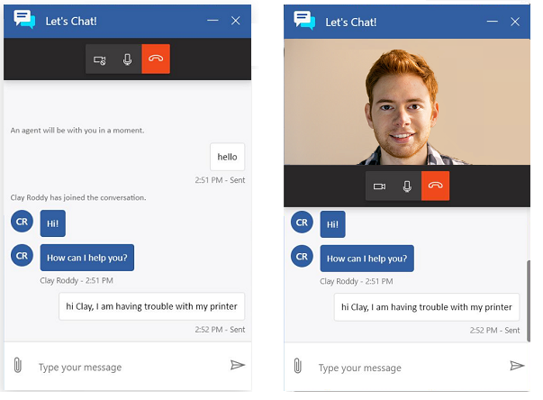

# Remote assistance and calling options in live chat

[!INCLUDE[cc-use-with-omnichannel](../../../includes/cc-use-with-omnichannel.md)]

## Calling Options in live chat

Calling Options in live chat conversation feature allows you to initiate a voice or video call while communicating with the customer over a live chat.

As an agent, when you communicate with a customer via chat, a lot of information is exchanged. This might increase the time you spend on resolving the customer's issue. Or, the customer may prefer to show and explain the issue with a physical product​. In these scenarios, you may want to initiate a voice or video call during the chat conversation to resolve the issue quickly. The calling options in the communication panel helps you to make a voice and video call during the chat conversation.

### Advantages of voice and video call in live chat

- Resolve the customer issue quickly
- Reduces average handle time and improves productivity
- Enhanced customer satisfaction
- Positive relationship with the customers

### Initiate voice and video call

When you are chatting with the customer, you can initiate the voice or video call. In the communication panel, beside the **End** button, an ellipsis (...) is present. Select the ellipsis and the **Voice Call** and **Video Call** options are displayed to you. Based on your administrator configuration, you might see **Voice Call** and **Video Call** or just **Voice call** option.

> [!div class=mx-imgBorder]
> 

When you initiate a voice call, you can view the call fly-out with buttons.

|Button | Name | Description |
|----------------------|-------------------------|-----------------------------|
|| Turn on video / Turn off video |  Use the button to turn on or off the video while in a call with the customer.|
|| Mute / Unmute | Use the button to mute or unmute the call while communicating with the customer. |
|| End call | Use this button to end the call. |

> [!div class=mx-imgBorder]
> 

### Capacity of the agent

When you initiate a voice or video call, your capacity is consumed, and you can't get any conversation request until you hang up. However, your supervisor can assign conversations to you.

### Site permissions

As an agent, you need to provide the camera and microphone access in the browser to make a video and audio call respectively.

## Customer experience

On receiving a call, customer on the portal can the accept voice call with audio, accept voice with video, or reject the call.

> [!div class=mx-imgBorder]
> 

After accepting the call, the customers can view and use the following options accordingly.

|Button | Name | Description |
|----------------------|-------------------------|-----------------------------|
|| Turn on video / Turn off video |  Use the button to turn on or off the video while in a call with the customer.|
|| Mute / Unmute | Use the button to mute or unmute the call while communicating with the customer. |
|| End call | Use this button to end the call. |

After accepting the call, customer can turn on or off the video, mute or unmute, and end the call.

> [!div class=mx-imgBorder]
> 

### Site permissions

Customers need to provide the camera and microphone access in the browser.

## Use co-browse and screen share in live chat

The co-browsing and screen sharing features help you quickly and easily understand the customer's issue while communicating with the customer via chat channel. These visual engagement channels allow agents to interact with customers within their browsers for a concrete and effective support experience. This integration capability allows agents to initiate a third-party co-browse or screen sharing session from the chat conversation. 

Note: Third-party providers of co-browse or screen share capabilities may have separate pricing and licensing requirements. Before enabling and using remote assistance features through third-party applications, ensure you understand the terms of using these applications. 
