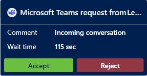

# Preview: Use a Microsoft Teams channel

[!INCLUDE[cc-use-with-omnichannel](../../includes/cc-use-with-omnichannel.md)]

[!include[cc-beta-prerelease-disclaimer](../../includes/cc-beta-prerelease-disclaimer.md)]

> [!IMPORTANT]
>
> - A preview is a feature that is not complete, as it may employ reduced privacy, security, and/or compliance commitments, but is made available before it is officially released for general availability so customers can get early access and provide feedback. Previews are provided "as-is," "with all faults," "as available," and without warranty.​
> - This preview feature does not come with technical support and Microsoft Dynamics 365 Technical Support won't be able to help you with issues or questions.  If Microsoft does elect to provide any type of support, such support is provided "as is," "with all faults," and without warranty, and may be discontinued at any time.​
> - Previews are not meant for production use, especially to process Personal Data or other data that is subject to heightened compliance requirements, and any use of "live" or production data is at your sole risk.  All previews are subject to separate [Terms and Conditions](../../../legal/dynamics-insider-agreement.md).
>
## Agent dashboard for Teams channel

When you sign in to Omnichannel for Customer Service, you can see your work items on the Omnichannel Agent Dashboard. More information: [View agent dashboard and agent conversations](oc-agent-dashboard.md)

## Prerequisite

Make sure that your administrator has configured a Teams channel.

## Incoming Teams chat notification

You'll receive a notification when a customer requests a conversation through Teams. When you accept the Teams chat request, a session is started, and you'll see the communication panel in which you can exchange messages with the customer.
<!--"Yi" isn't on our fictitious names list. -->
> [!div class=mx-imgBorder]
> 

In Omnichannel for Customer Service, you can:

- [View a customer summary](oc-customer-summary.md).
- [View the communication panel](oc-conversation-control.md).
- [Use call options and visual engagement in live chat](call-options-visual-engagement.md).
- [Monitor real-time customer sentiment](oc-monitor-real-time-customer-sentiment-sessions.md).
- [Manage sessions](oc-manage-sessions.md).
- [Manage applications](oc-manage-applications.md).
- Use these productivity tools:
  - [Use agent scripts](oc-agent-scripts.md)
  - [View smart-assist cards](oc-smart-assist.md)
  - [Use the productivity pane](oc-productivity-pane.md)
- [Create a record](oc-create-record.md).
- [Search, link, and unlink a record](oc-search-link-unlink-record.md).
- [Search for and share knowledge articles](oc-search-knowledge-articles.md).
- [Take notes specific to a conversation](oc-take-notes.md).
- [Understand conversation states](oc-conversation-state.md).
- [Manage presence status](oc-manage-presence-status.md).
- [Search for transcripts](oc-search-transcipts.md).
- [View conversation and session forms](oc-view-activity-types.md).
- [View the customer summary for an incoming conversation request](oc-view-customer-summary-incoming-conversation-request.md).
- [Search for transcripts](oc-search-transcipts.md).

### See also

[Configure a Microsoft Teams channel](../../administrator/configure-microsoft-teams.md)