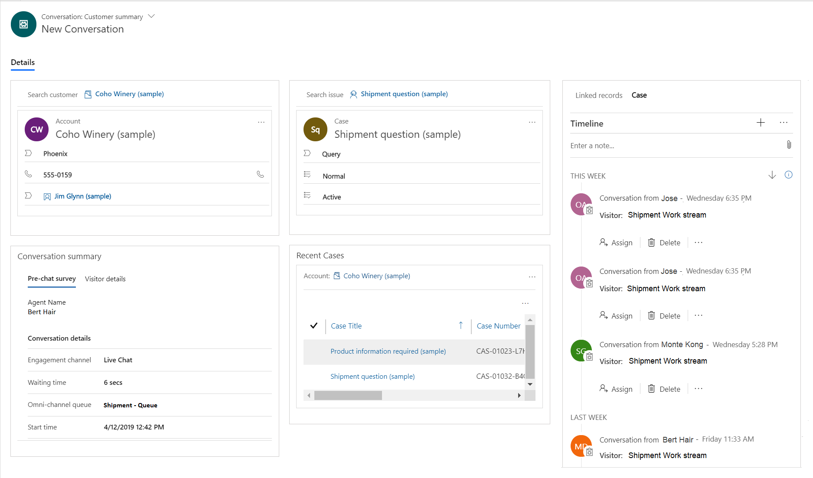
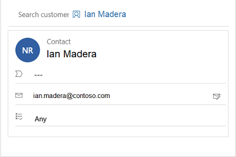
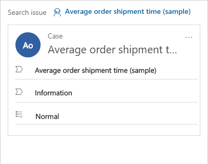

# View customer summary and know everything about customers

[!INCLUDE[cc-use-with-omnichannel](../../../includes/cc-use-with-omnichannel.md)]

## Overview of the existing challenges

One of the major challenges that customers face when contacting customer support is providing repetitive information about the issue with the support agent. Also, if the customer wants to review the status of the request raised at a later stage, the customer shares the same information with another support agent to explain the context of the conversation. To avoid this situation, the support agent must access the customer information with details about the product/service, issue, cases history, related cases, location, and so on.

By having this information ready, when customers reach out to contact center, support agents can help reduce the hold time that they spend retrieving customer information, reduce average handling time (AHT), and increase customer satisfaction through faster resolution of the issue.

## What is Customer summary?

**Customer summary** is a page where you can get complete information about a customer when you accept an incoming request from any engagement channel. The default view of the **Customer summary** page provides the following sections:

   - Customer

   - Conversation summary

   - Case

   - Recent cases

   - Timeline

> [!div class=mx-imgBorder]
> 

## Customer

The **Customer profile** section provides details about the customer, such as the name of the customer or account, job, title, relationship type, city, category, relationship type, primary contact for the account, and preferred channel for engagement.

> [!div class='mx-imgBorder']
> 

## Conversation summary

The conversation summary section displays tabs with the details that help you understand the information about the conversation with customer. It displays the following tabs:

- Pre-chat survey
- Portal navigation
- Visitor details
- Additional details (Only if configured and additional context variables available)
 
Also, below the these tabs, at all times, you can see the Conversation details section that shows the following details:

- Engagement channel
- Waiting time
- Skills
- Queue
- Start time

  > [!div class='mx-imgBorder']
  > 
 
### Pre-chat

The **Pre-chat survey** tab displays the survey answers against the questions that are requested by your organization, which helps your interaction with the customer.

### Portal navigation

The **Portal navigation** tab displays information on the path (recent actions) the customer took just before initiating a conversation. The information enables the agents to understand the customer intent and provide a personalized service with fast resolution for improved customer satisfaction. The **Portal navigation** tab displays the information in the reverse chronological order, and is categorized into the following type of actions:

| Action type | Description |
|-------------|-----------------------------------|
| Page visited | The page visited on the portal (website) along with the timestamp.|
| Phrase searched | The keyword or phrase searched for, along with the timestamp. |
| Knowledge article viewed | The knowledge article viewed along with the timestamp. |
| Custom action performed | Any other custom action that is tracked by your organization as per your business requirements are displayed along with the timestamp. |

   > [!div class='mx-imgBorder']
   > 

To configure the portal navigation tab, see [Enable visitor portal navigation](../../administrator/portal-navigation.md).

### Visitor details

The **Visitor details** tab provides some information such as whether the customer is authenticated or not, browser used by the customer for contacting support, operating system used by the customer, location of the customer, interacting language of the customer, and so on.

> [!div class='mx-imgBorder']
> 

If the customer signs in to the portal to initiate a chat with the support, then as an agent, you can see the **Authenticated** field value as **Yes** in the **Visitor details** tab of the **Conversation summary** section. Otherwise, the **Authenticated** field value is shown as **No**.

 

To learn more, see [Create chat authentication settings](../../administrator/create-chat-auth-settings.md).

## Case

For an incoming conversation request, the system links an existing case to the conversation and shows it in the **Issue snapshot** section. This section shows  information such as the title of the case, its priority, its status, the product, and the owner.

> [!div class='mx-imgBorder']
> 

## Recent cases

This section displays the recent cases that relate to the customer.

> [!div class='mx-imgBorder']
> 

#### Timeline

This section displays the case- and customer-related activities in the form of a timeline. You can create quick notes based on the discussion with the customer. Also, you can filter the timeline to view it based on Customer activities, Case activities, and Conversation activities.

> [!div class='mx-imgBorder']
> 

## Preview: Agent script

[!include[cc-beta-prerelease-disclaimer](../../../includes/cc-beta-prerelease-disclaimer.md)]

Agent script in Omnichannel for Customer Service provides guidance about what you (agent) should be doing when you get a customer issue. It ensures that you share only the accurate and company-endorsed information. Agent scripts help you to be accurate, and effective while being faster and more-efficient in terms of customer handling.

When you accept an incoming conversation request, a session starts and the **Customer Summary** application tab opens. You can see the Agent script section, which has a agent script .

> [!div class='mx-imgBorder']
> 

1. Agent script control
2. Text instructions
3. Macro
4. Sub agent script

Based on the type of agent script administrator has configured, you may following type of steps:

- Text instructions
- Macro
- Sub agent script

When you expand the step, the configured instructions appears.

### Text instructions

The text instructions provides guidance on the action you must perform. The **Text instructions** step in the agent script shows a title, instruction(s), and the text instruction icon. After you perform the the instruction, you can select the icon **Mark as done** to indicate that you've executed the step.

**Example:**
| Title | Instruction you need to perform |
|----------------|-------------------------------------------------------------------------|
| Greet customer | Greet the customer with welcome message from the quick reply repository.|

> [!div class='mx-imgBorder']
> 

### Macro

A macro is a set of instructions that tells the system how to complete a task. When a macro runs, the system performs each instruction. The **Macro** step in the agent script shows a title, instruction that system performs, and the macro icon. When you select run macro icon, the system executes the macro.

**Example:**

| Title | Instruction system performs |
|----------------|----------------------------------------|
| Create case | Triggers create case from customer context|

In this is example, when an agent selects the macro icon, the system opens a new **Create case** form in the application tab panel with pre-populated fields based on the customer context.

> [!div class='mx-imgBorder']
> 

### Sub agent script

The sub agent script is another agent script which is invoked from the current agent script. When you select the view icon, the system loads the sub agent script.

> [!div class='mx-imgBorder']
> 

> [!div class="nextstepaction"]
> [Next topic: View communication panel](left-control-panel.md)

## See also

- [Introduction to the agent interface in Omnichannel for Customer Service](introduction-agent-interface.md)
- [View call scripts, take notes, and search knowledge articles](right-control-panel.md)
- [View customer summary for an incoming conversation request](view-customer-summary-incoming-conversation-request.md)
- [Create a record](create-record.md)
- [Search for records](search-record.md)
- [Link and unlink a record](link-unlink-record.md)
- [setContextProvider](../../developer/reference/methods/setContextProvider.md)
