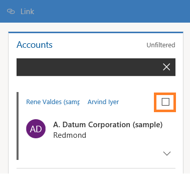

# Link and unlink a record to the conversation

[!INCLUDE[cc-use-with-omnichannel](../../../includes/cc-use-with-omnichannel.md)]

The topic explains how to link and unlink a record to the conversation.

## Link a record to the conversation when doing inline search

<!--
> [!div class=mx-imgBorder]
>  -->

During inline search, the search results are displayed, and you can select a record to link the conversation to the selected record. After you link the record, the **Customer summary** form loads with the details.

> [!div class=mx-imgBorder]
> 

> [!Note]
> You can link only one contact or account in the **Customer profile** section and one case in the **Issue snapshot** section.

<!-- ## Link a record by doing advanced search

You can link a record in the list of search results to a conversation. You can link only one record to a conversation.

1. Select the  icon to view the selection list.

 > [!div class=mx-imgBorder]
 > 

2. Select the check box next to the record you want to link.

 > [!div class=mx-imgBorder]
 > 

3. Select the link button at the top.

 > [!div class=mx-imgBorder]
 > 

After you link the record to the conversation, the Customer summary form is refreshed and reflects the details. Similarly, you can link other record types.

> [!Note]
> You can link only one contact or account in the **Customer profile** section and one case in the **Issue snapshot** section. -->

## Unlink a record from the conversation

You can unlink a record only when you are interacting with customer using the communication panel. That is, after you accept an incoming conversation request and view the **Customer summary** page, you can unlink the record from the conversation. 

To unlink a record, select the **X** button next to the customer name in the **Customer profile** form. After the record is removed, the **Customer profile** form is blank.

> [!Note]
> You can link and unlink only one contact or account in the **Customer profile** section and one case in the **Issue snapshot** section.

> [!div class="nextstepaction"]
> [Understand conversation states](conversation-state.md)

## See also

- [View call scripts, take notes, and search knowledge articles](right-control-panel.md)
- [View customer summary for an incoming conversation request](view-customer-summary-incoming-conversation-request.md)
- [Create a record](create-record.md)
- [Search for records](search-record.md)
