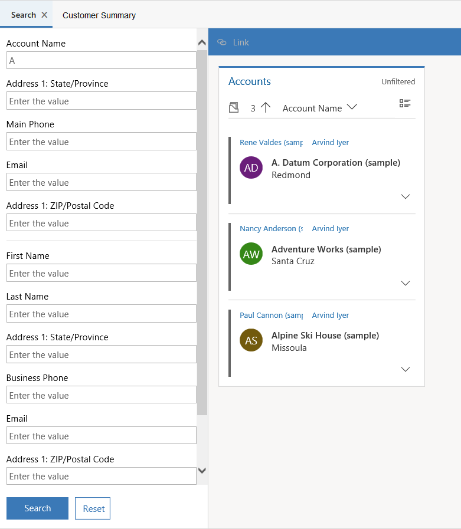

# Search for records in Omnichannel for Customer Service

Applies to Dynamics 365 for Customer Engagement apps version 9.1.0

The topic explains how to Search for records in Omnichannel for Customer Service.

## Search for records using the inline search option

You accept an incoming conversation request and there is no customer record identified in the Omnichannel for Customer Service. In this case, use the inline search option in the **Customer profile** form and **Issue snapshot** form to search for a contact or account and case respectively.

The inline search is based on the Lookup View and Quick Find View. You can search the fields (attributes) that is based on the Lookup View and Quick View Field.

For **Customer profile**, you can search for Contact or Account entity. By default, you can search using the following fields.

<table>
    <tr>
        <th>Entity</th>
        <th>Fields</th>
    </tr>
    <tr>
        <td rowspan="4">Account</td>
        <td>Account Name</td>
    </tr>
    <tr>
        <td>Account Number</td>
    </tr>
    <tr>
        <td>Email</td>
    </tr>
    <tr>
        <td>Main Phone</td>
    </tr>
    <tr>
        <td rowspan="7">Contact</td>
        <td>Company Name</td>
    </tr>
    <tr>
        <td>Email</td>
    </tr>
    <tr>
        <td>First Name</td>
    </tr>
    <tr>
        <td>Last Name</td>
    </tr>
    <tr>
        <td>Middle Name</td>
    </tr>
    <tr>
        <td>Full Name</td>
    </tr>
    <tr>
        <td>Mobile Phone</td>
    </tr>  
 </table>

For the **Issue snapshot**, you can search for Case (Incident) entity. By default, you can search using the following fields.

<table>
<tr>
        <th>Entity</th>
        <th>Fields</th>
    </tr>
    <tr>
        <td rowspan="2">Case</td>
        <td>Case Number</td>
    </tr>
    <tr>
        <td>Case Title</td>
    </tr> 
 </table>

Only active views are displayed for the search results. Also, you can customize the **Quick Find View** and **Lookup View** to change the searchable fields as per your business requirements. More information [Understand views](/dynamics365/customer-engagement/customize/create-edit-views) and [Unified Interface Lookup view leverages Quick Find View](https://blogs.msdn.microsoft.com/crm/2018/11/02/unified-interface-lookup-now-leverages-quick-find-view/)

To learn on how to link a record, see [Link a record to the conversation](link-unlink-record.md)

<!-- ## Search for records using the search option

You can search for Omnichannel records by using the search functionality. When you select the **Search** button, the **Search** page appears on the application management toolbar. Specify the details, and then select **Search**. The results appear in the form of a list.

1. Select the search icon , and select **Omnichannel Search**.

2. Specify any of the following values as per your search requirements:

 - Account Name
 - Address 1: State/Province
 - Main Phone
 - Email
 - Address 1: ZIP/Post Code
 - First Name
 - Last Name
 - Address 1: State/Province
 - Business Phone
 - Email
 - Address 1: ZIP/Post Code
 - Case Number

3. Select **Search**. The search results appear. -->

> [!div class="nextstepaction"]
> [Next topic: Link and unlink a record](link-unlink-record.md)

## See also

- [View customer summary and know everything about customers](customer-summary.md)
- [View conversation and session forms in Dynamics 365 for Customer Engagement apps](view-omnichannel-conversation-session.md)
- [View customer summary for an incoming conversation request](view-customer-summary-incoming-conversation-request.md)
- [Create a record](create-record.md)