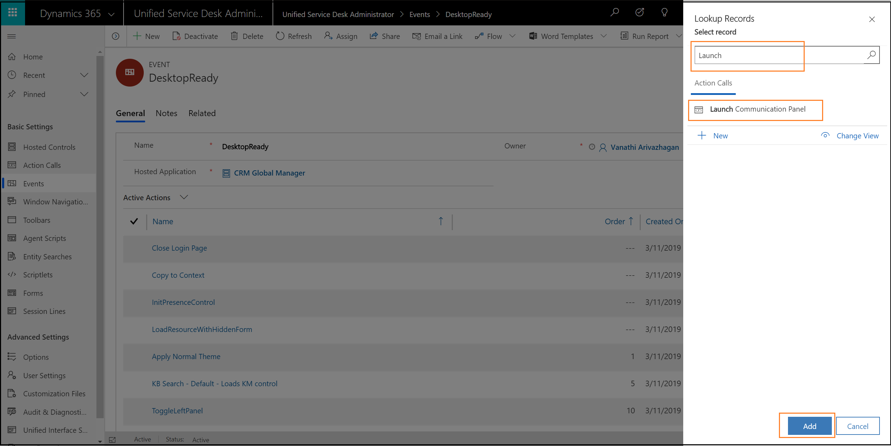

# Step 4:  Attach communication panel-related action calls to events 

[!INCLUDE[cc-use-with-omnichannel](../../includes/cc-use-with-omnichannel.md)]

This topic describes how to attach communication panel-related action calls to the out-of-the-box events in Unified Service Desk for Dynamics 365 Customer Service.

## Prerequisites

- You must have required Dynamics 365 Customer Service permissions to configure [!INCLUDE[pn_unified_service_desk](../../includes/pn-unified-service-desk.md)] and access the required Dynamics 365 Customer Service entities. [!INCLUDE[proc_more_information](../../includes/proc-more-information.md)] [Access management in Unified Service Desk](/dynamics365/customer-engagement/unified-service-desk/admin/security-unified-service-desk)

- You must have completed [Create agent and supervisor configurations in Unified Service Desk](create-agent-supervisor-configurations-unified-service-desk.md), [Step 1: Create communication panel entity search forms](communication-panel-step1-create-entity-searches.md), [Step 2: Create communication panel hosted control](communication-panel-step2-create-hosted-control.md), and [Step 3: Create action calls related to a communication panel](communication-panel-step3-create-action-calls.md). The configurations that you completed are required for this topic.

- You must be familiar with the following concepts in [!INCLUDE[pn_unified_service_desk](../../includes/pn-unified-service-desk.md)]:  
  
  - [Unified Service Desk Hosted Controls](/dynamics365/customer-engagement/unified-service-desk/unified-service-desk-hosted-controls)  
  
  - These three types of hosted controls: Connection Manager, Global Manager, and Panel Layout. [!INCLUDE[proc_more_information](../../includes/proc-more-information.md)] [Hosted control types, action, and event reference in Unified Service Desk](/dynamics365/customer-engagement/unified-service-desk/hosted-control-types-action-event-reference) 
  
  - Filter access using [!INCLUDE[pn_unified_service_desk](../../includes/pn-unified-service-desk.md)]. [!INCLUDE[proc_more_information](../../includes/proc-more-information.md)] [Manage access using Unified Service Desk configuration](/dynamics365/customer-engagement/unified-service-desk/admin/manage-access-using-unified-service-desk-configuration)

## Attach the action calls to events

1. Sign in to Common Data Service platform.

2. Select the Down arrow next to Dynamics 365.

3. Select **Unified Service Desk Administrator**.

4. Select **Events** and then select the event to which you want to add the action call. Select **DesktopReady**.

5. Select **Add Existing Action Call**. The **Lookup Records** pane appears.

     

6. In the **Lookup Records** pane, enter the name of the action call you want to add. Enter **Launch Communication Panel** in the search box and select the action from the list, and then select **Add**. The action call is added to the **DesktopReady** event.

    

7. Select **Save**.

8. Repeat steps 4 through 7 to add the following action calls to the corresponding events.

    | Event                              | Action call                                    |
    |------------------------------------|------------------------------------------------|
    | OmnichannelFetchConfigurationData | <ul> <li> Omnichannel Clear Entity List </li> <li>Omnichannel Fetch Live Work Streams </li> <li> Omnichannel Fetch Service End Point </li> <li>Omnichannel Save Configuration Data </li> </ul> |
    | OmnichannelUpdateConfigurationContext | <ul>Update Omnichannel Configuration</ul> |
    | AADAuthenticationFailed | <ul>Omnichannel AAD Authentication Failed</ul> |
    | CreateCustomerSession | <ul> <li>Omnichannel Activate Session</li> <li>Omnichannel Rehydrate Conversation</li> <li>Create Customer Session</li> <li>Show Session Assignment Toast Notification</li> <li>Set IsCaseSession to False</li> <li>Omnichannel Session Accepted</li> <li>Show Session Error Toast Notification</li> </ul> |
    | DisplayKBSearchControl | <ul> <li> Expand Right Pane </li> <li>Focus on KB Search</li> </ul> |
    | DisplayMessage | <ul>Display Message Action</ul> |
    | EndConversation | <ul> <li>Omnichannel End Conversation</li> <li>Omnichannel Presence Status Update</li> </ul> |
    | IncomingChatRequest | <ul>Omnichannel Incoming Session Request</ul> |
    | Omnichannel Conversation Control Ready | <ul> <li>Load Supervisor Dashboard</li> <li>Load Agent Home Page</li> <li>Omnichannel Communication Panel Loaded</li> <li>Load Supervisor Conversations</li> </ul> |
    | OmnichannelFetchContextEntities | <ul> <li>Omnichannel Clear Context Entities</li> <li>Omnichannel Copy Contact Ids To Context</li> <li>Omnichannel Fetch Context Contacts</li> <li>Omnichannel Save Context Entities</li></ul> |
    | OmnichannelFetchContextEntitiesOnUpdate | <ul> <li>Omnichannel Clear Context Entities</li> <li>Omnichannel Copy Contact Ids To Context</li> <li>Omnichannel Fetch Context Contacts</li> <li>Omnichannel Save Context Entities on Update</li> <li>Initialize Omnichannel Context - Window Variable - Customer Summary</li> <li>Refresh Customer Summary Controls</li> </ul> |
    | OmnichannelNotifyConversationControlError | <ul> Omnichannel Notify Communication Panel Error </ul> |
    | OmnichannelProxyHttpResponse | <ul>Omnichannel Proxy Response</ul> |
    | OmnichannelSessionTransferInitiated | <ul>Omnichannel Session Transfer Initiated</ul> |
    | OmnichannelSwitchToGlobalSession | <ul>Focus on Omnichannel Agent Dashboard</ul> |
    | OmnichannelUpdatePresenceGlobalContext | <ul> <li>Update Old Presence Status In Settings</li> <li>Update Current Presence Status In Settings</li></ul> |
    | OmnichannelUpdatePresenceParameters | <ul> <li>Update Current Presence Status In Settings</li> <li>Update All Presence State In Settings</li> </ul> |
    | EntityNotification | <ul> <li>ShowCaseEntityNotification</li> <li>ShowDefaultEntityNotification</li> </ul> |
    | UnreadMessage | <ul> Omnichannel Unread Message Action </ul> |
    | UpdatePresence | <ul> Omnichannel Update Presence </ul> |
    | UpdateSessionCount | <ul> Update Session Count in Dictionary </ul> |

> [!div class="nextstepaction"]
> [Next topic: Step 5: Configure window navigation rule for communication panel](communication-panel-step5-configure-window-navigation-rule.md) 

## See also

- [Step 1: Create communication panel entity search forms](communication-panel-step1-create-entity-searches.md)
- [Step 2: Create communication panel hosted control](communication-panel-step2-create-hosted-control.md)
- [Step 3: Attach communication panel-related action calls to events](communication-panel-step3-create-action-calls.md)
- [Step 6: Add the hosted control, action calls, window navigation rule, and events to configurations](communication-panel-step6-add-hosted-control-action-calls-events-configurations.md)
