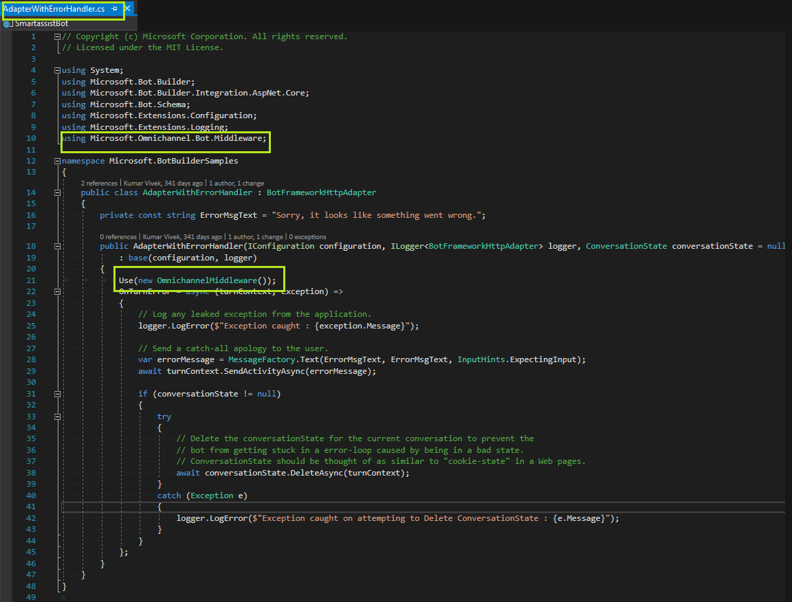

# Enable bot context NuGet package

[!INCLUDE[cc-use-with-omnichannel](../../../includes/cc-use-with-omnichannel.md)]

As a bot author, you can enable your Azure bot to understand context while authoring a bot flow. Bot context includes context name-value pairs for the current conversation and custom context passed by API programmatically. The Azure bot can transfer the context to Omnichannel for Customer Service by setting context name-value pairs and then display conversation context to an agent.

## Install the bot SDK in your project

1. To open the NuGet Package Manager, right-click your project and then click **Manage NuGet Packages.** Refer to [Nuget page](https://www.nuget.org/packages/Microsoft.Xrm.Omnichannel.BotSDK)

2. In the NuGet Package Manager, select the feedname **nuget.org** and search for "Microsoft.Xrm.Omnichannel.BotSDK". Select the package and click install.

>
    
Alternatively, you can use the following command in NuGet CLI: 

```
Install-Package Microsoft.Xrm.Omnichannel.BotSDK -version 1.0.0.4 
```
The bot SDK is now installed and the Omnichannel middleware is available in your project.

## Use the Omnichannel middleware in your bot code

Use this procedure if you have created your bot using Visual Studio Azure Bot template or Azure portal.

1. Open the file, **AdapterWithErrorHandler.cs**.

2. Add the import statement and instantiate the Omnichannel middleware.  

    ```
    using Microsoft.Omnichannel.Bot.Middleware; 
    Use(new OmnichannelMiddleware()); 
    ```

    


### See also

[Manage custom context](send-context-starting-chat.md)<br />
[setContextProvider](../reference/methods/setContextProvider.md)
