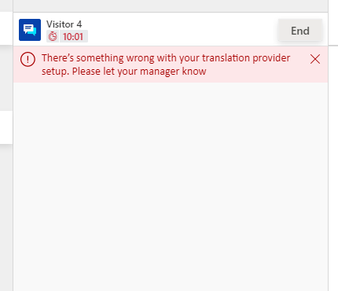

# Preview: initializeNewConversation

[!INCLUDE[cc-use-with-omnichannel](../../../../includes/cc-use-with-omnichannel.md)]

[!include[cc-beta-prerelease-disclaimer](../../../../includes/cc-beta-prerelease-disclaimer.md)]

This method is required to be implemented in web resource. It is called as soon as a new conversation invitation is accepted or existing conversation is opened from Agent Dashboard. 

1. You can choose to switch off or switch on the translation for the conversation; for example, you can decide whether you want to translate conversation messages based on the channel (e.g. Facebook, Live chat, Whatsapp etc.) of the incoming conversation or based on the pre-chat response. 
2. You can also override the agent's(C1) language to be used in translation for the conversation. 
3. It provides you various information about the conversation, e.g. based on certain information about the conversation, translation provider for a given conversation can be changed. 

> [!IMPORTANT]
> See this [sample web resource](https://github.com/microsoft/Dynamics365-Apps-Samples/tree/master/customer-service/omnichannel/real-time-translation Lorem Ipsum TODO) for more information on how to implement the `initializeNewConversation` API.

## Syntax

`Microsoft.Omnichannel.TranslationFramework.initializeNewConversation(conversationConfig)`

## Parameters

|Name|Required|Type|Description|
|----|----|----|----|
|`conversationConfig`|Yes| JSON object| Provides details about conversation. Such as conversation id, default agent input language (From Realtime translation administrator configuration) etc. <br />Please find more details in next paragraphs.|

Here is the structure of `conversationConfig` parameter.

```json
interface InviteParams {// Parameters received on a conversation invite 
        inviteLocale: string;  //Language locale of the channel from where conversation is received. This contains locale id, example- "1033" for english.
        channelType: string;   //The type of the channel, example- "lcw" for chat widget, "facebook" for facebook.
} 


interface conversationConfig { 
        conversationId: string,  // Unique Id for conversation in Omnichannel for Customer Service
        c1Language: string;      // Default agent input language (From Realtime translation administrator configuration)
        inviteParams: InviteParams;  // Parameters received on a conversation invite  
}
```
The `inviteLocale` parameter in `InviteParams` interface represents a Locale ID. More information: [Locale ID](https://docs.microsoft.com/openspecs/office_standards/ms-oe376/6c085406-a698-4e12-9d4d-c3b0ee3dbc4a).

The `channelType` parameter in `InviteParams` interface represents a supported channel in Omnichannel for Customer Service. More information: [List of channel](https://add your link here Lorem Ipsum TODO).

Given below is a sample of the `conversationConfig` parameter.

```json
conversationConfig = {
  "conversationId": "2f67af9e-c05a-4784-aaea-916d6938fcea",
  "c1Language": "1033",
  "inviteParams": {
    "inviteLocale": "3082",
    "channelType": "lcw"
  }
}
```


## Return Value

Returns the `InitializedConversationResponse` object, which contains the Boolean value for the `keepTranslationOn` parameter.

**Interface object**

```
InitializedConversationResponse  {
        keepTranslationOn: Boolean;
}
```

**Sample expected response**

```json
InitializedConversationResponse = 
{
  "keepTranslationOn": true
}
```

On exception in this method, invalid return values. Omnichannel for Customer Service will keep translation off for the conversation. You will need to do minimal processing in this function, as it make the UI wait before rendering.




### See also

[Add a web resource for real-time translation](../../how-to/add-web-resource-real-time-translation.md)
