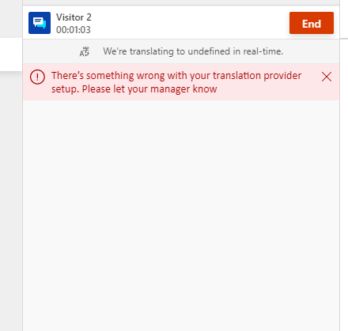

# translateMessage

[!INCLUDE[cc-use-with-omnichannel](../../../../includes/cc-use-with-omnichannel.md)]

[!include[cc-beta-prerelease-disclaimer](../../../../includes/cc-beta-prerelease-disclaimer.md)]

This method is called for every conversation message exchanged between the customer and the agent, if translation is on and if the message has not been translated earlier in the conversation.

> [!IMPORTANT]
> See this [sample web resource](TODO add a link) for more information on how to implement the `translateMessage` API.

## Syntax

`Microsoft.Omnichannel.TranslationFramework.translateMessage(conversationId, translationConfig)`

## Parameters

|Name|Type|Description|
|----|----|----|
|`translationConfig`|Javascript object| Consists of `conversationId`, `messagePayload` and `translateToC1orC2` key-value pairs.|

Here is the structure of `translationConfig` parameter.

```json

export class UserType { 
        public static readonly C1 = "Agent"; //Used if the sender of the message is agent
        public static readonly C2 = "Customer"; //Used if the sender of the message is customer
        public static readonly CONSULT = "Consult Agent"; //Used if the sender of the message is other than agent or customer
} 
 
export class TranslateTo { 
        public static readonly C1 = "Agent"; //Used if message is translated for agent
        public static readonly C2 = "Customer"; //Used if message is translated for customer
} 
 
export class MessageContentType { 
        public static readonly Text = "Text"; //Used if the content type is text
} 
     
interface Sender { 
        userType: UserType;  //Points to any static field in UserType type,Represents the type of the user who is sending this message
} 

interface MessagePayload { 
        content: string;                 //Contains the content to be translated
        contentType: MessageContentType;  //Points to any static field in MessageContentType type,Represents the type of message content. For example: "Text" etc.
        sender: Sender; //Implements Sender interface, Represents the sender of the message
} 

interface translationConfig { 
        conversationId: string;   //Unique Id for conversation in Omnichannel for Customer Service
        messagePayload: MessagePayload;  //Implements MessagePayload interface, Represents the payload for the message to be translated
        translateToC1orC2: TranslateTo;   //Points to any static field in TranslateTo type,Represents for whom the message has to be translated 
 } 
```

Given below is a sample of the `conversationConfig` parameter.

```json
translationConfig = {
  "conversationId": "2b330c52-6844-4d36-8e05-03c78c9681dc",
  "messagePayload": {
    "content": "Hello",
    "contentType": "Text",
    "sender": {
      "userType": "Agent"
    }
  },
  "translateToC1orC2": "Customer"
}
```

## Return Value

Returns the translated message, the source language and the destination language.

The `inviteLocale` parameter in `InviteParams` interface represents a Locale ID. More information: [Locale ID](https://docs.microsoft.com/openspecs/office_standards/ms-oe376/6c085406-a698-4e12-9d4d-c3b0ee3dbc4a).

**Interface object**

```
export interface ErrorObject{ 
        isError: boolean;               // represents yes for error and no otherwise.
        errorCode: ErrorCodes;   //represents the type of error based on errorCode
} 

export interface TranslatedMessageResponse { 
        translatedMessage: string;  // contains the translated message
        sourceLanguage: string;       //represents the language locale of the original content 
        destinationLanguage: string;  // represents the language locale of the translated content
        errorObject?: ErrorObject;  //represents the error object for any error scenarios
}
```

**Sample response**

```json
{
  "translatedMessage": "Hola",
  "destinationLanguage": "3082",
  "errorObject": {
    "isError": false,                             
    "errorCode": null
  },
  "sourceLanguage": "3082"
}
```

## Error codes

|Error message|Error code|Description|
|-----|-----|-----|
|MESSAGE_TOO_LONG|100|Error code for very long message which the translation service cannot translate|
|LANGUAGE_NOT_SUPPORTED|101|Error Code for language not supported by the translation service|
|MESSAGE_NOT_TRANSLATED|102|Error Code for message not translated by the translation service|
|TRANSLATION_SERVICE_LIMIT_EXCEEDED|103|Error code if the quota limit exceeded for the translation service|
|TRANSLATION_FAILED|104|Error Code if the translation service failed to translate a message|
|UNRECOGNIZED_TEXT|105|Error Code if the text is not recognized by the translation service|
|UNRECOGNIZED_ERROR|200|Error Code if there is any error other than the listed one.|

In case of an exception while calling this method, Omnichannel for Customer Service will not retry and instead will display a translation failed error message in a dialog box.

In case the return value is invalid, an error message on the translation banner will appear in the conversation control.

If this method is not implemented, then the message will not be translated and the following error will be displayed to the agent.



### See also

[Add a web resource for real-time translation](../../how-to/add-web-resource-real-time-translation.md)
