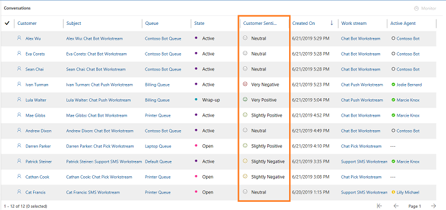

# Monitor conversations

[!INCLUDE[cc-use-with-omnichannel](../../includes/cc-use-with-omnichannel.md)]

As a supervisor, you can monitor the conversations that are being handled by agents. Monitoring the conversations helps you in identifying the conversations that need your attention to provide your expertise or suggestions to close. You can select a conversation from the dashboard and choose the **Monitor** action from the grid command bar. You can also join a conversation. When you join, notifications are sent to agent and customer who are in the conversation about your presence. You join the conversation in consult mode. The consult mode helps to provide your expertise to the agent who is interacting with the customer when necessary.

Use the **Omnichannel Ongoing Conversations** dashboard to monitor conversations between customers and agents. To learn more, see [Omnichannel Ongoing Conversations dashboard](ongoing-conversations-dashboard.md).

The following screen shot is an example of **Omnichannel Ongoing Conversations**:

> [!div class=mx-imgBorder]
> 

## Things you must know

Before you start using the **Omnichannel Ongoing Conversations** dashboard, here are a few things you must be aware of:

-	You can monitor only the conversations that are in the workstream with mode as **Chat**.

-	You can monitor only conversations that are in the **Active** and **Wrap-up** states.

-	You cannot monitor conversations that are assigned to you.

## Monitor and join a conversation

By monitoring the conversations, you will get an overview of how each conversation is tending (such as sentiments and agent responses) and can choose to join a conversation that may need your attention. 
  
By joining the conversation, you provide necessary inputs to both agent and customer based on the selected message mode (public or internal) in the communication panel.

1.	Sign in to Dynamics 365 Customer Service and go to **Omnichannel for Customer Service** app.

2.  From the dashboard view selector, select **Omnichannel Ongoing Conversations** dashboard.

    The list of conversations that currently handled by your agents are displayed. 

2.	Choose a conversation to monitor and select **Monitor**.

    > [!div class=mx-imgBorder]
    > 

    The conversation page opens.

3.	You can choose to join a conversation as required. Select **Join chat** in the conversation panel.

    > [!div class=mx-imgBorder]
    > 

    When you join the conversation, a notification will be sent to both agent and customer stating that you have joined as a consultant. Depending on your requirement, you can start consultation with agent and customer by using a messaging mode (public or internal). By default, the messaging mode is internal.
    
    To learn more, see [View communication panel](../agent/agent-oc/oc-conversation-control.md).

## Analyze chat and SMS sentiment

As a supervisor to ensure positive customer outcome, you must identify negative sentiment events in the conversation between the agents and customers. After identifying, you can provide timely inputs to agent to resolve the issue by monitoring and joining the conversation. To learn more, see [Monitor and join a conversation](#monitor-and-join-a-conversation)

> [!NOTE]
> If you are unable to see the **Customer Sentiment** column, contact your administrator to enable the sentiment analysis. To learn more, see [Enable sentiment analysis](../administrator/enable-sentiment-analysis.md) 

Real-time sentiment tracking enables you to identify chat and SMS sessions that are going well or that may need monitoring. The sentiments are scored in seven intensities ¬ Three positive, three negative, and one neutral gradients. These sentiment intensities are displayed based on the previous six customer messages. The following table explains the gradients in detail:

| Gradient | Description |
|----------|-------------|
| | Customer sentiment is very negative. |
|  | Customer sentiment is negative. |
|  | Customer sentiment is slightly negative. |
|  | Customer sentiment is neutral. |
|  | Customer sentiment is slightly positive. |
|  | Customer sentiment is positive. |
|  | Customer sentiment is very positive. |
|  | Session has less than six customer messages. | 

The following screen shows an example of sentiment column in Omnichannel Ongoing Conversation dashboard.

> [!div class=mx-imgBorder]
> 

### See also

-  [Configure intraday insights dashboard for Unified Service Desk](../administrator/configure-intraday-dashboard-supervisor.md)

-  [Enable sentiment analysis](../administrator/enable-sentiment-analysis.md)
