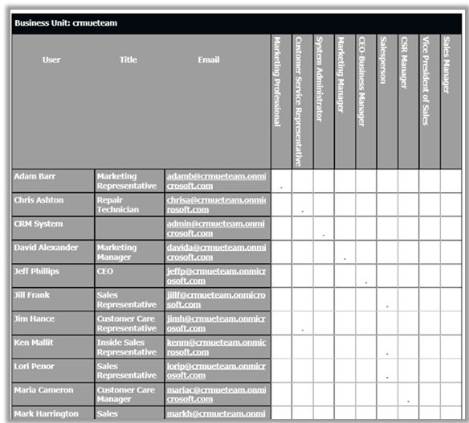

# Reports for customer service insights

[!INCLUDE[pn_dynamics_crm](../includes/pn-dynamics-crm.md)] includes many system reports that you can use to gain insights into how your business is doing. You can use these reports as is or customize them for your needs. For more information about customized reports, see [Customize and organize reports](../customize/customize-organize-reports.md). The following will provide administrative reports: 

|Description|More information|  
|-----------------|----------------------|  
|List of users|[User Summary report](../basics/user-summary-report.md#BKMK_UserSummary)|  

  
## User Summary report
Keep user information up to date by running a User Summary report.   
Get a list of all your users, including their contact information and security role in [!INCLUDE[pn_dynamics_crm](../includes/pn-dynamics-crm.md)].  
  
   
  
### See also  
 [Run a report](../basics/run-report.md)   
 [Create, edit, or copy a report using the Report Wizard](../basics/create-edit-copy-report-wizard.md)   
 [Troubleshoot problems with data not displaying in a report](../basics/troubleshoot-reports.md)
