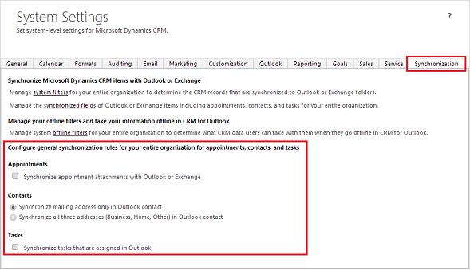

# Configure synchronization for appointments, contacts, and tasks
By default, some synchronization between Dynamics 365 and Outlook for Dynamics 365 apps is disabled so organizations can control what gets synced according to their business requirements. Dynamics 365 apps admins can enable synchronization using **Settings** > **Administration** > **System Settings** > **Synchronization**.  
  
> [!NOTE]
>  Users should have the latest [Dynamics 365 for Outlook](https://go.microsoft.com/fwlink/?LinkID=690396) installed.

 This topic covers the highlighted settings below.

 

## Enable appointment attachment synchronization with Outlook or Exchange

> [!NOTE]
>  This section applies to message synchronization done through [!INCLUDE[pn_microsoft_dynamics_crm_for_outlook](../../includes/pn-microsoft-dynamics-crm-for-outlook.md)] or server-side synchronization. [!INCLUDE[proc_more_information](../../includes/proc-more-information.md)] [Integrate your email system](../../admin/integrate-synchronize-your-email-system.md) 
  
 Users can attach documents, pictures, recordings, etc. to the appointments they create in the [!INCLUDE[pn_crm_shortest](../../includes/pn-crm-shortest.md)] web application or [!INCLUDE[pn_crm_for_outlook_short](../../includes/pn-crm-for-outlook-short.md)]. By default, appointment attachment synchronization is disabled. To enable:  
  
1. [!INCLUDE[proc_settings_administration](../../includes/proc-settings-administration.md)]  
  
2. Choose **System Settings**, then choose **Synchronization**.  
  
3. Choose **Synchronize appointment attachments with Outlook or Exchange**  
  
   **Considerations**  
  
-   When you disable attachment synchronization, the attachments will not appear in appointments in Dynamics 365 apps but will remain in Dynamics 365 for Outlook appointments.  
  
-   Recurring appointment attachment synchronization is not supported. When users synchronize recurring appointments with attachments, the attachments do not synch.  
  
-   Attachments could affect synchronization times so you may want to use attachments sparingly if attached to a low bandwidth network.  
  
-   Service activity attachment synchronization is not supported.  
  
## Address synchronization for Contacts  
  
> [!NOTE]
>  This section applies to message synchronization done through [!INCLUDE[pn_crm_for_outlook_short](../../includes/pn-crm-for-outlook-short.md)] or server-side synchronization. [!INCLUDE[proc_more_information](../../includes/proc-more-information.md)] [Integrate your email system](../../admin/integrate-synchronize-your-email-system.md)

 Admins have two options they can specify for how contact synchronization occurs.

 **Synchronize mailing address only in Outlook contact**

 By default, just one [!INCLUDE[pn_Outlook_short](../../includes/pn-outlook-short.md)] mailing address field is synchronized between [!INCLUDE[pn_crm_shortest](../../includes/pn-crm-shortest.md)] and [!INCLUDE[pn_Outlook_short](../../includes/pn-outlook-short.md)]. This is sufficient for most organizations.

 **Synchronize all three addresses (Business, Home, Other) in Outlook contact**

 Choose this option to synchronize all three Outlook mailing address fields (Business, Home, and Other fields) between [!INCLUDE[pn_crm_shortest](../../includes/pn-crm-shortest.md)] and [!INCLUDE[pn_Outlook_short](../../includes/pn-outlook-short.md)].

> [!WARNING]
>  Enabling this option can cause data loss if you have existing data. This is due to the remapping of the attributes for existing tracked contacts. We recommend you test this option prior to deployment to understand how the re-mapping affects your environment and your data. In most cases, you should have the full data in one side (normally in [!INCLUDE[pn_crm_shortest](../../includes/pn-crm-shortest.md)]) and have them sync to the other side (normally [!INCLUDE[pn_Outlook_short](../../includes/pn-outlook-short.md)] or [!INCLUDE[pn_Exchange](../../includes/pn-exchange.md)]).  
> 
>  [!INCLUDE[proc_more_information](../../includes/proc-more-information.md)] [Which fields can be synchronized between Dynamics 365 apps and Outlook?](which-fields-synchronized.md)
  
## Enable synchronization for tasks that are assigned in Outlook  
  
> [!NOTE]
>  This section applies to message synchronization done through [!INCLUDE[pn_crm_for_outlook_short](../../includes/pn-crm-for-outlook-short.md)] only. [!INCLUDE[proc_more_information](../../includes/proc-more-information.md)] [Integrate your email system](../../admin/integrate-synchronize-your-email-system.md)

 By default, task synchronization is disabled. User created tasks in [!INCLUDE[pn_crm_for_outlook_short](../../includes/pn-crm-for-outlook-short.md)] are not synchronized with the [!INCLUDE[pn_crm_shortest](../../includes/pn-crm-shortest.md)] web application. To enable:

1. [!INCLUDE[proc_settings_administration](../../includes/proc-settings-administration.md)]

2. Choose **System Settings**, then choose **Synchronization**.

3. Choose **Synchronize tasks that are assigned in Outlook**

   **Considerations**

-   Recurring task synchronization is not supported. When users synchronize recurring tasks, the tasks do not synch.

-   The person assigning the task and the person the task is assigned to must be in the same organization.

-   Tasks cannot be synchronized to multiple email addresses.

[!INCLUDE[footer-include](../../includes/footer-banner.md)]