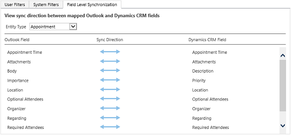

# Control field synchronization between Dynamics 365 and Dynamics 365 for Outlook
With field synchronization, admins can set the sync direction between [!INCLUDE[pn_microsoftcrm](../../includes/pn-microsoftcrm.md)] and [!INCLUDE[pn_microsoft_dynamics_crm_for_outlook](../../includes/pn-microsoft-dynamics-crm-for-outlook.md)] fields. You can control synchronization when using either [!INCLUDE[pn_Outlook_short](../../includes/pn-outlook-short.md)] synchronization or server-side synchronization ([!INCLUDE[pn_Exchange](../../includes/pn-exchange.md)]).  
  
 For example, a salesperson may want to take personal notes about a contact and not want the notes to synchronize with [!INCLUDE[pn_crm_shortest](../../includes/pn-crm-shortest.md)] data available to all users. You can set the Personal Notes field for contacts in Outlook to not [!INCLUDE[pn_crm_for_outlook_short](../../includes/pn-crm-for-outlook-short.md)] with [!INCLUDE[pn_crm_shortest](../../includes/pn-crm-shortest.md)] so the salesperson’s notes will remain private.  
  
> [!TIP]
>   Check out the following video: [Configurability in Synchronizing Data with Outlook or Exchange in Microsoft Dynamics CRM 2015](http://youtu.be/BMZsVUuaklo?list=PLC3591A8FE4ADBE07)  
  
## Set field synchronization between Dynamics 365 and Dynamics 365 for Outlook  
  
1.  In Dynamics 365,  [!INCLUDE[proc_settings_email_config](../../includes/proc-settings-email-config.md)]  
  
2.  Choose **Email Configuration Settings**.  
  
3.  Choose the **Synchronization** tab > **synchronized fields**  
  
4.  For the fields you want to change synchronization, choose the arrows in the Sync Direction column. Each choice will change the direction.  
  
       
  
    > [!TIP]
    >  Hover over a field name to see the fields mapped to it.  
  
5.  Choose **OK** > **OK** to close the open dialog boxes.  
  
 Let your users know they can view (not change) the synchronization settings. [!INCLUDE[proc_more_information](../../includes/proc-more-information.md)] [Which fields can be synchronized between Dynamics 365 and Outlook?](which-fields-synchronized.md)  
  
## Performance and synchronization  
 Configuring synchronization might have an impact on the time it takes to sync between [!INCLUDE[pn_crm_for_outlook_short](../../includes/pn-crm-for-outlook-short.md)] and [!INCLUDE[pn_crm_shortest](../../includes/pn-crm-shortest.md)]. You should test your configuration before deploying to ensure satisfactory sync times.  
  
## Permissions and synchronization  
 Role-based security controls access to a specific entity type, record-based security controls access to individual records, and field-level security controls access to specific fields. All these can impact what is synchronized between [!INCLUDE[pn_crm_shortest](../../includes/pn-crm-shortest.md)] and [!INCLUDE[pn_crm_for_outlook_short](../../includes/pn-crm-for-outlook-short.md)] or [!INCLUDE[pn_Exchange](../../includes/pn-exchange.md)].  
  
 Best practice is to review the security settings for these security methods to ensure field synchronization is processes as desired. For more information see:  
  
-   Securing roles: [Create or edit a security role to manage access](../../admin/create-edit-security-role.md)
  
-   Securing fields: [Enable or disable security for a field](https://technet.microsoft.com/library/mt812240.aspx)  
  
 [!INCLUDE[proc_more_information](../../includes/proc-more-information.md)] [Security concepts](../../admin/security-concepts.md)
