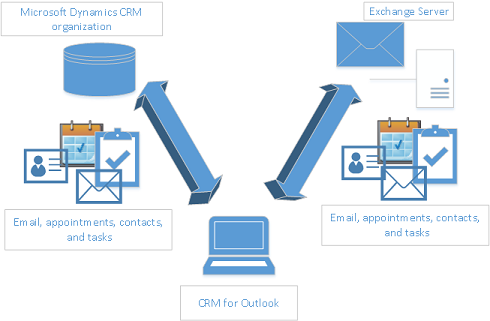

# Dynamics 365 for Outlook Administrator Guide

> [!IMPORTANT]
> Effective October 1 2020, the legacy Dynamics 365 for Outlook (also referred to as Outlook COM add-in) is retired. Customers must transition to the modern [Dynamics 365 App for Outlook](https://docs.microsoft.com/dynamics365/outlook-app/overview) at the earliest. Microsoft will not provide support or any futher updates (including security and critical updates) to the Outlook COM Add-in.
>
> 
> Starting December 4, 2020 the legacy Dynamics 365 for Outlook (also referred to as Outlook COM add-in) will be removed and users will no longer be able to use Outlook COM add-in. This removal will happen by geographic location and follows the weekly release schedule.
>
> For further information and steps to make a smooth transition, download [Dynamics 365 for Outlook (COM add-in) Playbook](https://aka.ms/OutlookCOMPlaybook).

[!INCLUDE[pn_crm_for_outlook_full](../../includes/pn-crm-for-outlook-full.md)] can synchronize email messages, contacts, tasks, and appointments between [!INCLUDE[pn_MS_Outlook_Full](../../includes/pn-ms-outlook-full.md)] and Dynamics 365 (client-to-server synchronization). Similar to [!INCLUDE[cc_server_side_synch](../../includes/cc-server-side-synch.md)], synchronization filters are used to synchronize messaging data from Dynamics 365 to [!INCLUDE[pn_Outlook_short](../../includes/pn-outlook-short.md)] or [!INCLUDE[pn_Exchange](../../includes/pn-exchange.md)]. Manually tracked or Inbox-rule based tracking is used to synchronize messaging data from [!INCLUDE[pn_Exchange](../../includes/pn-exchange.md)] or [!INCLUDE[pn_Outlook_short](../../includes/pn-outlook-short.md)] to Dynamics 365.  
  
   
  
 When you use [!INCLUDE[pn_crm_for_outlook_short](../../includes/pn-crm-for-outlook-short.md)], there are a few synchronization concepts that are helpful to understand. Notice that, to have any of this [!INCLUDE[pn_crm_for_outlook_short](../../includes/pn-crm-for-outlook-short.md)] functionality, each [!INCLUDE[pn_microsoftcrm](../../includes/pn-microsoftcrm.md)] user must run the [!INCLUDE[pn_crm_for_outlook_short](../../includes/pn-crm-for-outlook-short.md)] add-in and the Dynamics 365 user mailbox record must be configured appropriately.  
  
 When you select [!INCLUDE[pn_crm_for_outlook_short](../../includes/pn-crm-for-outlook-short.md)] as the messaging data synchronization method in the user mailbox record, email, contacts, appointments, and tasks created in [!INCLUDE[pn_Outlook_short](../../includes/pn-outlook-short.md)] are synchronized with Dynamics 365 apps or Customer Engagement (on-premises).  
 
 > [!IMPORTANT]
> - You must have the latest version of Dynamics 365 for Outlook (version 8.2.3) to connect to Dynamics 365 apps version. Version 8.2.3 provides support for [Transport Layer Security (TLS) 1.2](https://blogs.msdn.microsoft.com/crm/2017/09/28/updates-coming-to-dynamics-365-customer-engagement-connection-security/) required for connecting Dynamics 365 for Outlook and Dynamics 365 apps. For more information, see [Update for Dynamics 365 for Outlook](https://support.microsoft.com/help/3205084/december-2016-update-for-dynamics-365-online-and-on-premises).
> - When using Dynamics 365 for Outlook version 9.0 in offline mode, attachments to synchronized records won't be available in the offline mode. If there is an attachment to a record, the attachment will only be available when you are back online. If you added an attachment to a record in offline mode, the attachment will be synchronized to the server when you are back online. To use attachments in offline mode, consider saving the attachment your device.
> - The offline capability in [!INCLUDE[pn_crm_for_outlook_short](../../includes/pn-crm-for-outlook-short.md)] version 9.0 is not available in Dynamics 365 Customer Engagement (on-premises). 
> - Customizations that have dependency on the SQL database engine and the local offline instance of Dynamics 365 for Outlook aren't supported.
> - Microsoft Dynamics 365 for Outlook is not enabled on [Common Data Service](/powerapps/maker/common-data-service/data-platform-intro).
 
  
## Dynamics 365 for Outlook synchronization concepts  
 Note the following concepts when you use [!INCLUDE[pn_crm_for_outlook_short](../../includes/pn-crm-for-outlook-short.md)] as the synchronizing agent:  
  
1. **Synchronizing organization**. Only one organization can be designated as the synchronizing organization. If you have more than one Dynamics 365 organization configured, you can view the synchronizing organization in the [!INCLUDE[pn_Configuration_Wizard_long](../../includes/pn-configuration-wizard-long.md)]. The [!INCLUDE[pn_configuration_wizard](../../includes/pn-configuration-wizard.md)] is an application included with [!INCLUDE[pn_crm_for_outlook_short](../../includes/pn-crm-for-outlook-short.md)]. Notice that you can still connect to additional organizations by using [!INCLUDE[pn_crm_for_outlook_short](../../includes/pn-crm-for-outlook-short.md)]. However, when an organization is not defined as the synchronizing organization in [!INCLUDE[pn_crm_for_outlook_short](../../includes/pn-crm-for-outlook-short.md)], messaging data in [!INCLUDE[pn_Outlook_short](../../includes/pn-outlook-short.md)] does not synchronize with that organization.  
  
2. **Synchronizing mailbox**. Only one [!INCLUDE[pn_Exchange](../../includes/pn-exchange.md)] or POP3 mailbox can be designated for a single [!INCLUDE[pn_microsoftcrm](../../includes/pn-microsoftcrm.md)] user. You cannot designate multiple mailboxes and you cannot map more than one [!INCLUDE[pn_microsoftcrm](../../includes/pn-microsoftcrm.md)] user to a single [!INCLUDE[pn_Exchange](../../includes/pn-exchange.md)] or POP3 email mailbox. This mailbox is referred to as the primary mailbox.  
  
3. **Synchronizing Dynamics 365 for Outlook instance**. Only one [!INCLUDE[pn_crm_for_outlook_short](../../includes/pn-crm-for-outlook-short.md)] instance can be designated as the Synchronizing [!INCLUDE[pn_crm_for_outlook_short](../../includes/pn-crm-for-outlook-short.md)] instance. When you sign-in to an organization from another PC that is running [!INCLUDE[pn_crm_for_outlook_short](../../includes/pn-crm-for-outlook-short.md)] that is not the synchronizing [!INCLUDE[pn_crm_for_outlook_short](../../includes/pn-crm-for-outlook-short.md)] instance you will receive a dialog message asking whether you want to designate the current [!INCLUDE[pn_crm_for_outlook_short](../../includes/pn-crm-for-outlook-short.md)] instance as the synchronizing [!INCLUDE[pn_crm_for_outlook_short](../../includes/pn-crm-for-outlook-short.md)] instance. Notice that, when you choose not to set the [!INCLUDE[pn_crm_for_outlook_short](../../includes/pn-crm-for-outlook-short.md)] instance as the synchronizing instance, you can still connect to the [!INCLUDE[pn_microsoftcrm](../../includes/pn-microsoftcrm.md)] organization and perform tasks, but messaging data in [!INCLUDE[pn_Outlook_short](../../includes/pn-outlook-short.md)] will not synchronize with the [!INCLUDE[pn_microsoftcrm](../../includes/pn-microsoftcrm.md)] organization.  
  
4. **Go Offline data sync**. Go offline capability uses [!INCLUDE[pn_ms_SQL_Server_Express_long](../../includes/pn-ms-sql-server-express-long.md)] as the local data store. When you go offline or come back online, [!INCLUDE[pn_crm_for_outlook_short](../../includes/pn-crm-for-outlook-short.md)] synchronizes the records for the entity types you choose with the [!INCLUDE[pn_CRM_Online](../../includes/pn-crm-online.md)] or [!INCLUDE[pn_crm_op_edition](../../includes/pn-crm-op-edition.md)]. When you go offline or come back online, a separate synchronization process takes place that is not part of the messaging data synchronization described here. Go offline capability allows users to create, modify, or delete records offline that can be later synchronized to [!INCLUDE[pn_CRM_Online](../../includes/pn-crm-online.md)] or [!INCLUDE[pn_crm_op_edition](../../includes/pn-crm-op-edition.md)] when [!INCLUDE[pn_crm_for_outlook_short](../../includes/pn-crm-for-outlook-short.md)] comes online again.  
  
## Privacy notices  
 [!INCLUDE[cc_privacy_crm_outlook1](../../includes/cc-privacy-crm-outlook1.md)]  
  
 [!INCLUDE[cc_privacy_crm_go_offline_in_outlook](../../includes/cc-privacy-crm-go-offline-in-outlook.md)]  
  
 [!INCLUDE[cc_privacy_crm_sync_to_outlook](../../includes/cc-privacy-crm-sync-to-outlook.md)]  
