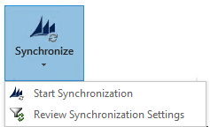
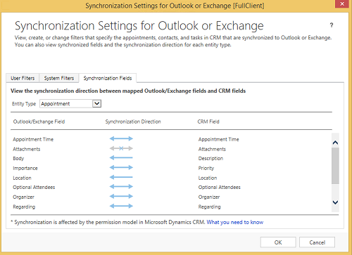

# View the fields that are synchronized between Dynamics 365 apps and Dynamics 365 for Outlook
In [!INCLUDE[pn_crm_2015_outlook](../../includes/pn-crm-2015-outlook.md)] or later, you can view the appointments, contacts, and tasks fields that are synchronized between [!INCLUDE[pn_microsoftcrm](../../includes/pn-microsoftcrm.md)] and [!INCLUDE[pn_Outlook_short](../../includes/pn-outlook-short.md)] so you can see where the data is coming from. You can also determine whether the fields:  

- Are synchronized one way (from [!INCLUDE[pn_Outlook_short](../../includes/pn-outlook-short.md)] to [!INCLUDE[pn_crm_shortest](../../includes/pn-crm-shortest.md)] **or** from [!INCLUDE[pn_crm_shortest](../../includes/pn-crm-shortest.md)] to [!INCLUDE[pn_Outlook_short](../../includes/pn-outlook-short.md)])  

- Are synchronized two way (from [!INCLUDE[pn_Outlook_short](../../includes/pn-outlook-short.md)] to [!INCLUDE[pn_crm_shortest](../../includes/pn-crm-shortest.md)] **and** from [!INCLUDE[pn_crm_shortest](../../includes/pn-crm-shortest.md)] to [!INCLUDE[pn_Outlook_short](../../includes/pn-outlook-short.md)])  

- Aren’t synchronized  

  For example, if the fields are synchronized one way, from [!INCLUDE[pn_crm_shortest](../../includes/pn-crm-shortest.md)] to [!INCLUDE[pn_Outlook_short](../../includes/pn-outlook-short.md)], you can update the field in [!INCLUDE[pn_Outlook_short](../../includes/pn-outlook-short.md)] and save the change, but your changes won’t be synced with [!INCLUDE[pn_crm_shortest](../../includes/pn-crm-shortest.md)], and will be overwritten if the same field value is changed in [!INCLUDE[pn_crm_shortest](../../includes/pn-crm-shortest.md)]. So if fields are synced one way, there’s no need to change the value in the synchronized field.  

## View the synchronized fields  

1. In [!INCLUDE[pn_crm_for_outlook_short](../../includes/pn-crm-for-outlook-short.md)], click **File**, and then click **[!INCLUDE[pn_crm_shortest](../../includes/pn-crm-shortest.md)]**.  

2. On the **Synchronize** button, click the down arrow, and then click **Review Synchronization Settings**.  

      

3. In the **Synchronization Settings for [!INCLUDE[pn_Outlook_short](../../includes/pn-outlook-short.md)] or [!INCLUDE[pn_Exchange](../../includes/pn-exchange.md)]** dialog box, click the **Synchronization Fields** tab.  

      

4. In the **Entity Type** list, select the record type you want to view.  

    [!INCLUDE[pn_Outlook_short](../../includes/pn-outlook-short.md)] fields are displayed on the left and the corresponding [!INCLUDE[pn_crm_shortest](../../includes/pn-crm-shortest.md)] fields are displayed on the right. The blue arrows show the sync direction:  

   |                                                                                                                                   |                                                                                                                                                            |
   |-----------------------------------------------------------------------------------------------------------------------------------|------------------------------------------------------------------------------------------------------------------------------------------------------------|
   |                                                        **This indicator**                                                         |                                                                 **Shows that the fields**                                                                  |
   |  in Dynamics 365 apps") | Are synced one way from [!INCLUDE[pn_Outlook_short](../../includes/pn-outlook-short.md)] to [!INCLUDE[pn_crm_shortest](../../includes/pn-crm-shortest.md)] |
   |   in Dynamics 365 apps")   | Are synced one way from [!INCLUDE[pn_crm_shortest](../../includes/pn-crm-shortest.md)] to [!INCLUDE[pn_Outlook_short](../../includes/pn-outlook-short.md)] |
   |                        |                                                                     Are synced two way                                                                     |
   |               |                                                                       Aren’t synced                                                                        |

   > [!NOTE]
   >  Field synchronization direction can be impacted by security settings configured by your system administrator. For example, if you don’t have read privileges for a field, it won’t be synchronized in [!INCLUDE[pn_Outlook_short](../../includes/pn-outlook-short.md)] even if the field is configured for two-way synchronization. To determine whether you have read privileges for a field, click the **View in [!INCLUDE[pn_crm_shortest](../../includes/pn-crm-shortest.md)]** button to open the record in [!INCLUDE[pn_crm_shortest](../../includes/pn-crm-shortest.md)]. If you see the **Lock** icon, you can’t access the field.  

### See also  
 [Which fields can be synchronized between Dynamics 365 apps and Outlook?](../admin-guide/which-fields-synchronized.md)
 [Control field synchronization between Dynamics 365 apps and Dynamics 365 for Outlook](../admin-guide/control-field-synchronization.md)
 [How field security affects synchronization with Outlook](../../admin/how-field-security-affects-synchronization-between-outlook.md)
