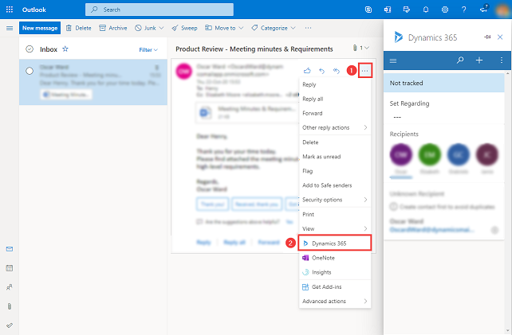
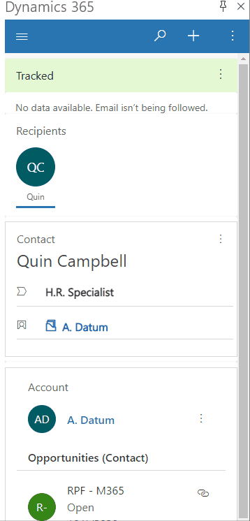

# Basic navigation in App for Outlook

Use Dynamics 365 App for Outlook to tap the power of your Dynamics 365 apps while you’re using Outlook on the desktop, web, or phone. When Dynamics 365 App for Outlook is installed, depending on which version of the app you have installed, you'll see a Dynamics 365 pane or window next to a selected Outlook email message, or when you're composing an email message or setting up a meeting or appointment.

To access the Dynamis 365 pane, do the following:

- On the Outlook desktop client, select **Dynamics 365**.

   > [!div class="mx-imgBorder"] 
   >   
   
- On the Outlook Web App, open an email and then select More (...) > **Dynamics 365**.

   > [!div class="mx-imgBorder"] 
   >   

## Site map

Use the site map to navigate to the **Home**, **Recent** items, **Pinned** items and **Dashboards**.

### Site map menu items

It's easy to get around and get back to your favorite or most-used rows. The following illustration shows the primary navigation elements

Legend

1. **Home**: Take you to the Dynamics 365 App for Outlook main screen that displays tracking status, the regarding row with contextual information.
2. **Recent**: Expand this entry to view a list of rows you were recently using. Select a row here to open it. Select the push-pin icon next to a row listed here to add it to your pinned rows.
3. **Pinned**: Expand this entry to view and open your favorite pinned rows. Use the **Recent** list to add rows here. Select the remove-pin icon next to a row listed here to remove it from this list.

