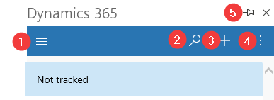
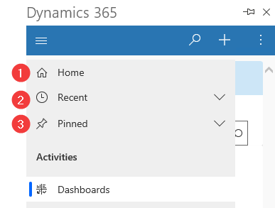
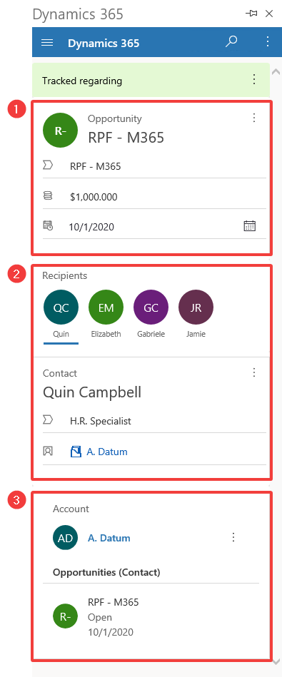

# Basic navigation in App for Outlook

Use Dynamics 365 App for Outlook to tap the power of your Dynamics 365 apps while you’re using Outlook on the desktop, web, or phone. When Dynamics 365 App for Outlook is installed, depending on which version of the app you have installed, you'll see a Dynamics 365 pane or window next to a selected Outlook email message, or when you're composing an email message or setting up a meeting or appointment.

It's easy to access the Dynamics 365 pane whether you're using Outlook on your desktop or the web app.

- In the Outlook desktop client, select **Dynamics 365**.

   > [!div class="mx-imgBorder"] 
   >   
   
- In Outlook Web App, open an email and then select More (...) > **Dynamics 365**.

   > [!div class="mx-imgBorder"] 
   >   
   > 

## Terminology

|Term  |Definition  |
|---------|---------|
|[Set regarding](track-message-or-appointment.md)     |Track and link the email or appointment to an existing row in Dynamics 365 apps.|
|Track     |Create a copy of the email or appointment in Dynamics 365 apps.   |
|[Untrack](track-message-or-appointment.md#untrack-a-linked-email-or-appointment)     |Remove the copy of the email or appointment from Dynamics 365. |

 
## Navigation bar

Use the navigation bar at the top to access the site map, search, quick create, and more commands.

1. **Site map**: Use the site map to navigate to the **Home**, **Recent** items, **Pinned** items and **Dashboards**.
2. **Search**: Search for rows across multiple tables sorted by relevance. 
3. **Create a new row**: Create a new row for the tables that have been included in the App for Outlook and are enabled for quick create.
4. **More commands**: Access more such as user information, information your Dynamics 365 environment, the [**Assistant**](assistant.md), and [**Outlook checker**](../diagnostic-checker.md).
5. **Pin**: Select the pin icon to pin Dynamics 365 App pane so that it remains open when you navigate from one email to another

## Site map

Use the site map to navigate to **Home**, **Recent** items, **Pinned** items and **Dashboards**.

### Site map menu items

It's easy to get around and get back to your favorite or most-used rows. The following illustration shows the primary navigation elements

Legend

1. **Home**: Take you to the Dynamics 365 App for Outlook main screen that displays tracking status, the regarding row with contextual information.
2. **Recent**: Expand this entry to view a list of rows you were recently using. Select a row here to open it. Select the push-pin icon next to a row listed here to add it to your pinned rows.
3. **Pinned**: Expand this entry to view and open your favorite pinned rows. Use the **Recent** list to add rows here. Select the remove-pin icon next to a row listed here to remove it from this list.

## Tracked row

Select an email to view additional information about the tracked item in the Dynamics 365 pane.

Legend

1. **Linked row information**: The Dynamics 365 row this Outlook item is linked to. The quick view form displays some of the row's key information.
2. **Recipients**: List of recipients from the email or the attendees of a meeting. You can navigate between the different recipients, which can be a contact, lead, or an account and display a quick view of their information in Dynamics 365. 
3. **Related information**: When a contact is selected, its parent account is also available so you can drill into the account details and surface more Dynamics 365 data. You can also see related data, such as related the contact's opportunities.

1. **Tracked information**: Shows if the email message or meeting is linked to a row and if it's being tracked in your Dynamics 365 app.

2. **More commands**: Select to set or change set regarding or tracking information or view information about the row in Dynamics 365

3. **Add activity**: Select to create activities for that row or view it in Dynamics 365.

4 & 5. **Set regarding**: Select to choose the **Set regarding** for the row or view information about the row in Dynamics 365.

