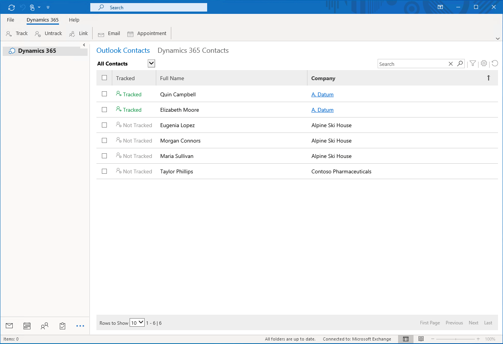
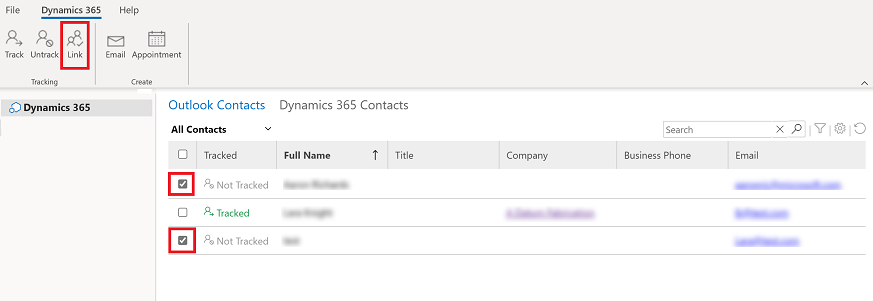
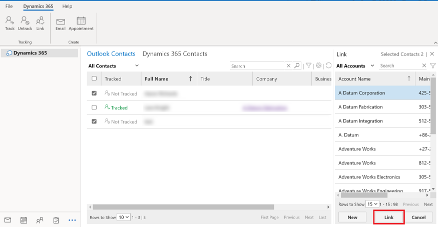
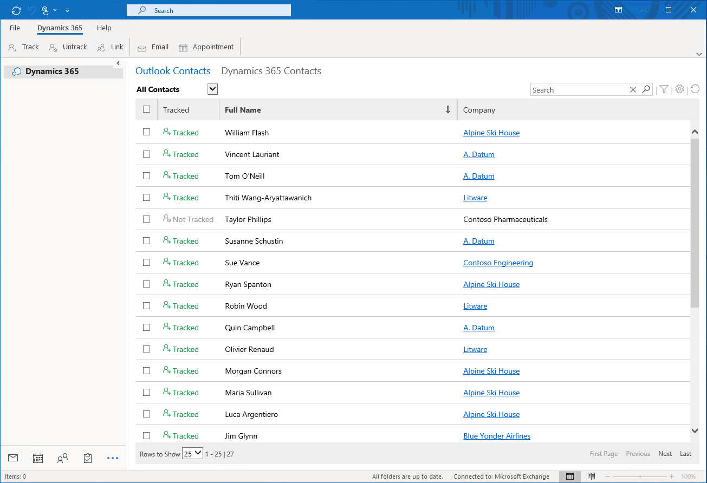

# Track contacts

Access your Outlook contacts and Dynamics 365 contacts and see which contacts are tracked. You can also link a Outlook contact to an account in your Dynamics 365 app.

To use this add-in option your admin must enable your Dynamics 365 mailbox for appointments, contacts, and tasks.

   > [!div class="mx-imgBorder"] 
   >   
 
Legend
1. **Outlook Contacts**: View all your Outlook contacts. The same contacts are displayed in the default contacts view in Dynamics 365.
2. **Dynamics 365 Contacts**: View all your Dynamics 365 contacts.
3. **Tracked**: See whether a contact is tracked or not, or whether tracking status is pending.
4. **Company**: Select to open a Dynamics 365 account record.
5. **Business Phone**: Select the number to dial the number.
6. **Email**: Select to view detail about the email address and compose a new email.

## Access contacts

To access your contacts, from the Outlook navigation pane, select More  and then select **Add-ins**.

   > [!div class="mx-imgBorder"] 
   >   

### View contact card

In the contacts list, select **Dynamics 365 Contacts** and then select the checkbox next to a contact's name. The contact details appear on the right side of the screen.

   > [!div class="mx-imgBorder"] 
   >   

## Link Outlook contacts to an account 

You can link and track a single or multiple contacts from Outlook to a account row in your Dynamics 365 app. 

   > [!div class="mx-imgBorder"] 
   >  

Depending on the server-side synchronization filters, the active contacts which a user owns in the Dynamics 365 app should be synchronized with Outlook after the mailbox is configured. For more information, see [Choose the records to synchronize between customer engagement apps and Exchange](/power-platform/admin/choose-records-synchronize-dynamics-365-outlook-exchange.md),

Follow the steps below to link and track your Outlook contacts to a row in your app.

1. From **Outlook Contacts**, select a contact(s) that is not already tracked.
2. On the command bar, select **Link**.
 
   > [!div class="mx-imgBorder"] 
   >  
 
3. Chosse the account row that you want to link the contact(s) with and then select elect **Link**.

   > [!div class="mx-imgBorder"] 
   >  

4.  To avoid issues, until the tracking is complete before navigate away from the page. 

## Track Outlook contacts without linking them to an account

You can track a single or multiple contacts from Outlook in your Dynamics 365 app without linking it to an account row.

   > [!div class="mx-imgBorder"] 
   >  

