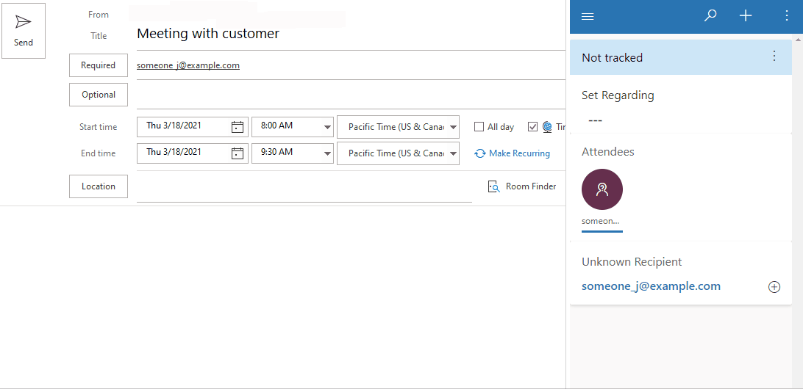
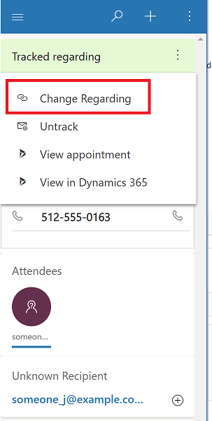
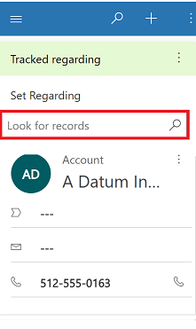
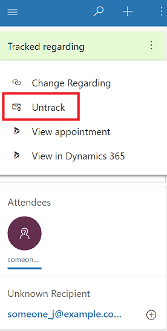

# Use set regarding to link an email message or appointment to a row 

Use **Set Regarding** in Dynamics 365 app for Outlook to associate an email message or appointment to a specific row in your app. You can link a email message or appointment to a specific account, opportunity, or case row. This populates the regarding lookup for the email or appointment and tracks it in your Dynamics 365 app.

## Link an email message or appointment

1. Open an email or appointment that you want to associate to a row in your app. 

2. Select **Dynamics 365** to open the **Dynamics 365** pane.  

   > [!div class="mx-imgBorder"] 
   >   

5. In **Set Regarding** textbox, type in your search text and select the row to associate the email or appointment with.

   

## View the linked email or appointment in your app

You can easily open your app to and see the meeting or appointment that you linked.

- In **Tracked regarding**, select **More commands**  > **View in Dynamics 365**.
   > [!div class="mx-imgBorder"] 
   >   

## Change the row an email or appointment is liked to

You can change the row an email or appointment is linked to using the **Change Regarding** feature.

1. Open the email or appointment which you want to link to a differernt row.
2. Select **Dynamics 365** to open the **Dynamics 365** pane.  

   > [!div class="mx-imgBorder"] 
   >   

3. In **Tracked regarding**, select **More commands**  > **Change Regarding**.

   > [!div class="mx-imgBorder"] 
   > 

4. In **Set Regarding** textbox, enter search text. 

   > [!div class="mx-imgBorder"] 
   > 
   
5. When a related rows appears, select the row to link the email or appointment to.

   > [!div class="mx-imgBorder"] 
   > 

## Untrack a linked email or appointment 

- In **Tracked regarding**, select **More commands**  > **Untrack**.
  > [!div class="mx-imgBorder"] 
  >   

