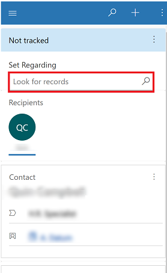
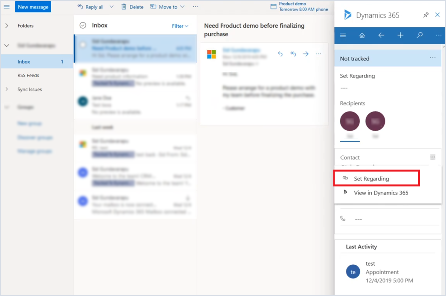
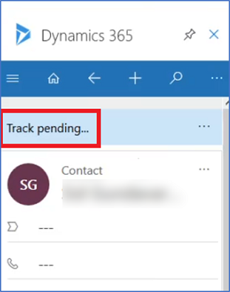
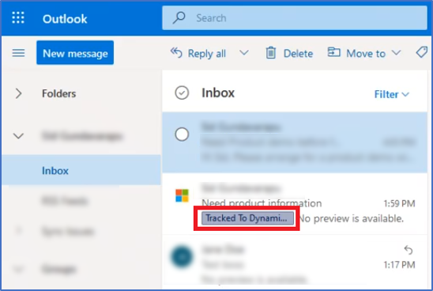
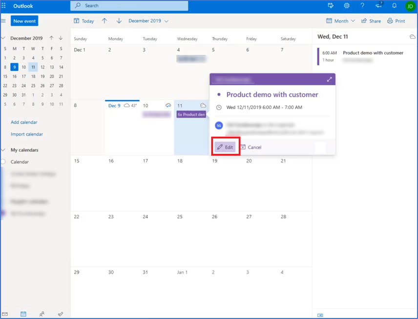
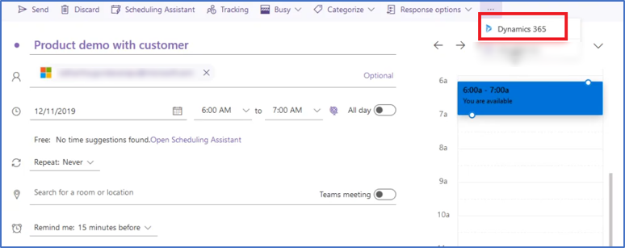
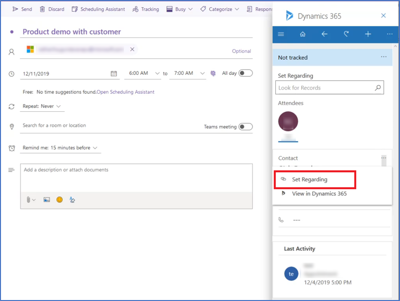

## Use delegate access 

Delegate access is granted to users who manage certain aspects of Outlook and Microsoft Dataverse information for another person.

Set up delegate access in Microsoft Outlook to give someone permission to act on your behalf. For example, you might want an assistant to create and respond to email or meeting requests for you and then track the information in Microsoft Dataverse using the Dynamics 365 App for Outlook.

For more information on how to set up delegate access, see [Set up delegate access](enable-delegate-access.md).

> [!IMPORTANT]
> - Track status might not update until the sync cycle is complete for both the user and the delegated user. This might take a few minutes. 
> - The delegated user should be able to access and interact with the primary user's mailbox.
> - The delegated user cannot track contacts on the delegated mailbox.
> - The delegated user cannot set **Regarding to** a new contact. Emails and appointments can only be tracked for existing contacts.

### Track an email and link it to a specific row in Dynamics 365

Track an email from a known contact and link it to a specific row in your app.

1. Go to the email folder of the person that you are a delegate for and open an email from a contact that you want to track.

2. Select **Dynamics 365** to open the **Dynamics 365** pane.  

   > [!div class="mx-imgBorder"] 
   >   

3. In **Set Regarding** textbox, type in your search text and select the row to link the email to.

   > [!div class="mx-imgBorder"] 
   >   

4. When a row is selected, the system links the email to the selected row. A **Tracked Successful** message display when the tracking is complete.

   > [!div class="mx-imgBorder"] 
   >   

3. In the Dynamics 365 pane, select **Contact** > **Set Regarding**.

   > [!div class="mx-imgBorder"] 
   > 

3. The status on the email changes to **Track pending** for both the user and the delegated user. 

   > [!div class="mx-imgBorder"] 
   > 
   
4. Once the email has finished synchronizing in Microsoft Dataverse, the status of the email changes to **Tracked regarding** for both the user and the delegated user.

   > [!div class="mx-imgBorder"] 
   > 

### Track appointment or meeting invitation for a known contact

1. Go to the calendar of the person that you are a delegate for and open the invitation that you want to track in Microsoft Dataverse.

   > [!div class="mx-imgBorder"] 
   > 
  
2. When the meeting invitation is open, on the main menu, select **Dynamics 365** to open the mail app.

   > [!div class="mx-imgBorder"] 
   > 

3. In the Dynamics 365 pane, select **Contact** > **Set Regarding**.

   > [!div class="mx-imgBorder"] 
   > 
   
4. The status of the meeting invitation changes to **Track pending** for both the user and the delegated user. 
   
5. Once the meeting invitation has finished synchronizing in Microsoft Dataverse, the status of the meeting invitation changes to **Tracked regarding** for both the user and the delegated user.
