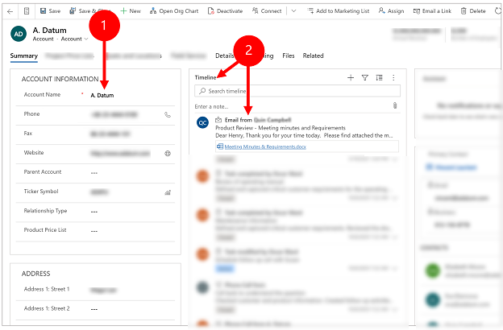

# Use delegate access 

Delegate access is granted to users who manage certain aspects of Microsoft Outlook and Dynamics 365 information for another person.

Set up delegate access in Microsoft Outlook to give someone permission to act on your behalf. For example, you might want an assistant to create and respond to email or meeting requests for you and then track the information in Microsoft Dataverse using the Dynamics 365 App for Outlook. For more information on how to set up delegate access, see [Set up delegate access](enable-delegate-access.md).

Tracking that's done using delegate access is synced asynchronously. When you use the App for Outlook tracking feature to track a n item in your email as a delegate, App for Outlook syncs the information for both the user and the delegate at the same time.

> [!IMPORTANT]
> - Track status might not update until the sync cycle is complete for both the user and the delegated user. This might take a few minutes. 
> - The delegated user should be able to access and interact with the primary user's mailbox.
> - The delegated user cannot track contacts on the delegated mailbox.
> - The delegated user cannot set **Regarding to** a new contact. Emails and appointments can only be tracked for existing contacts.

## Track an email and link it to a specific row in Dynamics 365

Track an email using **Set Regarding** and link it to a specific row in your app.

1. Go to the email folder of the person that you are a delegate for and open an email that you want to track.

2. Select **Dynamics 365** to open the **Dynamics 365** pane.  

   > [!div class="mx-imgBorder"] 
   >   

3. In the **Set Regarding** textbox, type in your search text and select a row to link the email to.

   > [!div class="mx-imgBorder"] 
   >   

4. When a row is selected, the system links the email to the selected row. A **Tracked Successful** message displays when the tracking is complete.

   > [!div class="mx-imgBorder"] 
   >   

## View the linked item in your app 

The email item is created as an email activity in Dynamics 365 and is linked to the row that you selected using **Set Regarding**.

- To see the item in your app, next to **Tracked regarding**, select **More commands**  > **View in Dynamics 365**.

   > [!div class="mx-imgBorder"] 
   >   
  
This is how an email appears in Dynamics 365. 

1. The row name that you selected using **Set Regarding**.
2. The email activity will appear in the row's timeline (if timeline has been enabled).
  
   > [!div class="mx-imgBorder"] 
   > 
  

## Track an email without linking it to a specific row in Dynamics 365

Track an email using **Track without Regarding** without linking the email to a specific row in your app.

1. Go to the email folder of the person that you are a delegate for and open an email that you want to track.

2. Select **Dynamics 365** to open the **Dynamics 365** pane.  

   > [!div class="mx-imgBorder"] 
   >   
  
3. Next to **Not tracked**, select **More commands** > **Track without Regarding**.

   > [!div class="mx-imgBorder"] 
   > 
   
4. The status of the meeting invitation changes to **Processing, please wait** for both the user and the delegated user. Don't close the Outlook item until the status changes to **Track pending**. If you close it too early then the item may not track successfully. Once the email has finished synchronizing in Microsoft Dataverse, the status of the meeting invitation changes to **Tracked** for both the user and the delegated user.

