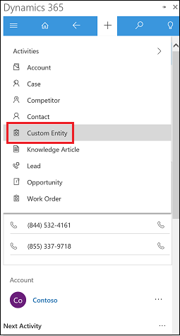
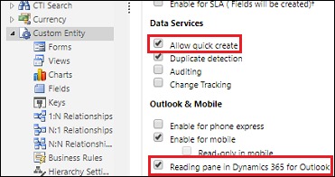
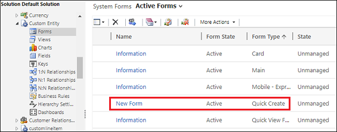
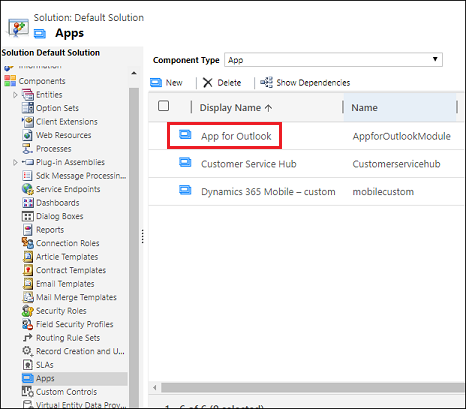

# Customize which entities appear in Quick create  

Follow these steps to enable a custom entity to appear in Quick create. Note, this example shows addition of custom entity but it can be used to add any entity.

 

1. In [!INCLUDE[pn_crm_shortest](../includes/pn-crm-shortest.md)], go to **Settings** > **Customizations** > **Customize the System**.
2. Choose the custom entity. Under **Data Services**, enable **Allow quick create**. Under **Outlook & Mobile**, enable **Enable for mobile**.

   
3. Verify the custom entity has a quick create form. Chose **Forms** and browse for form type **Quick Create**. Create a quick create form if needed.

   
4. Verify the custom entity is added to the app designer. Choose **Apps**, and then open **App for Outlook**.

   
5. In the app designer, choose **Entities** and browse to find your custom entity.

   

