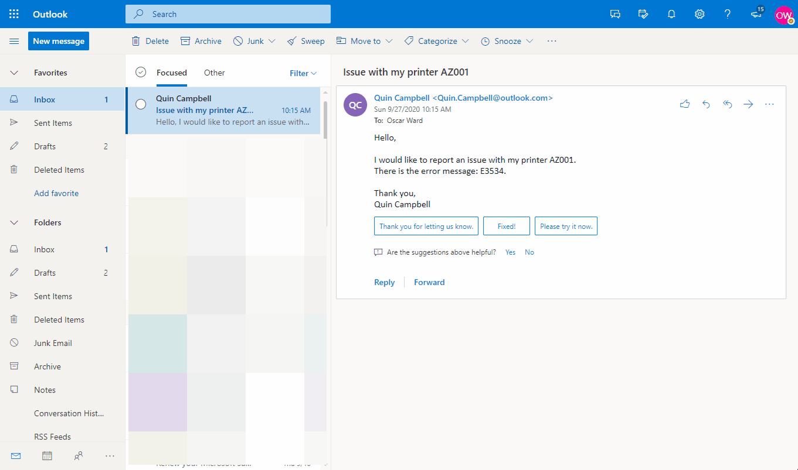
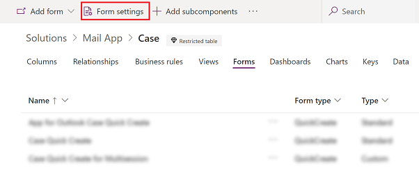

# Customize App for Outlook to auto populate data from an Outlook item to a quick create case table 

Use the quick create form in App for Outlook to auto populate information from an Outlook item to the quick create form for the Case table. You can only enable the quick create auto-populate option for the case table.

These fields that will be populated automatically:

|        Outlook item field                                                                                        |                                                                                         Mapped to     |       Quick Create Case form field                                                                             |
|------------------------------------------------------------------------------------------------|----------------------------------------------------------------------------------------------|--------------------------------------------------------------------------------------|
|                             Currently selected contact's account (if known)                                |                                               ---->                                               |                                         Customer                                          |
|                            Email subject                            |                                             ---->                                              |                                         Case Title                                          |
|                              Email sender                              |                                            ---->                                               |                                         Contact                                          |
|                              Email                                |                                              ---->                                              |                                         Origin                                          |
|                                   Email body                                     |                                          ---->                                               |                                          Description                                        |

## Enable quick create for a case table

1. Sign in to [Power Apps](https://make.powerapps.com).
2. On the left nav, select **Solution**.
3. Select an existing unmanaged solution or create a new one and then select **Edit** on the command bar. For more information on solutions, see [Solutions overview](/power-apps/maker/data-platform/solutions-overview).

   > [!div class="mx-imgBorder"]
   > 
   
4. Select the **Case** table and then on the command bar, select **Edit**.

   > [!div class="mx-imgBorder"]
   > 

5. Select the **Forms** tab and then on the command bar select **Form settings**.

   > [!div class="mx-imgBorder"]
   > 

6. On the left, select **Form order** and then select **Quick Create Form** from the dropdown menu. Move **App for Outlook Case Quick Create** to the top of the list. 

   > [!div class="mx-imgBorder"]
   > 
   
7. Select **Save and publish**.

[!INCLUDE[footer-include](../includes/footer-banner.md)]
