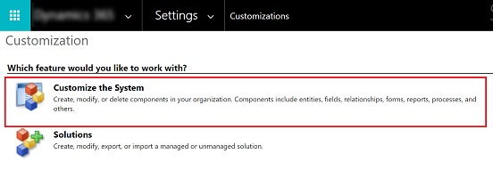
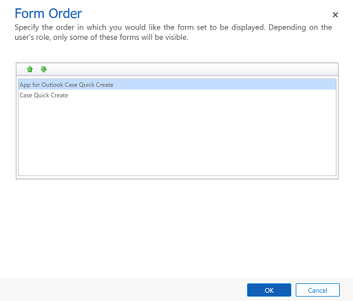

# Customize App for Outlook to auto populate data from an Outlook item to a Quick Create form for the Case entity 

Use the quick create form in App for Outlook to auto populate information from an Outlook item to the quick create form for the Case entity. You can only enable the quick create option for the case entity. 

These fields that will be populated automatically:

|                                                                                                |                                                                                              |                                                                                      |
|------------------------------------------------------------------------------------------------|----------------------------------------------------------------------------------------------|--------------------------------------------------------------------------------------|
|                                          **Outlook item field**                                           |  | **Quick Create Case form field** |
|                             Currently selected contact's account (if known)                                |                                             Mapped to ->                                              |                                         Customer                                          |
|                            Email/appointment subject                            |                                              Mapped to ->                                              |                                         Case Title                                          |
|                              Currently selected contact (if known)                              |                                             Mapped to ->                                              |                                         Contact                                          |
|                              Email                                |                                               Mapped to ->                                               |                                         Origin                                          |
|                                   Email/appointment body                                     |                                              Mapped to ->                                              |                                          Description                                        |

## Enable quick create for the case entity

1. From your app, go to **Settings** > **Advanced Settings**.

   > [!div class="mx-imgBorder"]
   >
  
2. Select **Settings** > **Customizations** and then select **Customize the System**.  

   > [!div class="mx-imgBorder"]
   >

3.	Expand **Entities** and then select the **Case** entity.
4.	Expand the entity and select **Forms**, then select **Form Order** and  **Quick Create Form Set**.
5.	Ensure that **App for Outlook Case Quick Create** form is at the top of the list, for it to be used for quick create scenario.

    > [!div class="mx-imgBorder"] 
    > 
   
6.	On the solution page, select **Publish All Customizations** and then close the page.

## Use quick create to create a case 

1. Open an email item that you want to create a case entity for and then select the **Dynamics 365** button. 
2. On the **Dynamics 365** pane, select  **Quick Create** > **Case**.

    The information from the Outlook item will auto populate to case from.

3. When you're done, select **Save and Close**. 

