# Deploy and install Dynamics 365 App for Outlook  

This topic covers how to setup and deploy Dynamics 365 App for Outlook.

The latest release of Dynamics 365 App for Outlook works with customer engagement apps (such as [Dynamics 365 Sales](./../sales-professional/help-hub.md), [Dynamics 365 Customer Service](./../customer-service/help-hub.md), [Dynamics 365 Marketing](./../marketing/help-hub.md). [Dynamics 365 Field Service](../field-service/overview.md), and [Dynamics 365 Project Service Automation](/dynamics-365-project-operations/articles/psa/overview.md), [Dynamics 365 Customer Engagement (on-premises), version 9](../customerengagement/on-premises/overview.md), and [Microsoft Dataverse](/powerapps/maker/common-data-service/data-platform-intro).

## Prerequisites

The following prerequisites are required before you begin setup.

- Setup synchronization of incoming email through server-side synchronization: [Set up server-side synchronization of email, appointments, contacts, and tasks](/power-platform/admin/set-up-server-side-synchronization-of-email-appointments-contacts-and-tasks)  

- Dynamics 365 App for Outlook is an Outlook add-in that uses Exchange Web Services (EWS) to interact with Microsoft Exchange. This requires OAuth be enabled on Microsoft Exchange. For more information: [Authentication and permission considerations for the makeEwsRequestAsync method](/outlook/add-ins/web-services#authentication-and-permission-considerations-for-the-makeewsrequestasync-method).

- On Windows clients, Internet Explorer 11 should be installed and enabled but doesn't necessarily need to be the default browser. For more information: [Requirements for running Office Add-ins](/office/dev/add-ins/concepts/requirements-for-running-office-add-ins#client-requirements-windows-desktop-and-tablet).

- Verify what's supported: [System requirements, limits, and configuration values for App for Outlook](support-info-deployment.md)

## Step 1: Set the default synchronization method

To use Dynamics 365 App for Outlook, you need to set Server-side synchronization for your email processing. For more information on email synchronization, see [Set incoming and outgoing email synchronization](/power-platform/admin/set-incoming-outgoing-email-synchronization)

1. From your app, go to **Settings** > **Advanced Settings**.

   > [!div class="mx-imgBorder"]
   > 

2. Go **Settings** > **Administration** and then select **System Settings**.

   > [!div class="mx-imgBorder"]
   >
   
3. Select the **Email** tab, and set **Process Email Using** to **Server-Side Synchronization**.

   > [!div class="mx-imgBorder"]
   > 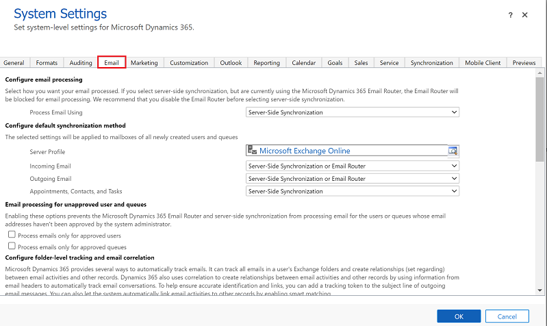

## Step 2: Test email configuration and enable mailboxes

Enable and test your user mailboxes so they can use Dynamics 365 App for Outlook. 

1. From your app, go to **Settings** > **Advanced Settings**.

   > [!div class="mx-imgBorder"]
   > 
   
2. Go **Settings** > **Email Configuration** and then select **Mailboxes**.

   > [!div class="mx-imgBorder"]
   > 
   
3. Select the **Active Mailboxes** view, and then select the mailboxes that you want to test and enable. 

   > [!div class="mx-imgBorder"]
   > 

4. On the command bar, select **APPROVE EMAIL** and then select **OK**.  

   > [!div class="mx-imgBorder"]
   > 

5. Once approved, select **TEST & ENABLE MAILBOX**.   

   > [!div class="mx-imgBorder"]
   > 

6. On the confirmation dialog box, select **OK**.

   > [!div class="mx-imgBorder"]
   > 

You may need to wait for the system to process the updates. The more mailboxes you enable, the longer it may take.

### Step 2.1: Verify configuration

To verify  mailbox is setup correctly, open the mailbox that you tested in the previous step.

If the setup is successful the **configuration Test Results** section should change from **Not Run** to **Success**. 

> [!div class="mx-imgBorder"]
> 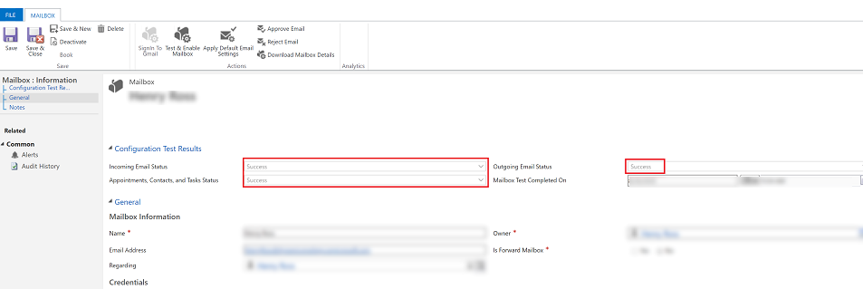

## Setp 3: Provide security role access

The security role **Dynamics 365 App for Outlook User** is available from build 9.1.0.4206 or later. If a user doesn’t have this security role or its underlying privileges, they’ll receive the following error: **You haven't been authorized to use this app. Check with your system administrator to update your settings**. You must add users to this role so they can use Dynamics 365 App for Outlook. This will ensure that the users have the basic privileges needed to access App for Outlook. 

Other security privileges on top of the basic privileges, related to the user's role, will light up more features. For example, if a user has create privilege on Lead table, in addition to **Dynamics 365 App for Outlook User** security role, they would see an email resolve to a Lead table where applicable.

App for Outlook also requires Server-Side Synchronization to be properly configured with the minimum security roles required by the service. These roles are outlined in the table below.

| **Privilege name**                      | **Table**         | **Location (tab) within security role**             |
|-----------------------------------------|--------------------|-----------------------------------------------------|
| prvReadEmailServerProfile               | EmailServerProfile | Business Management                                 |
| prvWriteMailbox                         | Mailbox            | Business Management                                 |
| prvReadMailbox                          | Mailbox            | Business Management                                 |
| prvReadOrganization                     | Organization       | Business Management                                 |
| prvSyncToOutlook (exchangesyncidmapping | Outlook            | Business Management &gt; Privacy-related privileges |
| prvReadActionCard                       | ActionCard         | Core Records                                        |
| prvDeleteActivity                       | Activity           | Core Records                                        |
| prvAppendActivity                       | Activity           | Core Records                                        |
| prvWriteActivity                        | Activity           | Core Records                                        |
| prvCreateActivity                       | Activity           | Core Records                                        |
| prvReadActivity                         | Activity           | Core Records                                        |
| prvAppendToActivity                     | Activity           | Core Records                                        |
| prvReadConnection                       | Connection         | Core Records                                        |
| prvAssignContact                        | Contact            | Core Records                                        |
| prvReadContact                          | Contact            | Core Records                                        |
| prvWriteContact                         | Contact            | Core Records                                        |
| prvCreateContact                        | Contact            | Core Records                                        |
| prvDeleteContact                        | Contact            | Core Records                                        |
| prvReadUserQuery                        | Saved View         | Core Records                                        |
| prvReadQueue                            | Queue              | Core Records                                        |
| prvReadQuery                            | View               | Customization                                       |
| prvReadIncident                         | Case               | Service                                             |
| prvSearchAvailability                   |                    | Service Management &gt; Miscellaneous Privileges    |
| prvOverrideCreatedOnCreatedBy           |                    | Service Management &gt; Miscellaneous Privileges    |

> [!NOTE]
>  If you create a team and add the team to the **Dynamics 365 App for Outlook User** security role, this doesn't automatically propogate the privileges to the users within that team.

1. To add users to the App for Outlook security role, from your app, go to **Settings** > **Advanced Settings**.

   > [!div class="mx-imgBorder"]
   >

2. Go **Settings** > **Security** and then select **Users**.

   > [!div class="mx-imgBorder"]
   > 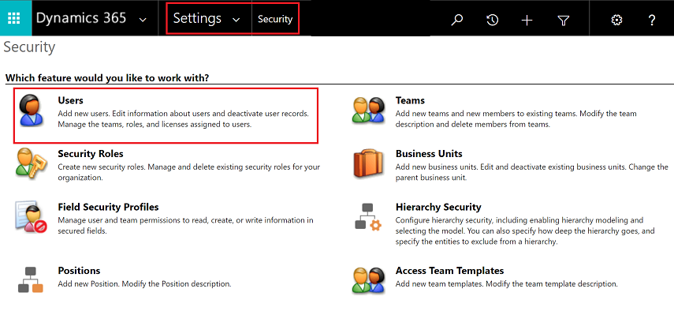

3. Select the users from the list and then select **Manage Roles**.

   > [!div class="mx-imgBorder"]
   > 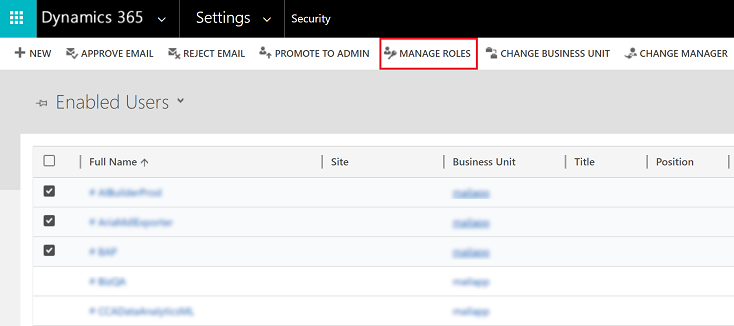

5. In the **Manage User Roles** dialog, select the **Dynamics 365 App for Outlook User** security role to the users and then select **OK**.

   > [!div class="mx-imgBorder"]
   > 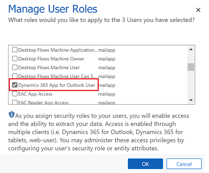

## Step 4: Install App for Outlook

Follow these steps to push Dynamics 365 App for Outlook to selected users, all users, or have users install it themselves as needed.

1. To push the app to your users, from your app, go to **Settings** > **Advanced Settings**.

   > [!div class="mx-imgBorder"]
   > 

2. Go **Settings** > **Dynamics 365 App for Outlook**.

   > [!div class="mx-imgBorder"]
   > 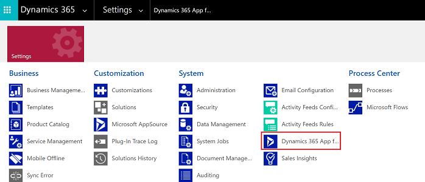

3. The **Getting Started with Microsoft Dynamics 365 App for Outlook** page lists all eligible users that can use App for Outlook. You have sereral different options on how you can deploy the app to your users:
 
    - **Option 1**: Select the checkbox to automatically add App for Outlook to all eligible users. If a user's email is synchronized through server-side synchronization, you won’t have to do anything more to push the app to them.

      > [!div class="mx-imgBorder"]
      > 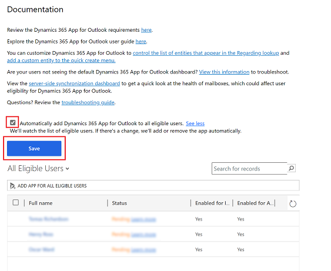
   
   
    - **Option 2**: Select **ADD APP FOR EIGIBILE USERS** to deploy the app to all users that are setup correctly. When you do this the **Status** changes to **Pending**.

      > [!div class="mx-imgBorder"]
      > 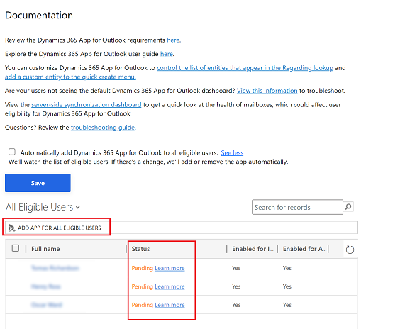

   
   - **Option 3**: Push the app to certain users, select those users in the list, and then select **Add App to Outlook**.
   
      > [!div class="mx-imgBorder"]
      > 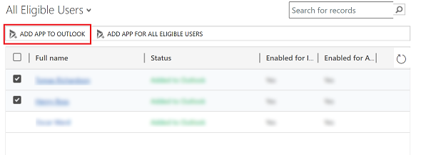
   
   
4. The status will change to **Added to Outlook** and the app will be available for your users. 

   > [!div class="mx-imgBorder"]
   > 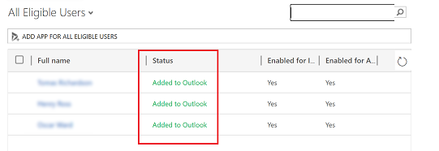

The app will appear in the Outlook ribbon for the added users.

   > [!div class="mx-imgBorder"] 
   >   

### Have users install App for Outlook themselves  

1. From your app, go to **Settings** > **Advanced Settings**.

   > [!div class="mx-imgBorder"]
   > 

2. Select the **Settings** button , again and then select **Apps for Dynamics 365 apps**.  

   > [!div class="mx-imgBorder"]
   > 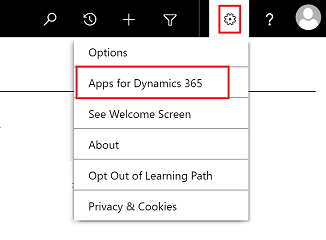

3. In the **Apps for Dynamics 365 apps** screen, under **[!INCLUDE[pn_crm_app_for_outlook_short](../includes/pn-crm-app-for-outlook-short.md)]**, users select **Add app to [!INCLUDE[pn_Outlook_short](../includes/pn-outlook-short.md)]**.  

### To deploy to Dynamics 365 apps (on-premises) users  

 Follow these steps if you're using Dynamics 365 apps (on-premises).  

-   Configure your Dynamics 365 apps server for Internet-facing deployment. See [Configure IFD for Microsoft Dynamics 365 apps](/previous-versions/dynamicscrm-2016/deployment-administrators-guide/dn609803(v=crm.8)).  

-   If you're connecting to Exchange on-premises, configure the OAuth provider and register client apps. See [Configure Windows Server 2012 R2 for Dynamics 365 apps that use OAuth](/previous-versions/dynamicscrm-2016/deployment-administrators-guide/hh699726(v=crm.8)).  

## Troubleshooting installation problems  

1. If you don't see [!INCLUDE[pn_crm_app_for_outlook_short](../includes/pn-crm-app-for-outlook-short.md)] when you click the **Settings** button , check that you've enabled the feature.

2. If you or your users have trouble installing [!INCLUDE[pn_crm_app_for_outlook_short](../includes/pn-crm-app-for-outlook-short.md)], it may be because their [!INCLUDE[pn_Exchange](../includes/pn-exchange.md)] mailbox is currently linked to another Microsoft Dataverse environment or Customer Engagement (on-premises) organization. An [!INCLUDE[pn_Exchange](../includes/pn-exchange.md)] mailbox (email address) can only synchronize appointments, contacts, and tasks with one organization, and a user that belongs to that organization can only synchronize appointments, contacts, and tasks with one [!INCLUDE[pn_Exchange](../includes/pn-exchange.md)] mailbox.  You can overwrite the setting stored in [!INCLUDE[pn_Exchange](../includes/pn-exchange.md)] if you want to change the primary synchronizing organization. For more information, see [this KB article.](https://support.microsoft.com/en-gb/help/3211627/incomingemailrejected-error-when-attempting-to-install-dynamics-365-app-for-outlook)

[!INCLUDE[footer-include](../includes/footer-banner.md)]
