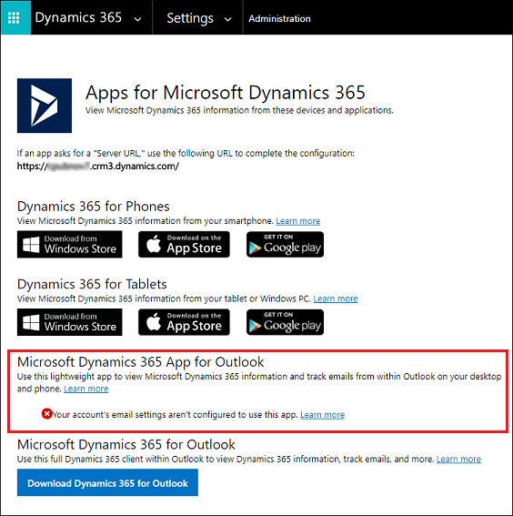

# Deploy Dynamics 365 App for Outlook  

## FAQs

There are two ways to install [!INCLUDE [pn-ms-office](../includes/pn-ms-office.md)]: using a Windows Installer (MSI) version or a Click-to-Run (C2R) version of [!INCLUDE [pn-office-shortest](../includes/pn-office-shortest.md)]. You might have issues accessing [!INCLUDE[pn_microsoftcrm](../includes/pn-microsoftcrm.md)] in the Add-ins area of [!INCLUDE[pn_Outlook_short](../includes/pn-outlook-short.md)] if you don't have the necessary updates for your installation version. For more information, see [Issue when trying to access Dynamics 365 apps within the Add-ins area of Outlook](https://support.microsoft.com/help/3211586/error-message-0x8006ffff-occurs-when-you-access-dynamics-365-within-th).

For more information on FAQs, see [Frequently Asked Questions about Dynamics 365 App for Outlook](faq.md).

   

## Deploy Dynamics 365 App for Outlook  
 After setting up [!INCLUDE[cc_server_side_synch](../includes/cc-server-side-synch.md)], you can push [!INCLUDE[pn_crm_app_for_outlook_short](../includes/pn-crm-app-for-outlook-short.md)] to some or all users, or you can have users install it themselves as needed.  

<!--
> [!NOTE]
>  If you're on [!INCLUDE[pn_dyn_365_op](../includes/pn-dyn-365-op.md)], see the section below:  [To deploy to Dynamics 365 apps (on-premises) users](#BKMK_DeployOnprem)  
--> 

#### To push the app to users  

1. Go to **Settings** > **Dynamics 365 App for Outlook**.  

2. In the **Getting Started with Dynamics 365 App for Outlook** screen, under **Add for Eligible Users** (you may have to click **Settings** if you’re opening this screen for the second or subsequent time), select the **Automatically add the app to [!INCLUDE[pn_Outlook_short](../includes/pn-outlook-short.md)]** check box if you want to have users get the app automatically. 
If a user's email is synchronized through [!INCLUDE[cc_server_side_synch](../includes/cc-server-side-synch.md)], you won’t have to do anything more to push the app to them.  

3. Do one of the following:  

   -   To push the app to all eligible users, click **Add App for All Eligible Users**.  

   -   To push the app to certain users, select those users in the list, and then click **Add App to Outlook**.  

   > [!TIP]
   >  If the list shows that a user is pending or hasn’t been added, you can click the **Learn more** link next to the user to find more information about status.  

4. When you’re done, click **Save**.  

5. Make sure to add users to the security role **Dynamics 365 App for Outlook User** as described in the **Provide security role access** section above.

#### To have users install the app themselves  

1. Users click the **Settings** button , and then click **Apps for Dynamics 365 apps**.  

2. In the **Apps for Dynamics 365 apps** screen, under **[!INCLUDE[pn_crm_app_for_outlook_short](../includes/pn-crm-app-for-outlook-short.md)]**, users click **Add app to [!INCLUDE[pn_Outlook_short](../includes/pn-outlook-short.md)]**.  

> [!NOTE]
>  Users can also disable or remove the add-in themselves, if needed. For more information, see the [Dynamics 365 App for Outlook User’s Guide](../outlook-app/dynamics-365-app-outlook-user-s-guide.md).  
  
   

## To deploy to Dynamics 365 apps (on-premises) users  
 Follow these steps if you're using Dynamics 365 apps (on-premises).  

-   Configure your Dynamics 365 apps server for Internet-facing deployment. See [Configure IFD for Microsoft Dynamics 365 apps](/previous-versions/dynamicscrm-2016/deployment-administrators-guide/dn609803(v=crm.8)).  

-   If you're connecting to Exchange on-premises, configure the OAuth provider and register client apps. See [Configure Windows Server 2012 R2 for Dynamics 365 apps that use OAuth](/previous-versions/dynamicscrm-2016/deployment-administrators-guide/hh699726(v=crm.8)).  

 
## Troubleshooting installation problems  

1. If you don't see [!INCLUDE[pn_crm_app_for_outlook_short](../includes/pn-crm-app-for-outlook-short.md)] when you click the **Settings** button , check that you've enabled the feature.

2. If you or your users have trouble installing [!INCLUDE[pn_crm_app_for_outlook_short](../includes/pn-crm-app-for-outlook-short.md)], it may be because their [!INCLUDE[pn_Exchange](../includes/pn-exchange.md)] mailbox is currently linked to another Microsoft Dataverse environment or Customer Engagement (on-premises) organization. An [!INCLUDE[pn_Exchange](../includes/pn-exchange.md)] mailbox (email address) can only synchronize appointments, contacts, and tasks with one organization, and a user that belongs to that organization can only synchronize appointments, contacts, and tasks with one [!INCLUDE[pn_Exchange](../includes/pn-exchange.md)] mailbox.  You can overwrite the setting stored in [!INCLUDE[pn_Exchange](../includes/pn-exchange.md)] if you want to change the primary synchronizing organization. For more information, see [this KB article.](https://support.microsoft.com/en-gb/help/3211627/incomingemailrejected-error-when-attempting-to-install-dynamics-365-app-for-outlook)

   

## Explore the User Guide and train your users  
 To learn how to use [!INCLUDE[pn_crm_app_for_outlook_short](../includes/pn-crm-app-for-outlook-short.md)], see the [Dynamics 365 App for Outlook User Guide](../outlook-app/dynamics-365-app-outlook-user-s-guide.md).  

### See also  
 [Dynamics 365 App for Outlook User Guide](../outlook-app/dynamics-365-app-outlook-user-s-guide.md)   
 [Read more about supported clients in this blog: Dynamics 365 App for Outlook Support Matrix](https://blogs.msdn.microsoft.com/crm/2016/12/13/dynamics-365-app-for-outlook-support-matrix/)   
 [Set up server-side synchronization of email, appointments, contacts, and tasks](/power-platform/admin/set-up-server-side-synchronization-of-email-appointments-contacts-and-tasks)   

<!-- 2. If you see the message Your account's email settings aren't configured to use this app, you need to [Set up server-side synchronization of email, appointments, contacts, and tasks](/power-platform/admin/set-up-server-side-synchronization-of-email-appointments-contacts-and-tasks).

   
-->

[!INCLUDE[footer-include](../includes/footer-banner.md)]
