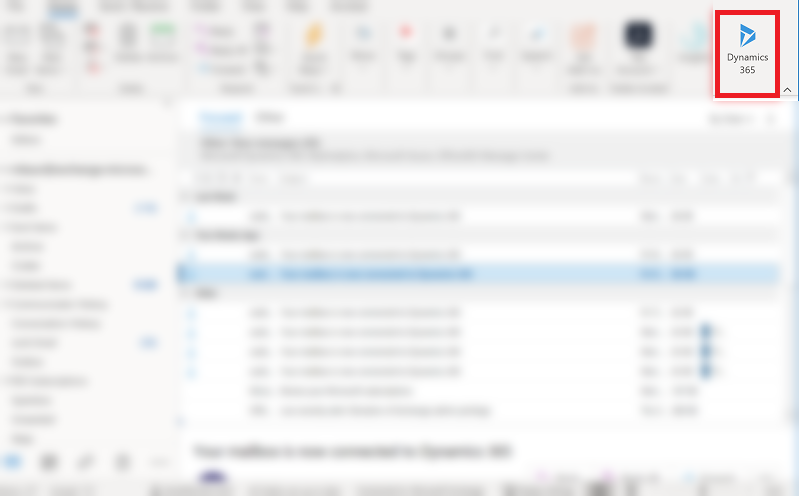
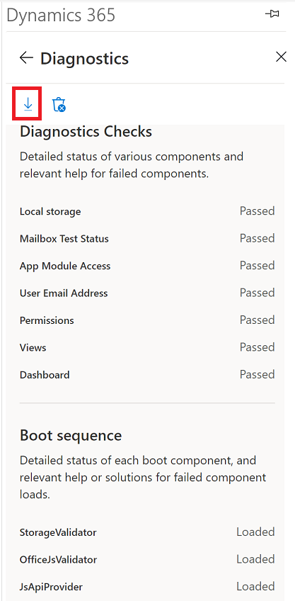

# Run the diagnostics checker and scan for potential issues 

Use the Outlook Checker to run a diagnostic check and scan for potential issues for Dynamics 365 App for Outlook. If you run into an issue, you can send the log files to your administrator to help troubleshoot the problem.

1. To run the checker, in Microsoft Outlook select **Dynamics 365** to open the Dynamics 365 pane.

    > [!div class="mx-imgBorder"] 
    > 
    
    
2. When you see the **Dynamics 365** pane, press **ALT** + **CTRL** + **Y** on your keyboard to bring up the **Outlook Checker**.
3. Use the **Show** or **Hide** toggle to show or hide the checker icon in the command bar.
  
    > [!div class="mx-imgBorder"] 
    >  

   - This is how the checker icon appears on the command bar. 
   
     > [!div class="mx-imgBorder"] 
     > 
     
    
4. Select **Run diagnostics** to run the checker.

    > [!div class="mx-imgBorder"] 
    > 
    
5. The checker will show a detailed status of all the components. If you run into issues, select **Export logs** to export the log files and send it to your administrator.

    > [!div class="mx-imgBorder"] 
    > 

