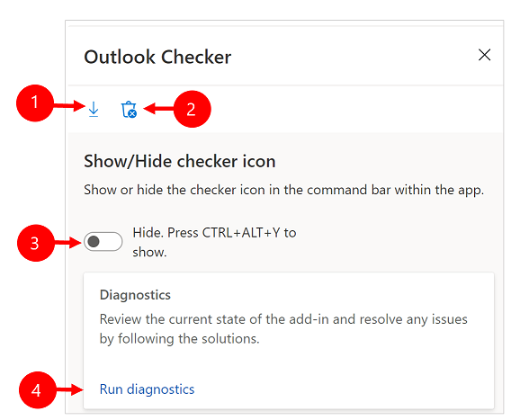
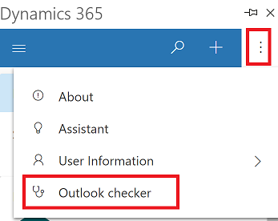
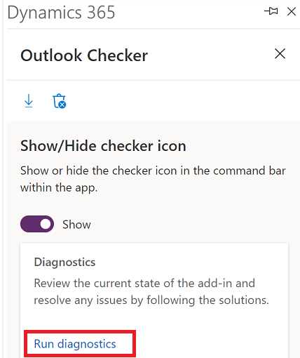

# Run the diagnostics checker and scan for potential issues 

Use the Outlook Checker to run a diagnostic check and scan for potential issues for Dynamics 365 App for Outlook. If you run into an issue, you can send the log files to your administrator to help troubleshoot the problem.

   > [!div class="mx-imgBorder"] 
   > 
   
 Legend:
 
 1. **Export logs**: After you run the checker, export the error logs to send it to your support team or admin for futher troubleshooting.
 2. **Clear cache**: This will clear any errors in the App for Outlook cache. Cache will rebuilt the next time you login. 
 3. **Hide or Show**: Move the toggle to **Show** to add the checker icon appears on the command bar. 
 4. **Run diagnostics**: This will run the diagnostics checker and scan for potential issues. 
 
 
## Run the access checker

1. In Microsoft Outlook select **Dynamics 365** to open the Dynamics 365 pane.

    > [!div class="mx-imgBorder"] 
    > 
    
    
2. When you see the **Dynamics 365** pane, press **ALT** + **CTRL** + **Y** on your keyboard to bring up the **Outlook Checker**.
3. Use the **Show** or **Hide** toggle to show or hide the checker icon in the command bar.
  
    > [!div class="mx-imgBorder"] 
    >  

- If you moved the toggle to **Show**, the checker icon is added to the command bar and the **Search** button  will move under **More commands** 
   
     > [!div class="mx-imgBorder"] 
     > 
     
    
4. Select **Run diagnostics** to run the checker.

    > [!div class="mx-imgBorder"] 
    > 
    
5. The checker will show a detailed status of all the components. If you run into issues, select **Export logs** to export the log files and send it to your administrator.

    > [!div class="mx-imgBorder"] 
    > 
    
## Common Issues

1. If you don't have sufficient privileges to use Dynamics 365 App for Outlook, see [A privilege error occurs when attempting to use Dynamics 365 App for Outlook](https://go.microsoft.com/fwlink/p/?linkid=2135239).

2. If you deactivated one of the views used by the Dynamics 365 App for Outlook and get an error, see [The view is not available error message](https://go.microsoft.com/fwlink/p/?linkid=213547).

3. If  **Track** and **Set Regarding** options are missing, see [Track and Set Regarding options are missing in Dynamics 365 App for Outlook](https://go.microsoft.com/fwlink/p/?linkid=2137902).

