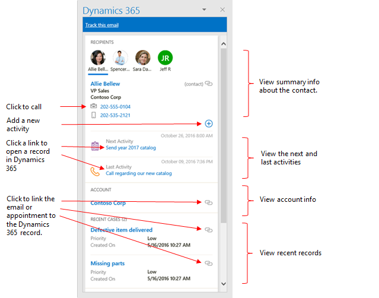
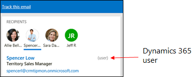
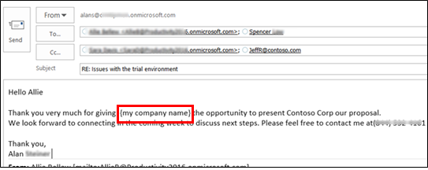
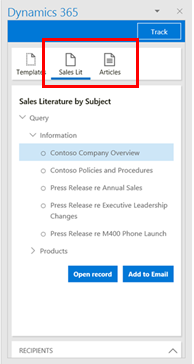
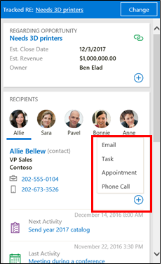
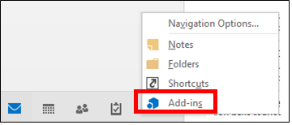
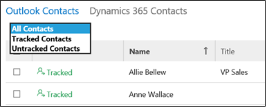
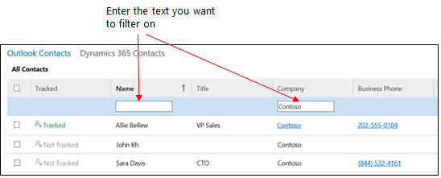

# Dynamics 365 App for Outlook User Guide  

> [!IMPORTANT]
> This page describes how to use [!INCLUDE[pn-dyn-365-app-outlook](../includes/pn-dyn-365-app-outlook.md)] with [!INCLUDE[pn-crm-8-2-0-online](../includes/pn-crm-8-2-0-online.md)]. [!INCLUDE[pn-dyn-365-app-outlook](../includes/pn-dyn-365-app-outlook.md)] is not  available yet for [!INCLUDE[pn_crm_9_0_0_online](../includes/pn-crm-9-0-0-online.md)]. We'll update this page when it's available.

Use [!INCLUDE[pn_ms_dyn_crm_app_for_outlook](../includes/pn-ms-dyn-crm-app-for-outlook.md)] to tap the power of [!INCLUDE[pn_crm_shortest](../includes/pn-crm-shortest.md)] while you’re using [!INCLUDE[pn_Outlook_short](../includes/pn-outlook-short.md)] on the desktop, web, or phone. When [!INCLUDE[pn_crm_app_for_outlook_short](../includes/pn-crm-app-for-outlook-short.md)] is installed, depending on which version of  the app you have installed, you'll see a **[!INCLUDE[pn_crm_shortest](../includes/pn-crm-shortest.md)]** pane or window next to a selected [!INCLUDE[pn_Outlook_short](../includes/pn-outlook-short.md)] email message, or when you're composing an email message or setting up a meeting or appointment.  
  
 For example, when you open an email message, view information from [!INCLUDE[pn_crm_shortest](../includes/pn-crm-shortest.md)] about the email recipients. Or with a single click, link an [!INCLUDE[pn_Outlook_short](../includes/pn-outlook-short.md)] email message or appointment to a specific [!INCLUDE[pn_crm_shortest](../includes/pn-crm-shortest.md)] record. When you link an email message or appointment to a [!INCLUDE[pn_crm_shortest](../includes/pn-crm-shortest.md)] record, the [!INCLUDE[pn_Outlook_short](../includes/pn-outlook-short.md)] record appears as an activity for that record in [!INCLUDE[pn_crm_shortest](../includes/pn-crm-shortest.md)].  
  
 [Watch a short video (1:35) about Dynamics 365 App for Outlook.](https://go.microsoft.com/fwlink/p/?linkid=829982)  
  
> [!NOTE]
> This content is for the latest release of [!INCLUDE[pn_ms_dyn_crm_app_for_outlook](../includes/pn-ms-dyn-crm-app-for-outlook.md)]. For prior releases, see [Dynamics 365 App for Outlook User's Guide](https://www.microsoft.com/en-us/dynamics/crm-customer-center/dynamics-365-app-for-outlook-user-s-guide.aspx)

<!--  
> [!TIP]
> [!INCLUDE[pn_crm_app_for_outlook_short](../includes/pn-crm-app-for-outlook-short.md)] is a [!INCLUDE[pn_MS_Office](../includes/pn-ms-office.md)] add-in. As of the [!INCLUDE[pn_crm_8_2_0_both](../includes/pn-crm-8-2-0-both.md)], [!INCLUDE[pn_crm_app_for_outlook_short](../includes/pn-crm-app-for-outlook-short.md)] paired with [!INCLUDE[cc_server_side_synch](../includes/cc-server-side-synch.md)] is the preferred way to use [!INCLUDE[pn_Outlook_short](../includes/pn-outlook-short.md)] together with [!INCLUDE[pn_crm_shortest](../includes/pn-crm-shortest.md)]. You may also be familiar with [!INCLUDE[pn_crm_for_outlook_short](../includes/pn-crm-for-outlook-short.md)], which provides complete [!INCLUDE[pn_crm_shortest](../includes/pn-crm-shortest.md)] capabilities (including offline capabilities) from [!INCLUDE[pn_Outlook_short](../includes/pn-outlook-short.md)]. **Note that tracking activities is not supported when [!INCLUDE[pn_crm_app_for_outlook_short](../includes/pn-crm-app-for-outlook-short.md)] and [!INCLUDE[pn_crm_for_outlook_short](../includes/pn-crm-for-outlook-short.md)] are used together by the same user. Choose one or the other.** 
 -->

   

## Prerequisites  
 Your [!INCLUDE[pn_crm_shortest](../includes/pn-crm-shortest.md)] system administrator can make [!INCLUDE[pn_crm_app_for_outlook_short](../includes/pn-crm-app-for-outlook-short.md)] available to your organization or you can add it yourself if:  
  
-   You have the **Use [!INCLUDE[pn_crm_app_for_outlook_short](../includes/pn-crm-app-for-outlook-short.md)]** security privilege.  
  
-   Your organization synchronizes mailboxes with server-side synchronization.  
  
 For more information, and for information on supported devices, browsers, and [!INCLUDE[pn_Outlook_short](../includes/pn-outlook-short.md)] versions, see [Deploy Dynamics 365 App for Outlook](deploy-dynamics-365-app-for-outlook.md).  
  
   

## Add the app to Outlook  
 After the prerequisites have been met, you can add the app directly from [!INCLUDE[pn_crm_shortest](../includes/pn-crm-shortest.md)].  
  
1.  Click the **Settings** button , and then click **Apps for [!INCLUDE[pn_crm_shortest](../includes/pn-crm-shortest.md)]**.  
  
2.  On the **Apps for [!INCLUDE[pn_crm_shortest](../includes/pn-crm-shortest.md)]** page, under **[!INCLUDE[pn_crm_app_for_outlook_short](../includes/pn-crm-app-for-outlook-short.md)]**, click **[!INCLUDE[pn_crm_app_for_outlook_short](../includes/pn-crm-app-for-outlook-short.md)]**.  
  
    > [!NOTE]
    >  If you have trouble installing  the app, see the troubleshooting section in [Deploy Dynamics 365 App for Outlook](deploy-dynamics-365-app-for-outlook.md).  
  
   

## Disable or remove the Outlook app  
  
1.  In [!INCLUDE[pn_Outlook_short](../includes/pn-outlook-short.md)], click **File**, and then click **Manage Add-ins**.  
  
      
  
    This opens the **Office 365** dialog box where you can see all your [!INCLUDE[pn_Outlook_short](../includes/pn-outlook-short.md)] add-ins. If you click the [!INCLUDE[pn_crm_shortest](../includes/pn-crm-shortest.md)] row, you can see which [!INCLUDE[pn_crm_shortest](../includes/pn-crm-shortest.md)] instance the app is connected to.  
  
2.  Do one of the following:  
  
    -   To disable the app, in the [!INCLUDE[pn_crm_shortest](../includes/pn-crm-shortest.md)] row, clear the **Turned on** check box.  
  
    -   To remove the app, select the [!INCLUDE[pn_crm_shortest](../includes/pn-crm-shortest.md)] row, and then click the Minus button.  
  
   

## Use the app for the first time  
 To display [!INCLUDE[pn_crm_shortest](../includes/pn-crm-shortest.md)] data after you’ve added the app:  
  
1.  Select an existing email message in your Inbox, or create a new email message or appointment.  
  
2.  On the ribbon, click the **[!INCLUDE[pn_crm_shortest](../includes/pn-crm-shortest.md)]** button.  
  
      
 
    -Or-

    Click the **[!INCLUDE[pn_crm_shortest](../includes/pn-crm-shortest.md)]** button in the email pane.

    
 
    The **[!INCLUDE[pn_crm_shortest](../includes/pn-crm-shortest.md)]** pane appears on the right side of the screen and shows information about the recipients.  
  
       

**Notes:**  
  
-   If the recipient is a [!INCLUDE[pn_crm_shortest](../includes/pn-crm-shortest.md)] user (as opposed to a contact or lead), it’s indicated next to their name:  
  
      
  
-   If the recipient isn’t known to [!INCLUDE[pn_crm_shortest](../includes/pn-crm-shortest.md)], you can click **Add to [!INCLUDE[pn_crm_shortest](../includes/pn-crm-shortest.md)]** to add them as a contact or lead.  
  
   

## Link an email message or meeting to a specific Dynamics 365 record  
You can link an email message or meeting to a specific [!INCLUDE[pn_crm_shortest](../includes/pn-crm-shortest.md)] record, such as an account, opportunity, or case, by clicking the **Set Regarding** button . [!INCLUDE[pn_crm_shortest](../includes/pn-crm-shortest.md)] automatically tracks the email or meeting, and links it to the record indicated in the **[!INCLUDE[pn_crm_shortest](../includes/pn-crm-shortest.md)]** pane.  
  
  
  
### To find a different record to link to:  
  
1.  Click **Track this email** at the top of the **[!INCLUDE[pn_crm_shortest](../includes/pn-crm-shortest.md)]** pane.  
  
2.  Do one of the following:  
  
    -   Click the record you want to link to in the list of **Pinned Records** or **Recently Used Records**.  
  
   
  > [!TIP]
>  This is the same list of pinned and mostly recently used records you see in the [!INCLUDE[pn_crm_shortest](../includes/pn-crm-shortest.md)] apps or Dynamics CRM web client.  
  
    -   If you don’t see the record you’re looking for, enter a keyword in the search box, and then click the magnifying glass.  
  
### To create a new record and link it to a Dynamics 365 record:  
  
1.  Click **New**, and then select the type of record you want to create.  
  
   
  
2.  Fill in the information in the form.  
  
   
  
3.  If you want, click the **Open record after saving** check box.  
  
4.  Click **Save**.  
  
### To untrack or change the regarding record:  
  
-   Click **Change** at the top of the **[!INCLUDE[pn_crm_shortest](../includes/pn-crm-shortest.md)]** pane.  
  
 
  
## Compose an email message and link it to a Dynamics 365 record  
  
1.  Create an email message as you normally would in [!INCLUDE[pn_Outlook_short](../includes/pn-outlook-short.md)].  
  
2.  Click the **[!INCLUDE[pn_crm_shortest](../includes/pn-crm-shortest.md)]** button on the ribbon.  
  
3.  Do one of the following:  
  
    -   Click a **Set Regarding** button  for a particular record in the **[!INCLUDE[pn_crm_shortest](../includes/pn-crm-shortest.md)]** pane.  
  
    -   To find a different record, click **Track this email** at the top of the **[!INCLUDE[pn_crm_shortest](../includes/pn-crm-shortest.md)]** pane as described earlier in this topic.  
  
    -   To create a new record and link it at the same time, click **New**.  
  
4.  If you select a different email message in your Inbox or add people to the **To**, **Cc**, or **Bcc** line, the list of recipients will be automatically refreshed in a few seconds.  
  
 
  
## Monitor an email message after you send it  
 You can monitor an email message after you send it to see the number of times that the message is viewed, opened, replied to, or forwarded. For a monitored email message, you can also see the last activity related to the email message, or view all activity related to the message.  
  
### To monitor an email message  
  
1.  Create an email message as you normally would in [!INCLUDE[pn_Outlook_short](../includes/pn-outlook-short.md)].  
  
2.  Track the email message or link it to a record in [!INCLUDE[pn_crm_shortest](../includes/pn-crm-shortest.md)]. You can’t monitor an email message unless you track it or link it (set a regarding record).  
  
3.  In the **[!INCLUDE[pn_crm_shortest](../includes/pn-crm-shortest.md)]** pane, click **Follow**, and then click **Follow this email**.  
  
   
  
    > [!NOTE]
    >  Any recipients that can’t be followed will be displayed at the bottom of the **[!INCLUDE[pn_crm_shortest](../includes/pn-crm-shortest.md)]** pane.  
  
4.  Send the message in [!INCLUDE[pn_Outlook_short](../includes/pn-outlook-short.md)].  
  
    > [!IMPORTANT]
    >  Do not edit the email message or change the recipients after you follow it. If you edit an email message after it’s followed, you may inadvertently delete the monitoring information or you may inadvertently add recipients who shouldn’t be followed.  
  
### To remove the monitoring for an email message  
  
1.  Select the monitored email message.  
  
2.  Click **Unfollow**.  
  
   

## Add an email template when you create an email message  
 If you frequently send the same type of email, you can save time by using an email template. When you use an email template, [!INCLUDE[pn_dyn_365_app_outlook](../includes/pn-dyn-365-app-outlook.md)] automatically inserts the [!INCLUDE[pn_crm_shortest](../includes/pn-crm-shortest.md)] information such as contacts or set regarding information in the email message.  
  
 For example, you could use a Thank you template to save time whenever you want to send a thank you message to a customer.  
  
   
  
> [!NOTE]
>  You must have the appropriate permissions to add email templates.  
  
### To add an email template:  
  
1.  Create an email message as you normally would in [!INCLUDE[pn_Outlook_short](../includes/pn-outlook-short.md)]. See [Create an email message template](https://support.office.com/article/Create-an-email-message-template-d14aff6f-b5be-4144-8979-2dca68a96215). 
  
2.  At the top of the **[!INCLUDE[pn_crm_shortest](../includes/pn-crm-shortest.md)]** pane, click **Templates**.  
  
   
  
3.  In the **Template Regarding** list, select an option  
  
4.  Select the template you want, and then click **Add to Email**.  
  
   
  
     For information on creating email templates in [!INCLUDE[pn_crm_shortest](../includes/pn-crm-shortest.md)], see [Create templates for email](../admin/create-templates-email.md).  
  

   
## Add sales literature or a knowledge base article when you create an email message  
 When you're working with a customer, you may want to send them some sales literature or a knowledge base article.  
  
> [!NOTE]
>  You must have the appropriate permissions to add sales literature or knowledge base articles to an email message.  
  
1.  Start by creating an email message as you normally would in [!INCLUDE[pn_Outlook_short](../includes/pn-outlook-short.md)].  
  
2.  At the top of the **[!INCLUDE[pn_crm_shortest](../includes/pn-crm-shortest.md)]** pane, click **Sales Lit** or **Articles**.  
  
   
  
3.  Drill down in the tree structure, and then select the appropriate literature or article.  
  
4.  Click **Add to Email**.  
  
   

## Link an appointment to a specific Dynamics 365 record  
  
1.  Create the appointment as you normally would in [!INCLUDE[pn_Outlook_short](../includes/pn-outlook-short.md)].  
  
2.  Click the **[!INCLUDE[pn_crm_shortest](../includes/pn-crm-shortest.md)]** button on the ribbon.  
   
3.  Do one of the following:  
  
    -   Click a **Set Regarding** button  for a particular record in the **[!INCLUDE[pn_crm_shortest](../includes/pn-crm-shortest.md)]** pane.  
  
    -   To find a different record, click **Track**  at the top of the **[!INCLUDE[pn_crm_shortest](../includes/pn-crm-shortest.md)]** pane.  
  
   
  
   

## Add a phone call, appointment, or task activity to Dynamics 365  
  
-   Click the **Plus sign**, and then select the type of activity you want to create.  
  
   
  
-   Fill in the information in the form.  
  
   
  
-   If you want, click the **Open record after saving** check box.  
  
-   Click **Save**.  
  
   

## Track Outlook contacts in Dynamics 365  
 You can track [!INCLUDE[pn_Outlook_short](../includes/pn-outlook-short.md)] contacts in [!INCLUDE[pn_crm_shortest](../includes/pn-crm-shortest.md)] by using the [!INCLUDE[pn_crm_shortest](../includes/pn-crm-shortest.md)] add-in, an [!INCLUDE[pn_Outlook_short](../includes/pn-outlook-short.md)] solution module.   The add-in is automatically installed when you install [!INCLUDE[pn_crm_app_for_outlook_short](../includes/pn-crm-app-for-outlook-short.md)]. You can access it as described below.  
  
> [!NOTE]
>  [Delegated users](https://support.office.com/article/Allow-someone-else-to-manage-your-mail-and-calendar-9684B670-7588-4EEA-8717-9E5799047540) can not use [!INCLUDE[pn_crm_app_for_outlook_short](../includes/pn-crm-app-for-outlook-short.md)] to track emails.
  
 Using the add-in, you can:  
  
-   View a list of [!INCLUDE[pn_MS_Office](../includes/pn-ms-office.md)] contacts or [!INCLUDE[pn_crm_shortest](../includes/pn-crm-shortest.md)] contacts, and see which contacts are tracked  
  
-   Link contacts to accounts in [!INCLUDE[pn_crm_shortest](../includes/pn-crm-shortest.md)]  
  
-   Open the [!INCLUDE[pn_crm_shortest](../includes/pn-crm-shortest.md)] contact or account record with a single click  
  
 When the [!INCLUDE[pn_crm_shortest](../includes/pn-crm-shortest.md)] add-in is installed, you’ll see a new **[!INCLUDE[pn_crm_shortest](../includes/pn-crm-shortest.md)]** tab on the [!INCLUDE[pn_Outlook_short](../includes/pn-outlook-short.md)] ribbon. Click the tab to see information about contacts.  
  
   
  
1.  Click to see all your [!INCLUDE[pn_Outlook_short](../includes/pn-outlook-short.md)] contacts (contacts displayed in your default contacts view in [!INCLUDE[pn_crm_shortest](../includes/pn-crm-shortest.md)]).  
  
2.  Click to see all your [!INCLUDE[pn_crm_shortest](../includes/pn-crm-shortest.md)] contacts.  
  
3.  See whether a contact is tracked or not, or whether tracking status is pending.  
  
4.  Open a [!INCLUDE[pn_crm_shortest](../includes/pn-crm-shortest.md)] account record.  
  
5.  Click to call.  
  
6.  Click to email.  
  
> [!NOTE]
>  To use the add-in your admin must enable your [!INCLUDE[pn_crm_shortest](../includes/pn-crm-shortest.md)] mailbox for appointments, contacts, and tasks.  
  
### Access the add-in  
  
1.  Click  the **More information** button (three dots) in the lower-left corner of the [!INCLUDE[pn_Outlook_short](../includes/pn-outlook-short.md)] window.  
  
2.  Click **Add-ins**.  
  
   
  
3.  Select the **Dynamics 365** add-in.  
  
### See the Dynamics 365 contact card for a contact  
  
1.  In the contacts list, select the check box next to the contact. The contact details appear on the right side of the screen.  
  
   
  
### Track or untrack a contact  
  
1.  Click the **[!INCLUDE[pn_Outlook_short](../includes/pn-outlook-short.md)] Contacts** tab.  
  
2.  In the contacts list, select the check box next to the appropriate contact(s).  
  
3.  On the ribbon, click **Track** or **Untrack**.  
  
   
  
    > [!IMPORTANT]
    >  Do not navigate outside the page while tracking or untracking the contact. Otherwise, it won’t be tracked or untracked.  
  
### Link a contact to an account or change the account that a contact is linked to  
  
1.  Click the **[!INCLUDE[pn_Outlook_short](../includes/pn-outlook-short.md)] Contacts** tab.  
  
    > [!NOTE]
    >  You can’t select a contact listed under the **[!INCLUDE[pn_crm_shortest](../includes/pn-crm-shortest.md)] Contacts** tab.  
  
2.  In the contacts list, select the check box next to the appropriate contact.  
  
3.  On the ribbon, click **Link**.  
  
4.  Do one of the following:  
  
    -   On the right side of the screen, select the account to link to, and then click **Link** at the bottom of the screen.  
  
     -Or-  
  
    1.  To create a new account, on the right side of the screen, click **New** at the bottom of the screen.  
  
    2.  Enter the new account name.  
  
    3.  Click **Save**.  
  
    4.  Click the **Refresh** button.  
  
    > [!NOTE]
    >  If the contact isn’t already tracked, the contact will be tracked immediately and will be linked to the account. If the contract isn’t already tracked, the account record will be synchronized in the next synchronization cycle.  
  
### Send email or schedule an appointment  
  
1.  Click  the **[!INCLUDE[pn_crm_shortest](../includes/pn-crm-shortest.md)] Contacts** tab, or the **Outlook Contacts** tab, and then select the check box next to the appropriate contact(s).  
  
2.  On the ribbon, click **Email** or **Appointment**.  
  
     Regardless of which tab you selected in step 1, the email, task, or appointment will be sent from [!INCLUDE[pn_MS_Outlook_Short](../includes/pn-ms-outlook-short.md)], not [!INCLUDE[pn_crm_shortest](../includes/pn-crm-shortest.md)].  
  
### Search for a contact  
  
-   Enter a value in the search box. You can search for data stored in the **Full name**, **Company**, **Department**, and **Business address** fields. You can’t search for data stored in the **Tracking** status, **Business phone**, or **Email** fields.  
  
### Filter by all contacts, tracked contacts, or untracked contacts  
  
1.  Click the arrow next to the view drop-down.  
  
2.  Select the view you want.  
  
   
  
### Filter contacts by column (field)  
  
1.  Click the **Filter** button .  
  
2.  Enter the text you want to filter on in the appropriate field(s).  
  
   
  
3.  Press Enter.  
  
4.  To clear the filter fields, click the **Filter** button again.  
  
    > [!NOTE]
    >  You can filter on the **Full name**, **Title**, **Company**, **Department**, and **Business address** fields. You can’t filter on the **Tracking** status, **Business phone**, or **Email** fields.  
  
### Add or remove columns  
  
1.  Click the **Settings** button .  
  
2.  Select or clear the check boxes for the columns you want to add or remove.  
  
    > [!NOTE]
    >  You can’t remove the **Tracking** column.  
  
3.  Click the **Settings** button  again to hide the list of columns.  
  
### Move columns  
  
-   Select the column you want to move, and then drag it to a new location.  
  
    > [!NOTE]
    >  You can’t move the **Status** column.  
  
### Sort data  
  
-   To sort the data in ascending order, click the column heading. To change the sort order to descending, click the column heading again.  
  
    > [!NOTE]
    >  You can sort on the **Full name**, **Company**, **Department**, and **Business address** fields.  
  
### Show the latest data  
  
-   Click the **Refresh** button .  
  
### Set the number of records you see on the screen  
  
-   Enter the number you want at the bottom of the screen.  
  
   
  
### See also  
 [Deploy Dynamics 365 App for Outlook](deploy-dynamics-365-app-for-outlook.md)   
 [Set up server-side synchronization (admins)](../admin/set-up-server-side-synchronization-of-email-appointments-contacts-and-tasks.md)   
 
