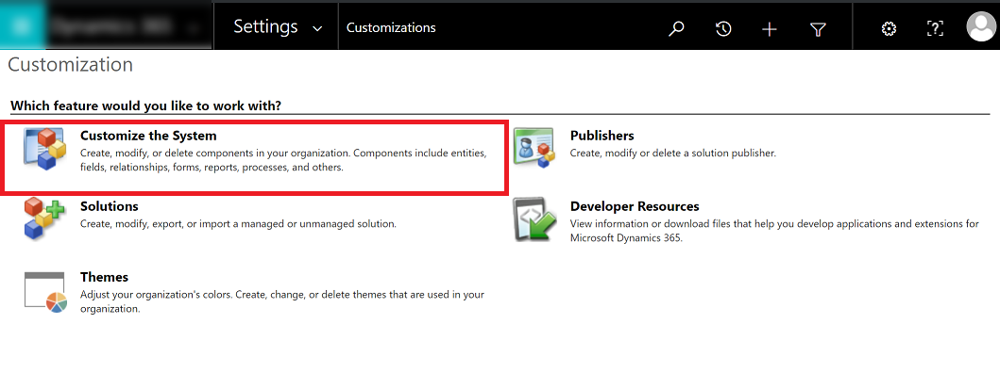
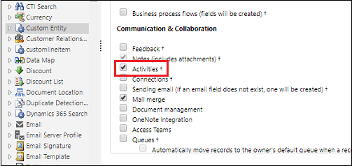

# Customize the Regarding lookup to add or remove entities

1. To open settings for apps that use Unified Interface, look in the upper-right corner and select the Gear icon. Then select **Advanced Settings**.

   > [!div class="mx-imgBorder"]
   >
  
2. Select **Settings** > **Customizations** and then select **Customize the System**.  

   > [!div class="mx-imgBorder"]
   >

3. Choose the custom entity. Under **Communication & Collaboration**, enable **Activities**, and then choose **Save** > **Publish** on the **Home** tab.

   
   
    > [!NOTE]
   > To add a custom entity, see [Filter entities and views that appear in Dynamics 365 App for Outlook](https://docs.microsoft.com/dynamics365/customer-engagement/outlook-app/filter-entities-and-views).

[!INCLUDE[footer-include](../includes/footer-banner.md)]
