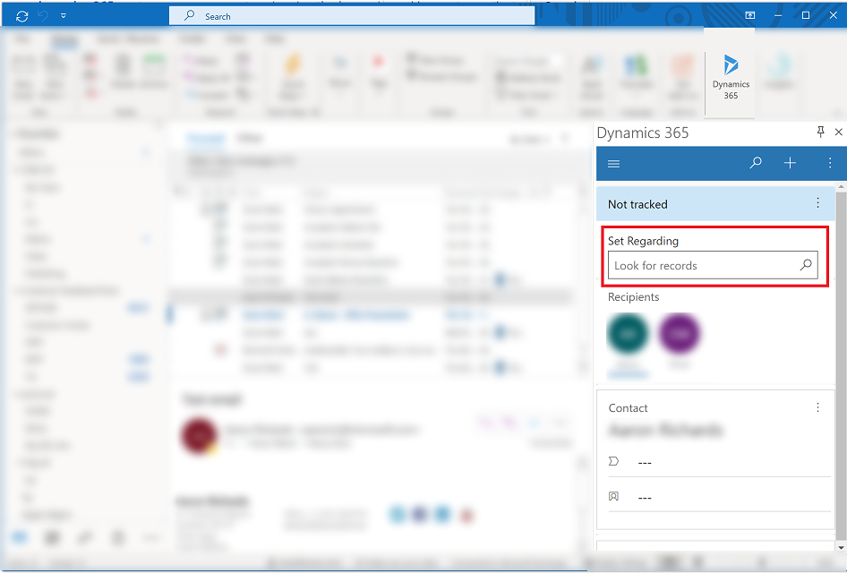

# Enable activities to use Set Regarding lookup in App for Outlook

In App for Outlook the **Set Regarding** lookup lets you link an email message, appointment, or task to a specific app row. To use the **Set Regarding** lookup, activities need to be enabled for the table. 

Most out-of-box (OOB) tables have activities enabled by default, which cannot be disabled. For custom tables that you create, make sure to enable activities to use  the **Set Regarding** lookup in App for Outlook. Once activities are enabled, it cannot be disabled for any table.

   > [!div class="mx-imgBorder"]
   >

## Enable activities for a table

1. To enable activities, Sign in to [Power Apps](https://make.powerapps.com).

  
2. On the left nav, select **Data** to expand it and then select **Tables**.  

   > [!div class="mx-imgBorder"]
   >
   
  
3. Select a table.

4. On the command bar, select **Settings**. 

   > [!div class="mx-imgBorder"]
   >

5. Expand **More settings** > **Collaboration**, and select the checkbox for **Enable for activities**.
6. 
   > [!div class="mx-imgBorder"]
   >
   
  > [!IMPORTANT]
  > Once enabled this setting can't be disabled. If prompted, select **Okay** to confirm.
   
6.  Select **Done** and then **Save Table**.

## Verify the table is added to the app designer

1. Sign in to [Power Apps](https://make.powerapps.com).
2. On the left navigation pane, select **Apps**.
3. From the list of apps select **Dynamics 365 App for Outlook** and then select **Edit**.

   > [!div class="mx-imgBorder"]
   > 

4. In the app designer, choose table and browse to find your custom table.

   > [!div class="mx-imgBorder"]
   > 

5. Select **Save** and then **Publish** the app.

## See also

[Filter entities and views that appear in Dynamics 365 App for Outlook](/dynamics365/customer-engagement/outlook-app/filter-entities-and-views).

[!INCLUDE[footer-include](../includes/footer-banner.md)]
