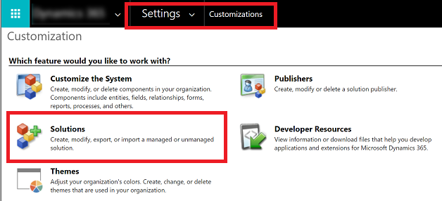
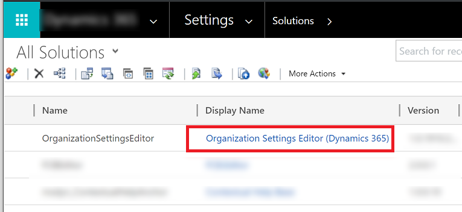
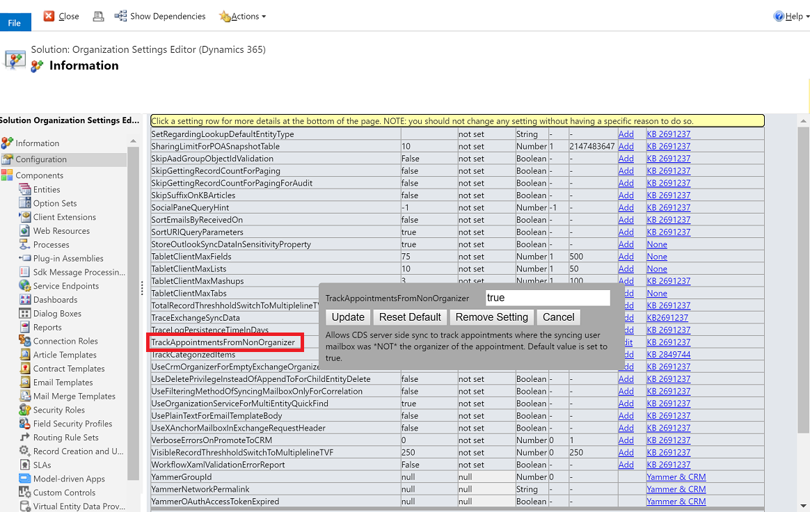

# Enable delegate access 

Enable delegate access to allow someone to track Common Data Service information using the Dynamic 365 Outlook App.

Set up delegate access in Outlook to give someone permission to act on your behalf. For example, you might have an assistant that you want to create and respond to email or meeting requests for you and then track the information in Common Data service using the Dynamic 365 Outlook App.

Prerequisites

- Exchange Online and Microsoft Outlook builds 16.0.12130.20272 or later.
- Configure delegate access in Microsoft Outlook. For more information, see [Allow someone else to manage your mail and calendar](https://support.office.com/article/allow-someone-else-to-manage-your-mail-and-calendar-41c40c04-3bd1-4d22-963a-28eafec25926).  
- Both manager and delegate user need to be set up to use Dynamics 365 App for Outlook. For more information, see [Deploy Dynamics 365 App for Outlook](deploy-dynamics-365-app-for-outlook.md).
- Skype Url is whitelisted. For more information, see [Office 365 URLs and IP address ranges](https://docs.microsoft.com/office365/enterprise/urls-and-ip-address-ranges#skype-for-business-online-and-microsoft-teams)

To enable this capability, you need to enable the **OrgDBOrgSetting** in your organization. Common Data Service apps provides the **OrgDBOrgSettings** tool that gives administrators the ability to implement specific updates that were previously reserved for registry implementations.

Follow the instructions in [this article](https://support.microsoft.com/en-us/help/2691237/orgdborgsettings-tool-for-microsoft-dynamics-crm) for steps to extract the tool. After extracting the tool, enable the **OrgDBOrgSettin TrackAppointmentsFromNonOrganizer**.

You can also use [this tool](https://github.com/seanmcne/OrgDbOrgSettings/releases/) to edit the **OrgDBOrgSetting TrackAppointmentsFromNonOrganizer**.

1.	Sign in as an admin to Dynamics 365 at [https://home.dynamics.com](https://home.dynamics.com).
2.	On the home page, go to **Settings** > **Advanced Settings**.

    > [!div class="mx-imgBorder"] 
    >  

3. From the main menu go to **Settings** > **Customization** and then select **Solutions**.

    > [!div class="mx-imgBorder"] 
    >  
    
4. On the **All Solutions** screen, select **Organization Settings Editor (Dynamics 365)**.

    > [!div class="mx-imgBorder"] 
    >  
    
5. On the **Solution Organization Settings Editor** screen, find
 	**TrackAppointmentsFromNonOrganizer** and **DelegateAccessEnabled** setting and set both to **True** and then select **Update**.
  
    > [!div class="mx-imgBorder"] 
    >  
    

> [!IMPORTANT]
>Things to verify before enabling delegate access in App for Outlook
>- Verify delegate access is setup correctly in Outlook.
>- Delegated user should have sufficient permissions on the delegated mailbox
>- Skype URL is whitelisted
>- Delegated user has the correct Outlook version
>- Organization Settings are configured properly
>- After the Organization settings are configured, App for Outlook is redeployed for all the delegated users

For more information on how to use delegate access see, [Use delegate access](dynamics-365-app-outlook-user-s-guide.md#use-delegate-access).

