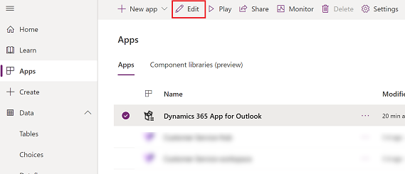
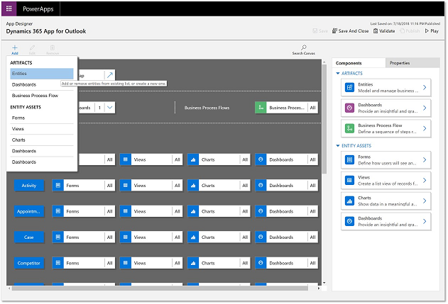
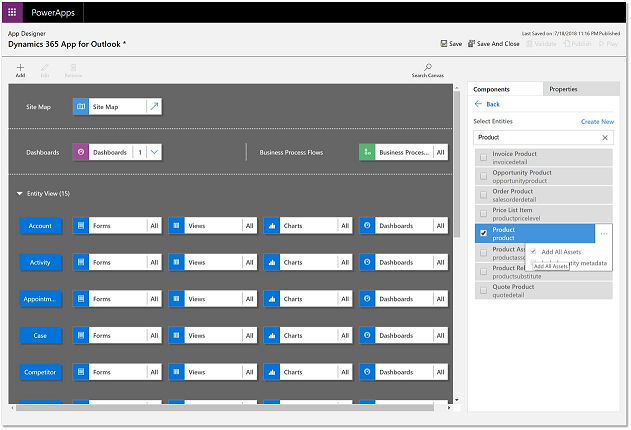

# Filter tables and views that appear in Dynamics 365 App for Outlook  

If you are a system administrator or a customizer, you can choose to expose only the required set of entities to be available to Dynamics 365 App for Outlook.You can do this through App Modules.

With the Power Apps App Designer, you can control the specific entities that appear in Dynamics 365 App for Outlook’s **Quick Create** menu and the **Regarding** lookup. This helps you get to the record you are looking for faster and also modularize business logic by exposing only the relevant entities for your users in Dynamics 365 App for Outlook.

Follow these steps to set which tables and views appear in App for Outlook:

1. Sign in to [Power Apps](https://make.powerapps.com).
2. On the left navigation pane, select **Apps**.
3. From the list of apps select **Dynamics 365 App for Outlook** and then select **Edit**.

   > [!div class="mx-imgBorder"]
   > 

4. In the app designer, **Add** > **Entities** and then select the table you want to add and complete the addition by including all assets.

   > [!div class="mx-imgBorder"]
   > 

   > [!div class="mx-imgBorder"]
   >

4.  Review the list of Views that are available for the table and deselect the ones you don't want to be available in Dynamics 365 App for Outlook. In Dynamics 365 App for Outlook **Regarding** lookup,  you can filter results based on an entity and further, on one of the views defined for that entity.

   

5.  When you're done, select **Save** and then **Publish**.

> [!NOTE]
> - You can also remove tables from Dynamics 365 App for Outlook.
> - An table must have activities enabled for it to appear in the **Set Regarding** lookup. For more information, see [Enable activities to use Set Regarding lookup in App for Outlook](enable-a-custom-entity-to-appear-in-the-regarding-lookup.md).

[!INCLUDE[footer-include](../includes/footer-banner.md)]
