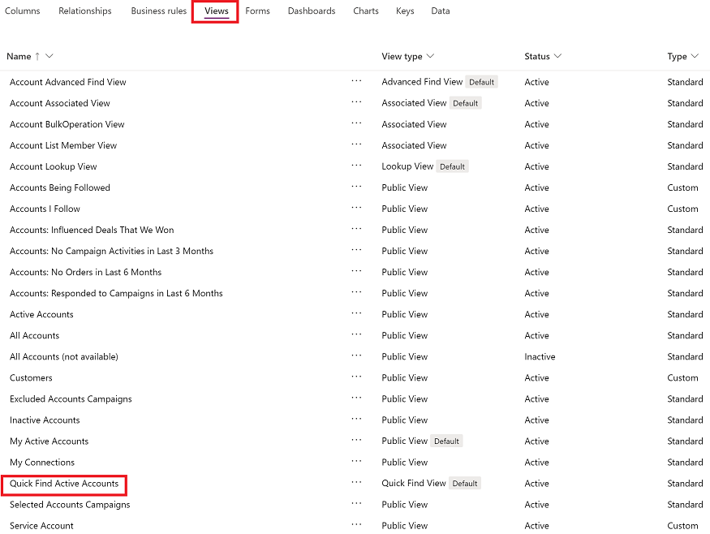

# Expand the columns that the Set Regarding lookup searches on

To have [!INCLUDE[pn_crm_app_for_outlook_short](../includes/pn-crm-app-for-outlook-short.md)] Regarding lookup search on custom columns, that column must be added to the table’s quick find view.

   > [!div class="mx-imgBorder"]
   > 

1. Sign in to [Power Apps](https://make.powerapps.com).
2. On the left nav, select **Solution**.
3. Select the solution that contains the table and then select **Edit** on the command bar. For more information on solutions, see [Solutions overview](/maker/data-platform/solutions-overview.md).

   > [!div class="mx-imgBorder"]
   > 
   
4. On the command bar select the **All** and then select **Table**.

   > [!div class="mx-imgBorder"]
   > 

5. Select a table to edit it such as **Account**.

6. Select **Views** and make sure that **Quick Find Active Accounts** view is active.

   > [!div class="mx-imgBorder"]
   > 
   

  
  

[!INCLUDE[footer-include](../includes/footer-banner.md)]
