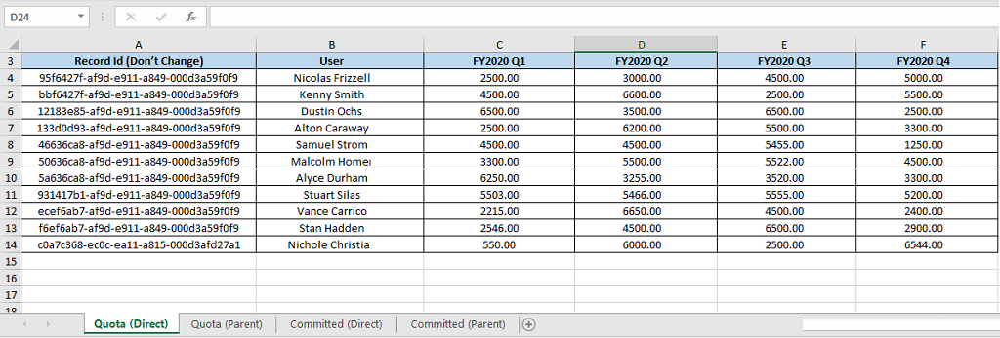

# Activate and upload simple columns data

Use the **Activate & add quotas** step to activate the forecast and make it available for users. Once, the forecast is active, you can download and upload a template (Excel file) with quotas and sample column types for all users defined in the forecast hierarchy.

> [!IMPORTANT]
> At any given time, you can have only six active forecasts in your organization.

1.	In the **Activate forecast** section, select **Activate forecast**. The configured forecast starts calculating the values for forecast and is available for users in your organization. The activation might take a few minutes.

    > [!div class="mx-imgBorder"]
    > 
 
    Once a forecast is activated, a confirmation message is displayed. The option to download the quota template becomes available.

    > [!NOTE]
    > - If the activation fails, the forecast definition’s status and status reason are set to **Active and Failed**. To learn more, see [Why am I unable to publish forecast definition?](troubleshooting.md#why-am-i-unable-to-publish-forecast-definition)  
    > - Forecast auto-recalculation only works while the forecast is active. If the last period of the forecast has just lapsed, the forecast will continue auto-recalculating for 30 more days and then will stop.

2.	In the **Upload quota and other static data for this forecast** section, select **Download simple data column template**. A template (Excel file) showing users in the hierarchy is downloaded to your local computer.
 
    > [!div class="mx-imgBorder"]
    > 

    The naming convention of the downloaded file is  ***forecastname*_Simple.xlsx**. For example, if you've created a forecast with the name **Kenny’s Org FY 2020 Forecast**, the name of the downloaded file is **Kenny’s Org FY 2020 Forecast_Simple.xlsx**.

3.	Open the downloaded Excel file.

    The file is divided into groups of two tabs **Direct** and **Parent**, and the groups depends on the simple columns you've configured for the forecast. Each tab consists of the following columns: Record Id, Hierarchy field (and any hierarchy-related columns), and each forecast period (depends on the number of periods you've selected for the forecast). 

    For example, if you've configured a forecast with two **Simple** columns **Quota** and **Committed** and specified the number of periods as 4 in 2020, the downloaded file will consist of four tabs – Quota (Direct), Quota (Parent), Committed (Direct), and Committed (Parent). Each tab consists of six columns – Record Id, User, FY2020 Q1, FY2020 Q2, FY2020 Q3, and FY2020 Q4.

    > [!div class="mx-imgBorder"]
    > 

    -	Direct tab: This tab shows all the sales reps or territories (also called leaf nodes) in the forecasting hierarchy. Enter values as required and when the file is uploaded, the values are displayed under their respective columns in the forecast grid. The values you enter for managers or parent territories in the Direct tab will not affect the values that you enter in the Parent tab (a manager or parent territories can also be working on opportunities and will have certain values as an individual).

    -	Parent tab: This tab shows anyone who has direct records reports in the selected hierarchy. A manager or parent territory has at least one direct report. Enter the values as required and when the file is uploaded, the values will show under their respective columns in the forecast grid for managers or parent territories (a level above individuals).

    > [!IMPORTANT]
    > Don't change the Record Ids values in the file. If changed, the forecast might display inaccurate values.

4.	Save and close the file.

5.	In the **Upload quota and other static data for this forecast** section, select the option to browse and upload, or drag and drop the file in the upload area. You can verify the status at the bottom of the upload area.

6.	After the file is uploaded, select **Finish**.

    You're directed to the Forecast configuration home page, where your organization's forecasts are listed.

<table>
<tr><td>

> [!div class="nextstepaction"] 
> [Previous step: Choose layout and columns](choose-layout-and-columns-forecast.md)
</td></tr>
</table>

### See also

[Configure a forecast in your organization](configure-forecast.md)