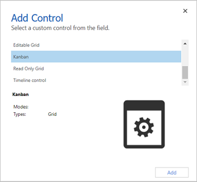

# Add the Kanban control to opportunity or activity entity

To enable your sales people to use the Kanban view to manage their opportunity, you must add the Kanban control that comes with Dynamics 365 Sales to the Opportunity form first.

To add the control:
1.	In your app, select the **Settings** icon, and then select **Advanced Settings**.

    
 
    The Business Management page opens.

2.	On the navigation bar, select **Settings**, and then under **Customization**, select **Customizations**.

3.	Select **Customize the System**.

4.	Under **Components** in the solution explorer, expand **Entities**, and then select **Opportunity**.

5.	Go to the **Controls** tab and select **Add Control**.

    

6.	In the **Add Control** dialog box, select **Kanban**, and then select **Add**.

    

    The Kanban control is added to the list of controls.

7.	By default, the Read-only grid option is selected, so when users select **Opportunities** from the site map, they'll see a list of opportunities. To make the Kanban view the default view instead, select the radio button for the Kanban control for the corresponding options.  

     

8.	Select the **Save** icon to save your changes.

9.	To publish the changes you’ve made, select **Publish**.

### See also

[Work with opportunities in the Kanban view](opportunity-kanban-view.md)  
