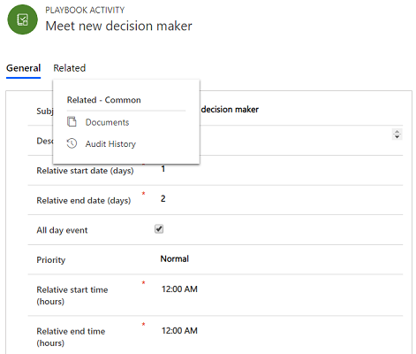

# Associate documents with playbook activities

Ensure sales reps always have the latest sales and training materials to close a deal by associating documents with playbook activities that you add to a playbook template.
For example, create a playbook template that sales reps can follow when the decision maker they are working with leaves the organization. While adding activities to this template, you can also attach documents that help the sales rep bring the new decision maker up to speed. 

## Prerequisites

So that you can add documents, make sure that document management for the playbook activity entity is enabled. Document Management must also be enabled for playbook activity and all the entities to which documents must be copied, that is, task, appointment, and phone call. [!INCLUDE[proc-more-information](../includes/proc-more-information.md)] [Enable SharePoint document management for specific entities](../admin/enable-sharepoint-document-management-specific-entities.md), [Set up SharePoint integration](../admin/set-up-sharepoint-integration.md).

## Add documents 

1.	In the **Playbook activities** section of the playbook template, open the playbook activity to which you want to associate a document.

2.	In the activity form, select the **Related** tab, and then select **Documents**.

    

    The **Documents** list opens.

    

3.	Select **Upload** to add documents that a sales rep might need while working on this playbook activity. The documents are stored on the configured SharePoint site. For more information about working with documents, see [Manage your SharePoint documents](../basics/manage-sharepoint-documents-document-locations-in-dynamics-365-apps.md).

> [!NOTE]
>   -	The document operations you can perform, such as creating a new document or uploading, checking out, editing, or deleting a document, depend on the permissions assigned to you.  
>   - If a system administrator disables document management on a playbook activity for which it was earlier enabled, and documents were associated, the documents won’t be available to the associated activities when a playbook is launched for an entity such as an opportunity or lead.
>   - By default, the playbook activity entity is enabled for customization because that’s a prerequisite for enabling SharePoint integration. However, we don't support any customizations to this entity.

### See also
[Manage playbook templates](manage-playbook-templates.md)  
[Enforce best practices with playbooks](enforce-best-practices-playbooks.md)  
