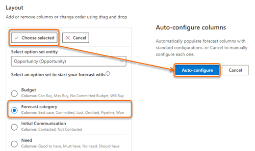
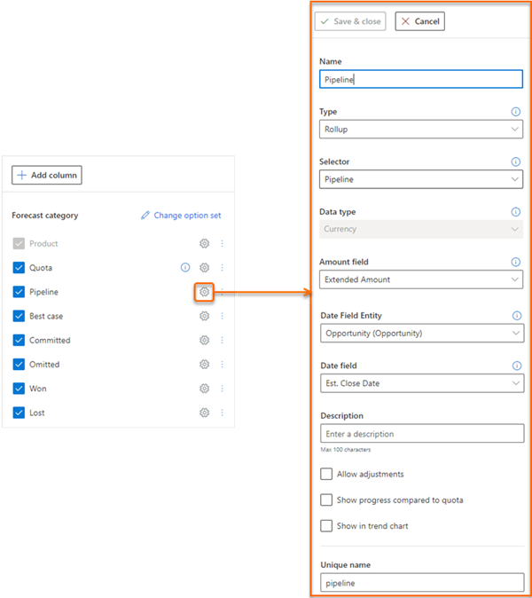
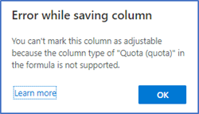
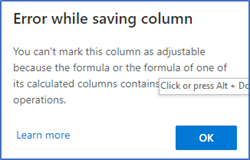
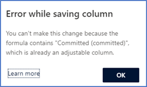
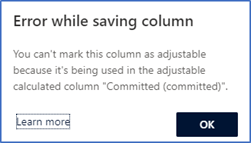

# Choose layout and columns

In the **Layout** step of the forecast configuration, you can configure columns to define the forecast grid that appears for users. You can configure rollup columns from option sets that are defined for opportunities in your organization.

Perform the following steps to add columns and configure the forecast grid:

1.	[Add columns from an option set](#add-columns).

2.	[Configure columns](#configure-columns).

## Add columns from an option set

Every forecast needs an option set to define rollup columns. 

> [!IMPORTANT]
> The **Prediction** column is available only when predictive forecasting is enabled for your organization. To learn more, see [About premium forecasting](https://docs.microsoft.com/dynamics365/ai/sales/configure-premium-forecasting).

To define the layout, select an option set and then add the rollup columns accordingly, as described in the following steps.

1.	In the **Layout and column** section, select **Add from option set**. A list of option sets appears. 

2.	Choose an option set entity from the rollup entity or from its related entities. The selected entity consists of option sets that are necessary to add columns to the forecast. In this example, the **Opportunity (Opportunity)** option set entity is selected from **Related Entities**. The list shows only the option sets defined on the opportunity entity.

    > [!div class="mx-imgBorder"]
    > 

3.	Choose an option set and then select **Choose selected**. In this example, **Forecast category** option set is selected. The option set values are added as columns for you to configure.

    > [!TIP]
    > We recommend you use the out-of-the-box **Forecast category** option set for column configuration. After choosing this option, select **Auto-configure** in the dialog box that asks if you want to auto-populate the configuration parameters. This saves time by automatically populating columns according to best practices. The option to auto-configure columns are available only for **Opportunity** and **Opportunity product** rollup entities.

    > [!div class="mx-imgBorder"]
    > 

    By default, a **Quota** column of type **Simple** is added to the forecast. To begin tracking against targets, you must manually upload an Excel workbook that contains quota values to the forecast. To learn more, see [Activate and upload simple columns data](activate-upload-simple-columns-data-forecast.md).

    After the rollup columns are added to the forecast, you can use **More options** to rearrange or remove the columns that you don't need.

    > [!div class="mx-imgBorder"]
    > 

      
## Configure columns

You can configure each column individually&mdash;such as changing the column type, allowing adjustments, and showing a column in the trend chart&mdash;according to your organizational requirements.

>[!NOTE]
>- Auto configuration of columns are available only for **Opportunity** and **Opportunity product** rollup entities. For other rollup entities, you must manually configure each column.
>- An alert icon  corresponding to a column, indicates that the column is not configured.

1.	To configure each column, select the gear icon  and the column configuration section opens. In this example, the **Pipeline** column is selected.

    > [!div class="mx-imgBorder"]
    > 

    On the column configuration page, the **Name** specifies the name of the column.

3.	Select the **Type** of column. The options that appear depend on the type of column you select. For example, when you select a column of type **Calculated**, a text box appears for you to enter a formula to use for calculating the value of the column. 

    The following column types are supported:

    -	[Rollup type](#configure-rollup-type)
    -	[Calculated type](#configure-calculated-type)
    -	[Simple type](#configure-simple-type)
    -	[Hierarchy related type](#configure-hierarchy-related-type)

    When configuring columns, you'll see a preview of the configuration in the **Preview** section.

4.	Save and close the configuration.

5.	Repeat steps 1 through 4 for each column that you want to edit.

  
### Rollup type

The **Rollup** column type aggregates the values of all fields based on the selected **Selector** and **Amount field** values, by using the **Date field** value as the filter criteria.

While configuring these columns, some attributes that are necessary for the forecast estimated revenue and estimated close date. Typically, these attributes are available in the selected rollup entity. For complex data models, such as opportunity splits and opportunity product, these attributes are distributed between rollup and related entities. To address this complexity, the forecasting supports the selection of related attributes for estimated revenue and estimated close date.

Select the column **Type** as **Rollup**. The following options are available to configure.

| Parameter | Description |
|-----------|-------------|
| Selector | Select the option set value that defines how this column is grouped. For example, if **Best Case** is selected, only opportunities with the forecast category set to **Best Case** will be aggregated. |
| Data type | Select the data type of a column of which the aggregated value is displayed in the forecast grid. The supported values are currency, integer, and decimal. You can use integer or decimal data type for quantity-based forecast. By default, the value is selected as **Currency**. If the forecast contains both currency and numeric columns, then you must select the primary data type to activate the forecast. More information: [Forecast with different data type](forecast-different-data-types.md). |
| Amount field | Select the amount field on which the aggregation is calculated. The list is displayed based on the selected **Data type** and **Rollup entity**. For example, if the **Forecast category** option set is selected, the amount field is automatically configured as **Est.Revenue**.   If you're using a custom field to track the estimated revenue for your organization, select that custom field. |
| Date entity | Select the entity from which you want to choose the date field.  If the required date field is not available in the rollup entity, you can choose from the related entities. For example, in a product-based forecast, the rollup entity is **Opportunity Product** and the required estimated close date attribute will not be available in this entity. Therefore, select the **Opportunity** entity from **Related entities** that has the estimated close date attribute. |
| Date field | Select the date field that defines the record's forecast period. The available fields are based on the selected **Date entity**, such as **Opportunity**. For example, if the **Opportunity** entity is selected, the date field is configured as **Est.Close Date**.  If you're using a custom field to track the estimated close date for your organization, select that custom field.|
| Description | Enter a description for the column. This description appears as a tooltip on the column header of the forecast grid, to help your users understand what the column contains. |
| Allow adjustments | Enable this setting to let users manually edit a system-calculated value directly in the forecast grid. When this setting is enabled, you'll see a pencil icon next to the forecasted value in that column. To learn more, see [Adjust values in a forecast](adjust-values-in-forecast.md). |
| Show progress compared to quota | Enable this option to compare the column's value against the quota column. When this is enabled, a progress bar indicating the attainment percentage is shown below the column's value.|
| Show in Trend Chart | Enable this option to show the value in the **Trend Chart**. This option is available only when predictive forecasting is enabled for your organization. To learn more about trend charts, see [Understand forecast projection through trend charts](https://docs.microsoft.com/dynamics365/ai/sales/understand-forecast-projection-through-trend-chart.md). |
| Unique name | The unique name is used to identify the column to use when you're writing a formula for a **Calculated** column. |

### Calculated type

Calculated columns can be identified in your forecast by looking for the information icon in the column header. Hovering over the icon will display the formula that is defined for the column. When you select column **Type** as **Calculated**, the values for the column are calculated and displayed based on a formula that you define. The following options are available to configure.

| Parameter | Description |
|-----------|-------------|
| Data type	| Select the data type of a column of which the aggregated value is displayed in the forecast grid. The supported values are currency, integer, and decimal. You can use integer or decimal data type for quantity-based forecast. By default, the value is selected as **Currency**. If the forecast contains both currency and numeric columns, then you must select the primary data type to activate the forecast. More information: [Forecast with different data type](forecast-different-data-types.md).  |
| Calculation | Enter a formula to calculate values for the column. When you start typing a formula, suggestions are displayed for your convenience. The names shown are the column's unique name and value. For example, if you want to see the best case forecast in this column, enter the formula as **Closed + Commit + Best Case**.   If you enter an invalid formula, an appropriate error message appears below the **Calculation** field. |
| Description | Enter a description for the column. This description appears as a tooltip on the column header of the forecast grid, to help your users understand what the column contains. |
| Allow adjustments | Enable this setting to let users manually edit the value of a calculated column directly in the forecast grid. When you select the column as adjustable, the formula you have created for this column must satisfy certain conditions that allow a proper rollup of values in the forecast. If not satisfied, an error is displayed, and you can’t proceed to the next step. To learn more about the conditions and its corresponding errors, see [Adjustment column conditions](#adjustment-column-conditions).  When this setting is enabled, you'll see a pencil icon next to the forecasted value in that column. To learn more, see [Adjust values in a forecast](adjust-values-in-forecast.md). |
| Show progress compared to quota | Enable this option to compare the column's value against the quota column. When enabled, a progress bar indicating the attainment percentage is shown below the forecast value in that column.|
| Show in Trend Chart | Enable this option to show the value in the **Trend Chart**. This option is available only when predictive forecasting is enabled for your organization. To learn more about trend charts, see [Understand forecast projection through trend chart](https://docs.microsoft.com/dynamics365/ai/sales/understand-forecast-projection-through-trend-chart). |
| Unique name | The unique name is used to identify the column when you're writing a formula for a **Calculated** column. |	

#### Adjustment column conditions

To configure a calculated column as adjustable, it must satisfy certain conditions. These conditions are applicable on columns that are used to create the formula. If the conditions are not satisfied, an error will be displayed, and you will not be able to proceed further. The conditions are:

| Condition	| Description | Error type | Resolution |
|-----------|-------------|------------|------------|
| No column with adjustments | In the **Calculation** box, the formula must not contain columns that have adjustment defined.   **Example:** You want to configure **committed** column as calculated field with adjustments and entered the formula as **won + forecast**. Here forecast column is configured as adjustable.  When you select **Allow adjustments**, an error is displayed. | **Error:** The formula is invalid. The column reference - *column* results in a circular dependency.  | Remove the column that is configured as adjustable from the formula and add non-adjustable columns. |
| No simple or prediction column | In the **Calculation** box, the formula must not contain any columns that are of type simple or prediction.  **Example:** You want to configure **forecast** column as calculated field with adjustments and entered the formula as **won + quota**. Here quota is a simple column. When you select **Allow adjustments** and then save the configurations, an error is displayed. | An error of type **Error while saving column** is displayed with the message – **You can't mark this column as adjustable because the column type of *"Column(display name) "* in the formula is not supported.**   Select **OK** to continue. | Remove the simple or prediction columns from the formula. |
| No Hierarchy related column | In the **Calculation** box, the formula must not contain any columns that are of type **Hierarchy related**. These types of columns will not be available as autocomplete text in the Calculation box; manually typing them will end in an error.  **Example:** You want to configure **committed** column as a calculated field with adjustments and entered the formula as **won + user**. Though the **user** column is of type hierarchy related and not displayed in the suggested list, you entered it manually.  When you select **Allow adjustments**, an error is displayed. | **Error:** The formula contains invalid column reference - *column* at position *number*.  | Never use columns that are of type **Hierarchy related**. |
| Formula must contain only addition and subtraction operations | In the **Calculation** box, the formula must contain only the addition and subtraction operations. Other mathematical operations such as, multiplication and division are not supported. **Example:** You want to configure **forecast** column as calculated field with adjustments and entered the formula as **won * committed**. Here the operator is multiplication. When you select **Allow adjustments** and then save the configurations, an error is displayed. | An error of type **Error while saving column** is displayed with the message – **You can't mark this column as adjustable because the formula or the formula of one of its calculated columns contains non-supported operations.**  Select **OK** to continue. | Remove the unsupported mathematical operations from the formula, and use only addition and subtraction operations. |
| No adjustable calculated field inside a formula of another calculated field | In the **Calculation** box, the formula can contain calculated fields. However, the used calculated field must not be adjustable and must satisfy other conditions defined in this table. **Example:** You want to configure **forecast** column as calculated field with adjustments and entered the formula as **committed + pipeline**. Here **committed** is a calculated column that is set as adjustable.  When you select **Allow adjustments** and then save the configurations, an error is displayed. | An error of type **Error while saving column** is displayed with the message – **You can't make this change because the formula contains *"Column(display name)"*, which is already an adjustable column.**  Select **OK** to continue. | Remove the calculated column that is configured as adjustable from the formula and add non-adjustable columns. |
| No column must be set as adjustable after being added to the formula | After you created a calculated field that is adjustable, and you can’t set a column used in the formula to adjustable.  **Example:** You configured the **committed** calculated column by entering the formula won + best case and set the column to adjustable. Then, you tried to change the **won** column setting to adjustable. When you select **Allow adjustments** and then save the configurations, an error is displayed. | An error of type **Error while saving column** is displayed with the message – **You can't mark this column as adjustable because it's being used in the adjustable calculated column *"Column(display name)"*.**  Select **OK** to continue. | Don’t use the columns that can be used as adjustable in future. |

### Simple type

Use the **Simple** column type to manually upload external data to a forecast. An Excel workbook is available for you to download after you activate the forecast. You must edit the Excel workbook with the necessary values and then upload it to the forecast. To learn more, see [Activate and upload simple columns data](activate-upload-simple-columns-data-forecast.md).

For example, **Quota** is a simple column type where you can manually upload data by using an Excel workbook. The following options are available to configure.

| Parameter | Description |
|-----------|-------------|
| Data type	| Select the data type of a column of which the aggregated value is displayed in the forecast grid. The supported values are currency, integer, and decimal. You can use integer or decimal data type for quantity-based forecast. Depending on the type of value that you'll be uploading data through an Excel workbook. By default, the value is selected as **Currency**. If the forecast contains both currency and numeric columns, then you must select the primary data type to activate the forecast. More information: [Forecast with different data type](forecast-different-data-types.md). |
| Description | Enter a description for the column. This description appears as a tooltip on the column header of the forecast grid, to help your users understand what the column contains. |
| Unique name | The unique name is used to identify the column to use when you're writing a formula for a **Calculated** column. |

### Hierarchy related type

When you select column **Type** as **Hierarchy related**, the column helps you pull additional attributes from the hierarchy entity. The following options are available to configure.

| Parameter | Description |
|-----------|-------------|
| Data type	| Data type of the column that you want to display on the forecast grid. By default, the value is selected as **Single line of text** and can't be changed. |
| Attribute field | Select an attribute to display in the column. For example, you can select **Email**, which will be unique to each user in your organization and can help you identify to whom the record belongs. |
| Description | Enter a description for the column. This description appears as a tooltip on the column header of the forecast grid, to help your users understand what the column contains. |
| Unique name | The unique name is used to identify the column to use when you're writing a formula for a **Calculated** column. |
<table>
<tr><td>

> [!div class="nextstepaction"] 
> [Previous step: Provide viewing permissions](provide-permissions-forecast.md)
</td><td>

> [!div class="nextstepaction"] 
> [Next step: Apply additional filter](add-additional-filters.md)
</td></tr>
</table>

### See also

[Configure forecasts in your organization](configure-forecast.md) 
[View a forecast](view-forecasts.md) 
[About premium forecasting](https://docs.microsoft.com/dynamics365/ai/sales/configure-premium-forecasting) 
[Configure forecast using custom rollup entity](configure-forecast-using-custom-rollup-entity.md)
