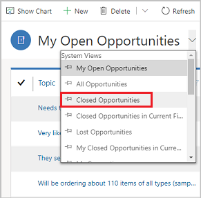

# Close an opportunity as won or lost (Sales and Sales Hub)

[!INCLUDE[cc-applies-to-update-9-0-0](../includes/cc_applies_to_update_9_0_0.md)]

If your customer has accepted your proposal, congratulations! However, whether your customer accepted or declined your proposal, it's now time to close that opportunity.  
  
1. If you're using the Sales Hub app, in the site map, select **Opportunities**. 
   
   OR

   In the Sales module, go to **Sales** > **Opportunities**.
  
2. Open the opportunity you want to edit.  
  
3. At the top of the **Opportunity** form, do one of the following:  

   - To close your opportunity as won, select **Close as Won**.  
 
   - To close your opportunity as lost, select **Close as Lost**.

      

4. When you close the opportunity as **Won**, in the **Close Opportunity** dialog box, do the following, and select **OK**:

    - In **Actual Revenue**, Verify the amount, and make changes, if necessary.
    
    - In **Description**, enter details about what contributed to winning this opportunity. 

      

    When you close the opportunity as **Lost**, in the **Close Opportunity** dialog box, do the following, and select **OK**:
  
    -  In **Competitor**, select a competitor you lost this opportunity to.
    
    -  In **Description**, add more details around why the opportunity was lost.

        

    > [!IMPORTANT]
    > If your system administrator has enabled custom fields on the Opportunity Close form, you may be required to fill in data in other fields as defined by your organization. The capability to enable custom fields on the Opportunity Close form is in preview.  [What are Preview features and how do I enable them?](../admin/what-are-preview-features-how-do-i-enable-them.md)

For information on how to resolve the common errors that you may see while closing an opportunity, see the [troubleshooting guide](troubleshooting.md).

## Reopen a closed opportunity

If you've closed an opportunity as lost, but would like to start discussions about a potential sale, you may want to reopen a closed opportunity.

1. If you're using the Sales Hub app, in the site map, select **Opportunities**. 
   
   OR

    In the Sales module, go to **Sales** > **Opportunities**.

2. To see all the closed opportunities, in the view selector, select the **Closed Opportunities** view.  

    

3. Select the opportunity that you want to repoen, and on the command bar, select **Reopen Opportunity**. The reopened opportunities start appearing in the open opportunities list.
  
### See also  
 [Nurture sales from lead to order](../sales-enterprise/nurture-sales-from-lead-order-sales.md)   
 [Print leads, quotes, and other records](../basics/print-leads-quotes-other-records.md)  
 [Dynamics 365 for Sales troubleshooting guide for administrators](troubleshooting-admin.md)  
