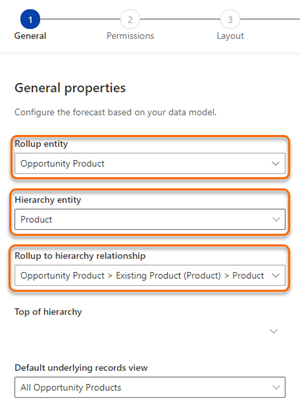
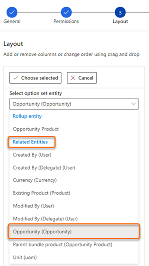
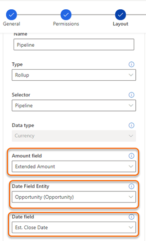
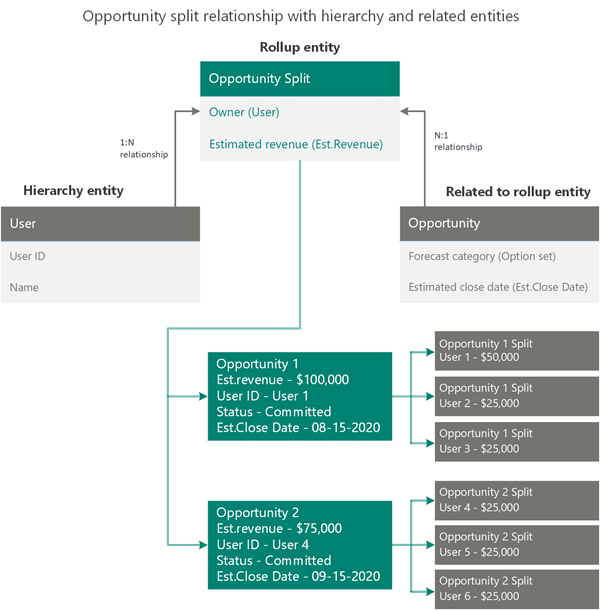
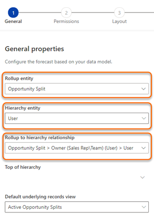
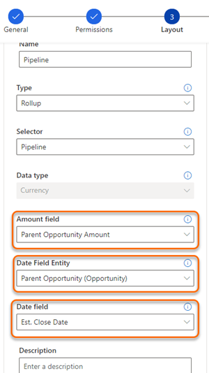

# Configure forecast using custom rollup entity

<!--Early access preview note will be added here-->

In the existing forecasting, you can configure a forecast based on the **Opportunity** rollup entity only. Now, forecasting is enhanced to support custom and other out-of-the-box rollup entities to enable you to configure a forecast that matches your organizational requirements.

## How it works

To configure a forecast that is specific to your organization, you can select any entity as rollup, any related entity as hierarchical entity with hierarchical entity defined in your organization, and establish a relationship between them.

Forecasting supports up to two levels of relationships between the rollup and hierarchical entities. For example, *Opportunity > Owner (User) > Territory (Territory) > Territory*. Here, **Owner** is the attribute in the **Opportunity** entity of type **User** and **Territory** is the attribute in **User** entity of type **Territory**. This helps the forecast to be more specific to your complex organizational requirements.

While configuring the forecast columns, some attributes that are necessary for a forecast are forecast category, estimated revenue, and estimated close date. Typically, these attributes are available in the selected rollup entity. For complex data models, such as opportunity splits and opportunity product, these attributes are distributed between rollup and related entities. To address this complexity, the enhanced forecasting supports the selection of related attributes for forecast category and estimated close date.

For example, let’s consider two data models – [opportunity product](#opportunity-product) and [opportunity split](#opportunity-split).

## Opportunity product

Use this model to create a product-based revenue forecast.

For product-based foresting, the product level revenue comes from **Opportunity Product** entity. Therefore, **Opportunity Product** must be selected as rollup entity and **Product** as hierarchy entity which has a direct relationship with **Opportunity Product** (rollup entity). 

The other key attributes for the forecast are **Forecast category** and **Est.Close Date**. These attributes are available in **Opportunity** entity that is related to **Opportunity Product** (rollup entity). 

So, we are using the following entities to create the forecast:

-	**Opportunity Product** entity as rollup entity
-	**Product entity** as hierarchy entity
-	**Opportunity** entity for forecast category and estimated close date

The following diagram illustrates the above-mentioned data model:

> [!div class="mx-imgBorder"]
> 

Let’s configure this forecast.

1.	Select the template.

    With the early access, the **Product forecast** template is available to you to configure a forecast based on opportunity product and product hierarchies. 

    >[!NOTE]
    >You can choose **Create from scratch** to create a forecast based on your custom entities and custom relationships.
 
    > [!div class="mx-imgBorder"]
    > 

2.	In the **General** section, select the rollup entity as **Opportunity Product** and the hierarchy entity as **Product**. 

    A direct relationship exists between the rollup and hierarchy entities, therefore select the relationship as **Opportunity Product > Existing Product (Product) > Product**. Here, **Existing Product** is an attribute in **Opportunity Product** (rollup entity) that has a relationship to **Product** (hierarchy entity).

    >[!NOTE]
    >If there is no direct entity relationship between the rollup entity and the hierarchy entity, you can choose a related attribute to define the relationship. Select the **Related** tab, and then choose a related attribute from the list. The list displays attributes of the hierarchy-defined entities only. If no relationships exist, the entity and related tab will be empty, and you can’t configure the forecast.

    > [!div class="mx-imgBorder"]
    > 

    Enter other necessary information in the form, and select **Next**. To Learn more, see [Define general properties and scheduling](define-general-properties-scheduling-forecast.md).

3.	Perform the steps in [Provide viewing permissions](provide-permissions-forecast.md).

4.	In the **Layout** section, choose the option set entity from the rollup entity or from its related entities. For this data model, the forecast categories exist in opportunity entity, select the **Opportunity (Opportunity)** option set entity from **Related Entities**.

    > [!div class="mx-imgBorder"]
    > 

    In the **Opportunity (Opportunity)** entity, the **Forecast category** option set is selected and auto configured.
    
    To configure each column, select the corresponding gear icon  and the column configuration section opens. 
    
    In the **Amount field**, the **Extended Amount** attribute is selected from **Opportunity Product** (rollup entity). 
    
    However, **Date field entity** is not available in **Opportunity Product** (rollup entity). You can select the related **Opportunity** entity and then select **Est.Close Date** attribute.

    > [!div class="mx-imgBorder"]
    > 

    Enter other necessary information in the form and save.

    Repeat the step to configure other columns as required and select **Next**. To learn more, see [Choose layout and columns](choose-layout-and-columns-forecast.md).

5.	Perform the steps in [Apply data filters](choose-layout-and-columns-forecast.md#apply-additional-filters).

6.	Optionally, you can [configure to take snapshot daily](https://docs.microsoft.com/dynamics365/ai/sales/take-snapshots-daily). 

7.	Perform the steps in [Activate and upload simple columns data](activate-upload-simple-columns-data-forecast.md).

## Opportunity split 

Use this model to create an opportunity split forecast.

For opportunity split-based foresting, the user level revenue comes from the **Opportunity Split** entity. Therefore, **Opportunity Split** must be selected as rollup entity and **User** as hierarchy entity which has a direct relationship with rollup entity through the **Owner** attribute. 

The other key attributes for the forecast are **Forecast category** and **Est.Close Date**. These attributes are available in **Opportunity** entity that is related to **Opportunity Split** (rollup entity). 

So, we are using the following entities to create the forecast:

-	**Opportunity Split** entity as rollup entity
-	**User** entity as hierarchy entity
-	**Opportunity entity** for forecast category and estimated close date

The following diagram illustrates the above-mentioned data model:

> [!div class="mx-imgBorder"]
> 

Let’s configure this forecast.

1.	In the template selection page, select **Create from scratch** to create a forecast based on your custom rollup entities.

    > [!div class="mx-imgBorder"]
    > 

2.	In the **General** section, select the **Opportunity Split** option in rollup entity and the hierarchy entity as **User**.

    As there is a direct relationship between the rollup and hierarchy entities through the **Owner** attribute. Select the relationship as **Opportunity Split > Owner (User) > User**. 

    >[!NOTE]
    >If there is no direct entity relationship between the rollup entity and the hierarchy entity, you can choose a related attribute to define the relationship. Select the **Related** tab, and then choose a related attribute from the list. The list displays attributes of the hierarchy-defined entities only. If no relationships exist, the entity and related tab will be empty, and you can’t configure the forecast.

    > [!div class="mx-imgBorder"]
    > 

    Enter other necessary information in the form, and select **Next**. To Learn more, see [Define general properties and scheduling](define-general-properties-scheduling-forecast.md).

3.	Perform the steps in [Provide viewing permissions](provide-permissions-forecast.md).

4.	In the **Layout** section, choose the option set entity from the rollup entity or from its related entities. Here, you’ve selected **Parent Opportunity (Opportunity)** from **Related Entities**. 

    > [!div class="mx-imgBorder"]
    > 

    In the **Parent Opportunity (Opportunity)** entity, the **Forecast category** option set is selected. The columns for the **Forecast category** option set will not be auto configured as there will be custom attributes that you might want to use. You must manually configure each column.

    To configuring each column, select the corresponding gear icon  and the column configuration section opens.

    Select **Amount field** and it lists the out-of-the-box and custom revenue attributes that are related to **Opportunity Split**, such as **Parent Opportunity Amount** and **Revenue Total**. Select the appropriate amount field. Here, you’ve selected **Amount field** as **Parent Opportunity Amount**.

    For **Date Field Entity**, though, the **Opportunity Split** entity consists of date attributes, we select **Parent Opportunity (Opportunity)** entity from the related entities section which consists of the required estimated close date attribute. In **Date field**, select the **Est.Close Date** attribute. 

    > [!div class="mx-imgBorder"]
    > 

    Enter other necessary information in the form and save.

    Repeat the step to configure other columns as required and select **Next**. To learn more, see [Choose layout and columns](choose-layout-and-columns-forecast.md).

    >[!NOTE]
    >You can’t proceed to next step until you complete the configuration of all columns. 

5.	Perform the steps in [Apply data filters](choose-layout-and-columns-forecast.md#apply-additional-filters).

6.	Optionally, you can [configure to take snapshot daily](https://docs.microsoft.com/dynamics365/ai/sales/take-snapshots-daily). 

7.	Perform the steps in [Activate and upload simple columns data](activate-upload-simple-columns-data-forecast.md).

### See also

[Configure forecasts in your organization](configure-forecast.md)

[Project accurate revenue with sales forecasting](project-accurate-revenue-sales-forecasting.md)
