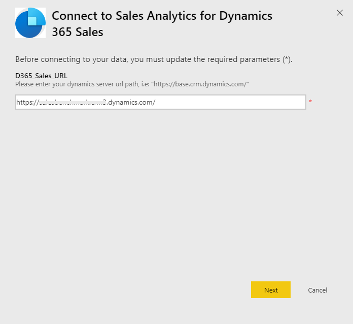
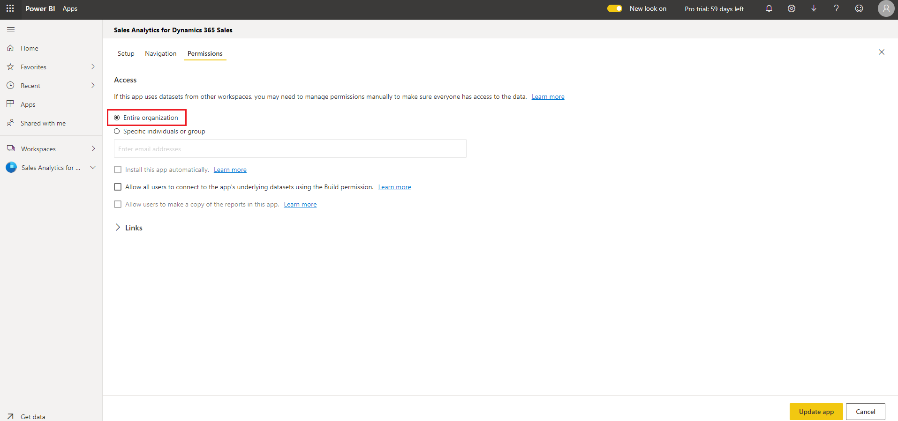
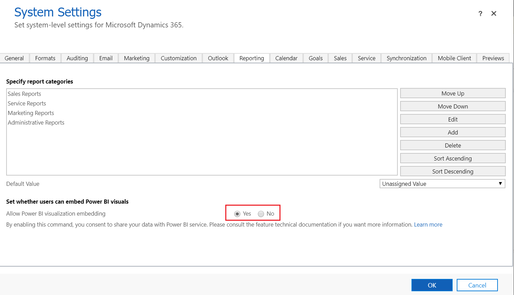
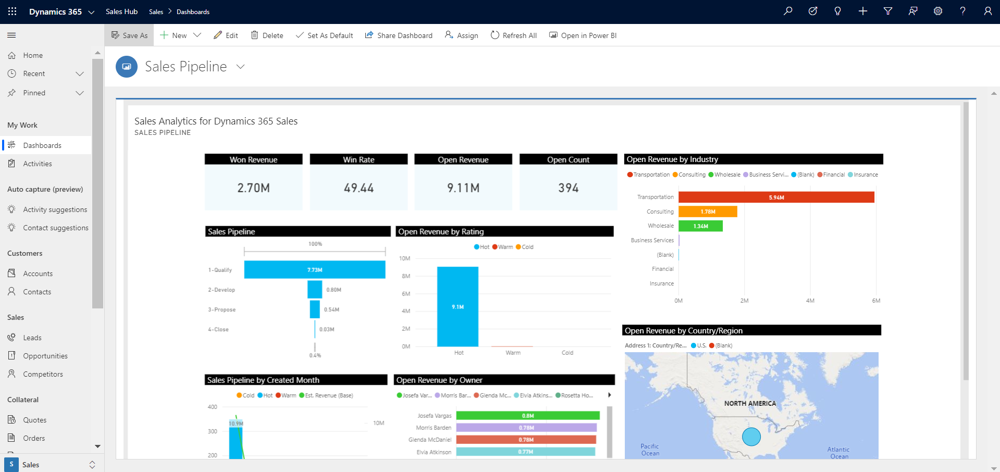

# Configure Power BI template apps to work with Dynamics 365 Sales

You must perform the following steps to configure Sales Analytics for Dynamics 365 Sales or Process Analytics for Dynamics 365 Sales:

1. [Review the prerequisites](#step-1-prerequisites)
2. [Install the Power BI template app](#step-2-install-the-power-bi-template-app)
3. [Connect Dynamics 365 Sales to the Power BI template app](#step-3-connect-dynamics-365-sales-organization-the-power-bi-template-app)
4. [Configure refresh frequency on Power BI dataset](#step-4-configure-refresh-frequency-on-power-bi-dataset)
5. [Publish application within your organization](#step-5-publish-application-within-your-organization)
6. [Enable Power BI reporting in the Common Data Service platform (optional)](#step-6-enable-power-bi-reporting-in-the-common-data-service-platform)
7. [Add Power BI Dashboard to the Sales Hub app (optional)](#step-7-add-power-bi-dashboards-to-the-sales-hub-app)

### Step 1: Prerequisites

Review the following prerequisites before configuring the Power BI template apps:

- You have administrative privileges for Dynamics 365 and Power BI.
- You have a Power BI Pro license for all users of the reports or dashboards in the Power BI template apps.

### Step 2: Install the Power BI template app

1.	Sign in to [Power BI](https://app.powerbi.com/) app as an administrator.

2.	As a Power BI BI administrator, open the link of the Power BI Template App you want to install:

    - [Sales Analytics template app](https://go.microsoft.com/fwlink/p/?linkid=2121603)
    - [Process Analytics template app](https://go.microsoft.com/fwlink/p/?linkid=2121604)

3.	Install the Power BI template app.

4.	After the Power BI template app is installed, the app configuration options page is displayed.

    > [!div class="mx-imgBorder"]
    > 

    Now proceed to configure the app by connecting your Dynamics 365 organization.

### Step 3: Connect Dynamics 365 Sales organization the Power BI template app

1.	On the Power BI template app configuration options page, select **Connect**.

    > [!div class="mx-imgBorder"]
    > 

2.	On the connect data page, enter your organization's Dynamics 365 URL and select **Next**.

    > [!div class="mx-imgBorder"]
    > 

3.	Select **Authentication method** as **OAuth2** and **Privacy level** as **Organizational**. Select **Sign in**.

    > [!div class="mx-imgBorder"]
    > 

4.	Enter your Dynamics 365 Sales credentials and select **Enter**.

    When you are signed in, the existing report is updated with the data from your organization.

### Step 4: Configure refresh frequency on Power BI dataset

After you connect the Power BI template app with Dynamics 365 Sales, you need to configure the refresh frequency on the Power BI dataset to update reports and dashboards properly.

1.	Sign in to Power BI as an administrator.

2.	Go to the Power BI template app workspace.
 
3.	Go to the **Datasets** tab and select **Settings**.

    > [!div class="mx-imgBorder"]
    > 
 
4.	Turn **Scheduled refresh** to On.

    > [!div class="mx-imgBorder"]
    > 

    Now, publish the application in your organization.

> [!NOTE]
> We recommend you configure the refresh frequency to **Daily**.

### Step 5: Publish application within your organization

You must share the configured application with your entire organization for users to view the dashboards and reports with their own Power BI Pro accounts.

1.	On the app workspace, select **Update app**.

    > [!div class="mx-imgBorder"]
    > 

2.	In the Update app wizard, go to the **Permissions** tab.

3.	Choose **Entire organization** and select **Update app**.

    > [!div class="mx-imgBorder"]
    > 
 
    The app is now available to install for all individuals in your organization.

### Step 6: Enable Power BI reporting in the Common Data Service platform

As an administrator, you must enable Power BI reporting in the Common Data Service platform environment for sales managers to view the dashboards in the Sales Hub app.

1.	Sign in to the Common Data Service platform and go to **Settings**.

2.	Select **Administration** > **System Settings**.

3.	Go to the **Reporting** tab and enable **Allow Power BI visualization embedding**.

    > [!div class="mx-imgBorder"]
    > 
 
    Sales managers can now configure dashboards.

### Step 7: Add Power BI dashboards to the Sales Hub app

Each sales manager must configure their environment to integrate the Sales Analytics for Dynamics 365 Sales dashboard.

1.	Sign in to Dynamics 365 Sales and open the **Sales Hub** app.

2.	Select **Dashboards** under **My Work**.

3.	Select **New** > **Power BI Dashboard**.

    > [!div class="mx-imgBorder"]
    > 
 
4.	For **Workspace**, select **Sales Analytics for Dynamics 365 Sales**. For **Dashboard**, select **Sales Pipeline**.

    > [!div class="mx-imgBorder"]
    > 
 
5.	Save and close.

    The Sales Analytics for Dynamics 365 Sales dashboard is now available in Dynamics 365.

    > [!div class="mx-imgBorder"]
    > 

## Customize Sales Analytics for Dynamics 365 Sales

> [!IMPORTANT]
> Microsoft does not support customizations made to the Power BI template app and does not provide updates once modifications are made.

Power BI is a comprehensive collection of services and tools that you use to visualize your business data. Power BI Template apps make it easy to visualize and analyze the sales data with Power BI based on a standard data model. The Sales Analytics for Dynamics 365 Sales and Process Analytics for Dynamics 365 Sales Power BI template apps are built with a set of entities and fields that are useful for most reporting scenarios.

Dynamics 365 apps are often extended with custom fields. These custom fields don't automatically show up in the Power BI model. This topic describes how you can edit and extend the report included in the template app to include custom fields in the Power BI model.

Before you customize the template app, read the information here and perform each task, as necessary.

### Prerequisites

- [Power BI service registration](https://powerbi.com/)
- [Power BI Desktop](https://powerbi.microsoft.com/desktop/) application for editing Power BI reports
- Power BI report for the template app that you want to customize:
    - [Download the Power BI report for Sales Analytics for Dynamics 365 Sales](https://go.microsoft.com/fwlink/p/?linkid=2121605)
    - [Download the Power BI report for Process Analytics for Dynamics 365 Sales](https://go.microsoft.com/fwlink/p/?linkid=2121504)

### Prepare a PBIX for customization

1.	Start Power BI Desktop.

2.	Select **File** > **Open**. Open the .pbix file you want to edit, and then select **Open**.

    Several pages of reports are loaded and displayed in Power BI Desktop.

3.	On the Power BI Desktop ribbon, select **Edit Queries**.

4.	In the left navigation pane of the **Edit Queries** window, under **Queries**, select the D365_Sales_URL query, and then on the ribbon, select **Advanced Editor**.

    In the source definition, replace the placeholder value with your app's instance URL. For example, if the organization name is _Contoso_, the URL looks like this: Source = `https://contoso.crm.dynamics.com`

5.	Select **Done** and then select **Close & Apply** in the Query Editor.

6.	When the **Access an OData feed** dialog appears, select **Organizational account** and then select **Sign in**.
 
7.	When the sign-in field appears, enter your credentials to authenticate to your instance.

8.	In the **Access an OData feed** dialog, select **Connect**.

    The queries are updated. This might take several minutes.

### See also

[Analyze your sales data using Power BI template apps](introduction-sales-template-apps.md)