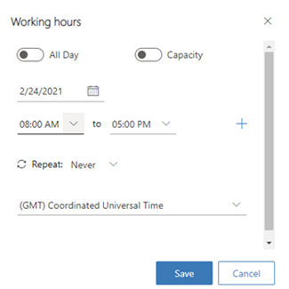

# Configure your work availability

Configure your working days, hours, and days off to adjust scheduled tasks and lead assignment according to your availability. For example, you're taking a day off on April 1, 2021, and you have a few activities to complete that day. When you configure the calendar with your day off, any activities that were scheduled for that day will be moved to your next available date or time.

> [!NOTE]
> - Ensure that you've read and write privileges to Calendar entity. More information: [Security roles and privileges](/power-platform/admin/create-users-assign-online-security-roles#assign-a-security-role-to-a-user).
> - Verify that administrator has enabled the option to let you configure your availability. For more information, see step 4 in [Configure sales accelerator for assignment rules](sales-accelerator-assignment-rules.md).

1.	Sign in to your sales app, and in the lower-left corner of the page, go to **Change area** > **Personal settings**.

2.	Select **Calendar**.

    The calendar opens for the current month with your work availability.

    > [!div class="mx-imgBorder"]
    > 

4.	Select **+ New**, and choose an option to configure your calendar according to your requirements.    
    -	**Working hours**: Configure your regular working hours between dates you define. This helps sales accelerator to consider the assignment of activities to your work list.    
        >[!div class="mx-imgBorder"]
        >    
        
        Configure the following options:     
        1.	Select a date for which you want to configure your working hours.     
        2.	Select the working hours in your day. By default, nine working hours are configured from 8:00 AM to 5:00 PM, without any breaks. To add a general break or lunch hours between working hours, select **Add** (**+**). In the following example, you can see that a break of 30 minutes has been added to the working hours. You can continue adding breaks as needed.     
            >[!div class="mx-imgBorder"]
            >    
        3.	Choose whether you want to repeat this working hour configuration each day or only on this day of the week:    
            -	If you select **Every day**, the configured working hours are applied to each day of the week, including Saturday and Sunday. You can select any days for which you don't want to apply these working hours. In the following example, Saturday and Sunday have been removed from this working hour configuration. 
            Also, you can **choose an end date** on which you want to end this working hour configuration.      
                >[!div class="mx-imgBorder"]
                >    
            -	If you select **Every week**, the configured working hours are applied to the same day every week. In the following example, the configuration is applied on Wednesday, and all subsequent Wednesdays will have the same working hour configuration. 
            Also, you can **choose an end date** on which you want to end this working hour configuration.        
                >[!div class="mx-imgBorder"]
                >    

        4.	Select your time zone. The time zone allows to match the time properly when your team is spread across countries or regions. By default, Coordinated Universal Time (Greenwich Mean Time) is selected.    
        5.	Save the configurations.      
     -	**Non-working hours**: Configure a break or time you're taking off from work on a particular day. Choose the period of time you want to take off, and then select **Save**.     
        In the following example, you have an appointment with a doctor for a checkup between 1:00 and 4:00 PM on March 2, 2021. When you use the **Non-working hours** option to update your calendar, sales accelerator will consider the break and adjust your activity timeline to match your working hours.    
        >[!div class="mx-imgBorder"]
        >    
    -	**Time off**: Configure vacations or personal days off from work. This option blocks a full day or multiple days. When you're applying for multiple days, select the **All-day** option, and then choose start and end dates.     
        Provide a description so other sellers can know your status and your reason for being away. Select your time zone, and then save the configurations.    
        In the following example, you plan to go on vacation with family from March 9 to March 12, and you use the **Time off** option to update your calendar. Sales accelerator will consider the vacation and adjust the activity timeline to match your vacation.   
        >[!div class="mx-imgBorder"]
        >    

