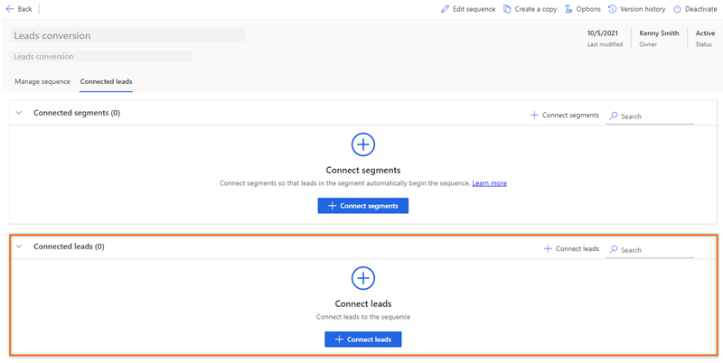
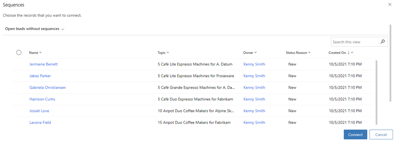
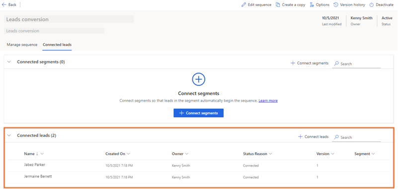
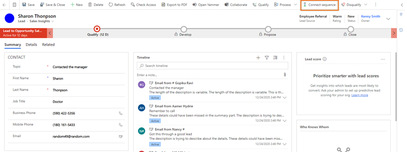
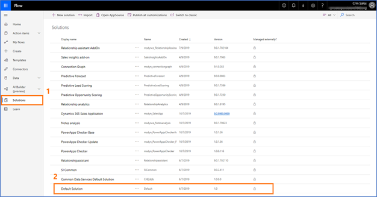
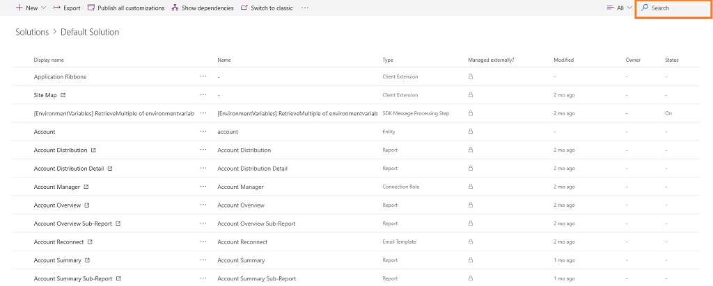
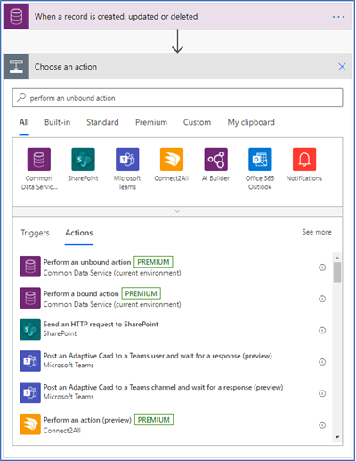
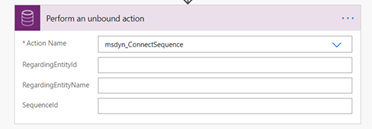

# Connect a sequence to records 

## Requirements
|  | |
|-----------------------|---------|
| **License** | Dynamics 365 Sales Enterprise or Dynamics 365 Sales Premium  More information: [Dynamics 365 Sales pricing](https://dynamics.microsoft.com/sales/pricing/) |
| **Security Role** | System Administrator or Sales Manager    More information: [Predefined security roles for Sales](security-roles-for-sales.md)|
|||

After you create and activate a sequence for the selling process, you connect the sequence to records depending on the entity that you've created the sequence for. When a sequence is connected to an entity, the activities defined in the sequence will be shown in order on the record's **Summary** under **Up next** in **My work**.   
> [!NOTE]
> You can connect a sequence to the following types of records only:
> - Leads that are in a **New** state.
> - Opportunities that are in an **Open** state.    

You can connect a sequence to records in the following ways:    
- [Through a sequence](#ContactThroughASequence)
- [Through the lead or opportunity grid view](#ContactThroughGridView)
- [Through a record](#ContactThroughARecord)
- [Through Power Automate](#through-power-automate)

## Through a sequence   

>[!NOTE]
>In this procedure, we're considering a sequence that was created based on **Lead** as an example. For sequences that are based on **Opportunity**, the procedure is similar.

1. Sign in to your sales app.   
2. Go to **Change area** in the lower-left corner of the page, and select **Sales Insights settings**.   
3. Under **Sales accelerator**, select **Sequence**.   
4. On the **Sequences** page, select a sequence that is active state.    
    >[!NOTE]
    > You can assign records only to sequences that are in an **Active** state.

5. Select and open the sequence for which you want to assign records. or Hover over a sequence, and then select **More options** > **View sequence**.    
    The sequence opens. On the **Manage sequence** tab, you can view the activities that are defined for the sequence.     
    > [!div class="mx-imgBorder"]
    >      
6. Select the **Connected leads** tab.    
    You can see the list of records that are connected to the sequence. If no records are connected, an empty section is displayed.   
7.	In the **Connect leads** section, select **+ Connect leads**.     

    > [!div class="mx-imgBorder"]
    >    

    The list that appears shows available lead records that aren't connected to any sequence.

    > [!div class="mx-imgBorder"]
    >  

    > [!NOTE]
    > On the record selection page, you can do the following tasks on the grid:
    > - Sort and filter the records based on the column options. Select the down arrow icon corresponding to column header, and then select the sort and filter options that are available.
    > - Reorder the columns by dragging-and-dropping at the location you want in the grid.
    > - Search is available only on the name and description of the sequence.

8.	Choose the records that you want to connect to the sequence, and then select **Connect**.     
    Verify that the **Open leads without sequences** view is selected. Selecting this view helps to list only the records that aren't associated with other sequences. You can select other views to choose records to connect, but the records in that view must not be associated with other sequences.     
    > [!div class="mx-imgBorder"]
    >    

    The lead records are connected to the sequence and are added to the list of connected records.   
    > [!div class="mx-imgBorder"]
    >        
    

## Through the lead or opportunity grid view   

1. Sign in to your sales app.   
2. Go to **Change area** in the lower-left corner of the page, and select **Sales**.   
3. Under **Sales**, select **Leads** or **Opportunities**, depending on the records you want to connect.   
    In this example, we select **Leads**.   
    > [!div class="mx-imgBorder"]
    >         
4. Select the records to which you want to connect the sequence. In this example, we select **Sharon Thonpson** and **Christopher Anderson**.   
    > [!div class="mx-imgBorder"]
    >    

    > [!NOTE]
    >- You can't connect a sequence to a record that has already been connected with a different sequence. When you select a record that was already connected, the **Disconnect sequence** option appears on the toolbar. To connect to a different sequence, select **Disconnect sequence**. The record will be available to connect to the sequence you want.      
    >- When you choose multiple sequences to connect, and the chosen list contains both connected and disconnected records, no option to connect or disconnect will be displayed on the toolbar.    
5. Select **Connect sequence**. The list of available sequences that appears includes sequences created by you and other sales managers.   
    In this example, a list of sequences that are configured for the **Lead** entity is displayed.    
    > [!div class="mx-imgBorder"]
    >    
6. Select a sequence, and then select **Connect**.

A confirmation message appears at the bottom of the page, and the sequence is connected to the selected lead records. Now, sellers who have access to the lead record can see the activities connected with it.   

## Through a record   

1. Sign in to your sales app.   
2. Go to **Change area** in the lower-left corner of the page, and select **Sales**.   
3. Under **Sales**, select **Leads** or **Opportunities**, depending on the records you want to connect.   
    In this example, we select **Leads**.   
    > [!div class="mx-imgBorder"]
    >        
4. Open the record to which you want to connect the sequence. In this example, we opened the lead **Sharon Thonpson**.   
    > [!div class="mx-imgBorder"]
    >    
    > [!NOTE]
    >  When you select a record that was already connected, the **Disconnect sequence** option appears on the toolbar. Disconnect the record from the sequence it's currently connected with, and then connect it to the sequence you want. More information: [View details of a sequence and its connected records](view-sequence-details-connected-records.md)       
5. Select **Connect sequence**. The list of available sequences that appears includes sequences created by you and other sales managers.   
    In this example, a list of sequences that are configured for the **Lead** entity is displayed.    
    > [!div class="mx-imgBorder"]
    >     
6. Select a sequence, and then select **Connect**.

A confirmation message appears at the bottom of the page, and the sequence is connected to the selected lead records. Now, sellers who have access to the lead record can see the activities connected with it.

## Through Power Automate

You can create a flow based on a sequence. The flow connects the records automatically to the sequence when the trigger satisfies the flow condition.

1.	Go to [Microsoft Power Automate](https://flow.microsoft.com), and sign in with your Dynamics 365 credentials.    
    >[!NOTE]
    >By default, your organization is selected based on your latest association. If you have multiple organizations associated with you, select the proper organization from your profile settings.    
2.	Select **Solutions**, and then select **Default Solution**.    
    > [!div class="mx-imgBorder"]
    >     
    All default solutions are listed.
3.	In the search box on the toolbar, search for the flow that you want update or view.     
    > [!div class="mx-imgBorder"]
    > 
4. Configure a trigger to the flow.    
5. Select **+ New step**.   
6. In the **Search connectors and actions** box, select **Common Data Services**, and then search for and add the action **Perform an unbound action**.     
    > [!div class="mx-imgBorder"]
    >      
7.	In the **Perform an unbound action** step, select the **Action Name** as **msdyn_ConnectSequence**.     
    > [!div class="mx-imgBorder"]
    >        
    Enter the following additional information:     
    -	**RegardingEntityId**: The unique identifier of the entity record that is to be connected to the sequence.    
    -	**RegardingEntityName**: The logical name of the entity.    
    -	**SequenceId**: The unique identifier of the sequence.    
        To get the unique identifier of the sequence, query OData for the sequence entity (**msdyn_sequence**). More information: [Querying or browsing an OData endpoint](/dynamics365/fin-ops-core/dev-itpro/data-entities/odata#querying-or-browsing-an-odata-endpoint)     
8. Use **Flow Checker** to verify errors and warnings in the flow.   
    Errors and warnings in the flow cause performance or reliability issues. Ensure that the flow is free from errors and warnings. The checker is always active, appearing in the command bar in the designer. The checker shows a red dot when it finds one or more errors in your flow.   
    For example, while creating a **For due date coming up** card, you haven't entered **Card Name**. The flow checker identifies the error and displays a red dot.     
    > [!NOTE]
    > You must resolve all errors and warnings to save the flow.     
9. (Optional) Select **Test** to test your flow.     
    Ensure that all the configured steps are working as required. The test feature runs and validates each step in the flow, and highlights any step that contains an error. You must resolve the error to proceed.    
    Select an option to test the flow by triggering actions or by using the data from previous test runs, and then select **Save & Test**.     
    > [!div class="mx-imgBorder"]   
    >            
10. Save and publish the flow.

### See also

[Create and manage sequences](create-manage-sequences.md)

[!INCLUDE[footer-include](../includes/footer-banner.md)]
