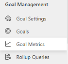

# Define goal rollup queries (Sales & Sales Hub)

Use the rollup query to gather data about a given goal, including all its related goals, in one view.  

## Create a rollup query (Sales Hub)

1.	Make sure that you have the Manager, Vice President, CEO-Business Manager, System Administrator, or System Customizer security role or equivalent permissions.

2.	In the site map, at the bottom, select the Change area icon , and then select **App Settings**.  

    > [!div class="mx-imgBorder"]
    > 

3. Select **Rollup Queries**.

    > [!div class="mx-imgBorder"]
    > 
 
4.	To create a new rollup query, on the command bar, select **New**.

5. [!INCLUDE[proc_handy_infotips](../includes/proc-handy-infotips.md)]  
  
    - **Name**.  Enter a name between 1 and 50 characters.  
  
    - **Entity Type**. Select the record type.  
  
    - **Owner**. Select the **Lookup** icon, and select the user or team who will own this query.  

    > [!div class="mx-imgBorder"]
    > 
    
        > [!NOTE]
        >  If you change this selection after you add your query criteria in the **Query** section, your query criteria will be deleted.  
  
6. In the **Query** section, add the criteria for your query. The criteria you can add depends on the record type. 

    > [!div class="mx-imgBorder"]  
    > 
  
7. To see the results for the query, select **View Records**.  
  
8. Select **Save**, **Save and Close**, or, to create a new rollup query, **Save and New**.  
  
9. To view the data for a goal, in the site map, select **Goals**.  
  
10. Open the goal you want, and then on the command bar, select **Recalculate**.  
  
     The values of the actuals are recalculated. You can see the recalculated values in the **Percentage Achieved**, **Actual**, and **In-Progress** columns. If you open the goal, under **Actuals**, you can see the **Last Rolled Up Date**.  
  
> [!NOTE]
>  The maximum number of records that can be counted  in a goal rollup query is 5000.  
  

## Create a rollup query (Sales)
  
1. [!INCLUDE[proc_permissions_mgr_vp_sys_admin_sys_cust](../includes/proc-permissions-mgr-vp-sys-admin-sys-cust.md)]  
  
    #### Check your security role  
  
   - [!INCLUDE[proc_follow_steps_in_link](../includes/proc-follow-steps-in-link.md)]  
  
   - [!INCLUDE[proc_dont_have_correct_permissions](../includes/proc-dont-have-correct-permissions.md)]  
  
2. Go to **Rollup Queries**. [How do I get there?](../basics/navigation-customer-engagement-enterprise.md)  
  
3. To create a new rollup query, in the **Records** group, select **New**.  
  
    -OR-  
  
    To edit a rollup query, select **Edit**.  
  
4. [!INCLUDE[proc_handy_infotips](../includes/proc-handy-infotips.md)]  
  
    - **Name**.  Enter a name between 1 and 50 characters.  
  
    - **Entity Type**. Select the record type.  
  
    - **Owner**. Select the **Lookup** icon, and select the user or team who will own this query.  

        > [!NOTE]
        >  If you change this selection after you add your query criteria in the **Query** section, your query criteria will be deleted.  
  
5. In the **Query** section, add the criteria for your query. The criteria you can add depends on the record type.

6. To see the results for the query, select **View Records**.  
  
7. Select **Save**, **Save and Close**, or, to create a new rollup query, **Save and New**.  
  
8. To view the data for a goal, on the nav bar, select **Sales**, and then select **Goals**.  
  
9. Select the goal you want, and then select **More Commands**, and then select **Recalculate**.  
  
     The values of the actuals are recalculated. You can see the recalculated values in the **Percentage Achieved**, **Actual**, and **In-Progress** columns. If you open the goal, under **Actuals**, you can see the **Last Rolled Up Date**.  
  
> [!NOTE]
>  The maximum number of records that can be counted  in a goal rollup query is 5000.  
  
### See also  

[Create or edit goals](../sales-enterprise/create-edit-goal-sales.md)   
[Define a goal metric](create-edit-goal-metric.md)
