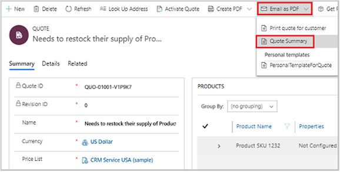

# Create a PDF document from a record

Create and share a professional-looking PDF documents for sales records by generating a PDF document using a standard template from your organization. 

The capability to create PDF document is available on the following entities: Accounts, Contacts, Leads, Opportunities, Orders, and Invoices.
Your system administrator can choose the entities on which PDF generation is enabled. 

> [!IMPORTANT]
> If you do not see the **Create PDF** and **Email as PDF** options on one of the supported entity records, it might be because your system administrator hasn't enabled the PDF-generation capability for that entity. Please talk to your system administrator.

1.	Open the entity record for which you want to create a PDF document. For example, open a quote record.

2.	On the command bar, select **Create PDF**, and then select a template based on which you want to create the PDF. 

    

    > [!IMPORTANT]
    > Templates are available out-of-the-box for the Account, Opportunity, Order, and Invoice entities. For entities that do not have the out-of-the-box templates, you can create new templates. You can't create a PDF document for an entity record if there's no template available for that entity. 

    A PDF document using the selected template is downloaded to your computer. You can add this document to a note or send it as an attachment in email.

    > [!TIP]
    > To learn more about using Word templates, see [Use Word templates to create standardized documents](../admin/using-word-templates-dynamics-365.md). 

## Email as a PDF document

You can also generate a PDF document and directly email it to a customer.

1.	Open an entity record. For example, open a quote record.

2.	On the command bar, select **Email as PDF**, and then select a document template.

    

    An email form opens. 
    
    The following information is automatically populated.

    |Field             |	Populated with                                 |
    |------------------|-------------------------------------------------|  
    |**To**                |	Potential customer of the quote                |
    |**From**	             |  Current user                                   |
    |**Attachments**       |	The generated PDF, added as an attachment         |
    |**Regarding**	       |  Record from which the email was triggered| 
    |**Subject**	         |  Title of the record                                    |

3.	Verify and change any details in the email form, and select **Send**.

> [!IMPORTANT]
> The time taken to generate the PDF document and download or send email is dependent on the size of the file. You'll see optimum performance when the file size is less than 2 MB. Larger files can require considerably more response time.

### See also

[Enable PDF generation from sales records](enable-pdf-generation-quote.md)  
