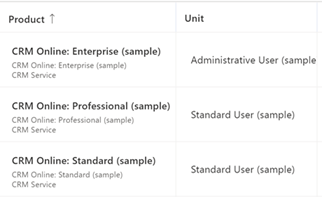

# Preview: Customize the Add Products dialog box

[!INCLUDE [cc-beta-prerelease-disclaimer](../includes/cc-beta-prerelease-disclaimer.md)]

As a system administrator, you can customize the Add products dialog box
to add information that will help your salespeople identify and select products quickly. You can either add more columns to the grid or add more details to the **Product** column. Attributes in the Product column help sellers get more information about the products *before* choosing a product. So, if you want to add a category or
product ID to help distinguish between two products, add them to the
**Product** column. On the other hand, if *after* selecting a specific
product, the sellers should choose delivery priority (custom attribute),
add that attribute to the grid.  

> [!IMPORTANT]

> - The enhanced experience for adding products is a preview feature. [!INCLUDE[cc-preview-features-definition](../includes/cc-preview-features-definition.md)]

> - [!INCLUDE[cc-preview-features-expect-changes](../includes/cc-preview-features-expect-changes.md)]

> - [!INCLUDE[cc-preview-features-no-ms-support](../includes/cc-preview-features-no-ms-support.md)]

## Add or remove columns from the grid

By default, the Add products dialog displays the following columns in
the grid:

- Product name
- Unit
- Price per unit
- Quantity

 > [!NOTE]
 > The procedure below refers to the customization option available in **Product catalog > settings**. If you are using a custom app, access the following views from Power Apps:

> - Opportunity products Add products
> - Quote products Add products
> - Order products Add products
> - Invoice products Add products

For information on editing views, see [Choose and configure
columns in model-driven app
views](https://docs.microsoft.com/powerapps/maker/model-driven-apps/choose-and-configure-columns).

**To add or remove columns from the grid**

1. In the Sales Hub app, select the **Change area** icon  at the bottom-left of the page and then select **App Settings**.  

2. Under **Product Catalog**, select **Product Catalog Settings**.  

3. Turn on the **Adding Products (preview)** option, if you haven't already.  
    You will see additional options to customize the Add products dialog for
    opportunity, quote, invoice, and order.  

4. Click the add products view of the entity that you want to customize. For example, click **Quote 'add products'** view to customize the Add products dialog for quotes.  
    You will be redirected to the corresponding view in Power Apps.

5. Click **Add Columns** and select the columns that you want to add.

6. To remove a column, select the column in the view and click **Remove** from the Common Tasks pane.

## Add or edit attributes in the Product column

The **Product** column in the Add product dialog includes the product name
and ID by default. You can add more information to distinguish the
products better. For example, you can add the product category to help
differentiate products as shown in the screenshot below:

**Note**: The **Product** column can display up to three attributes.  

> [!NOTE]
> The procedure below refers to the customization option available
> in **Product catalog settings**. If you are using a custom app, access
> the **Product Lookup View** from Power Apps:

For information on editing views, see [Choose and configure columns in model-driven app views](https://docs.microsoft.com/powerapps/maker/model-driven-apps/choose-and-configure-columns).

**To add or edit product attributes:**

1. In the Sales Hub app, select the **Change area** icon  at the bottom-left of the page and then select **App Settings**.

2. Under **Product Catalog**, select **Product Catalog Settings**.

3. Turn on the **Adding Products (preview)** option, if you haven't already.
    You will see additional options to customize the Add products dialog.

4. Click **Customize Product lookup view.**
    You will be redirected to the **Product Lookup View** in Power Apps.

5. Click **Add Columns** and select the attributes that you want to add.

6. To remove an attribute, select the column in the view and click
 **Remove** from the Common Tasks pane.

7. To verify the changes, open an opportunity and click **Add products**.
   You will see the updated attributes in the Product column.

The changes are applicable to the Add products dialog of opportunity,
quote, order, and invoice.

### See also

[Choose and configure columns in model-driven app views](/powerapps/maker/model-driven-apps/choose-and-configure-columns)  
[Preview: Add products to an opportunity using the enhanced experience](add-products-enhanced-experience.md)  
[Preview: Add products to quotes, orders, or invoices using enhanced experience](add-products-qoi-enhanced.md)  
